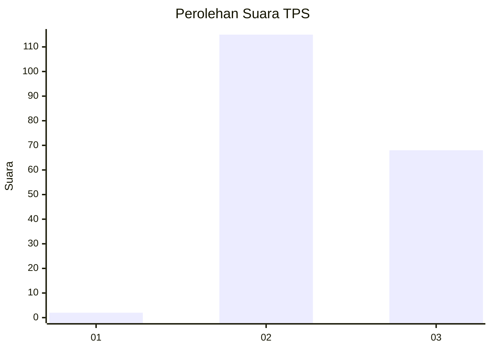
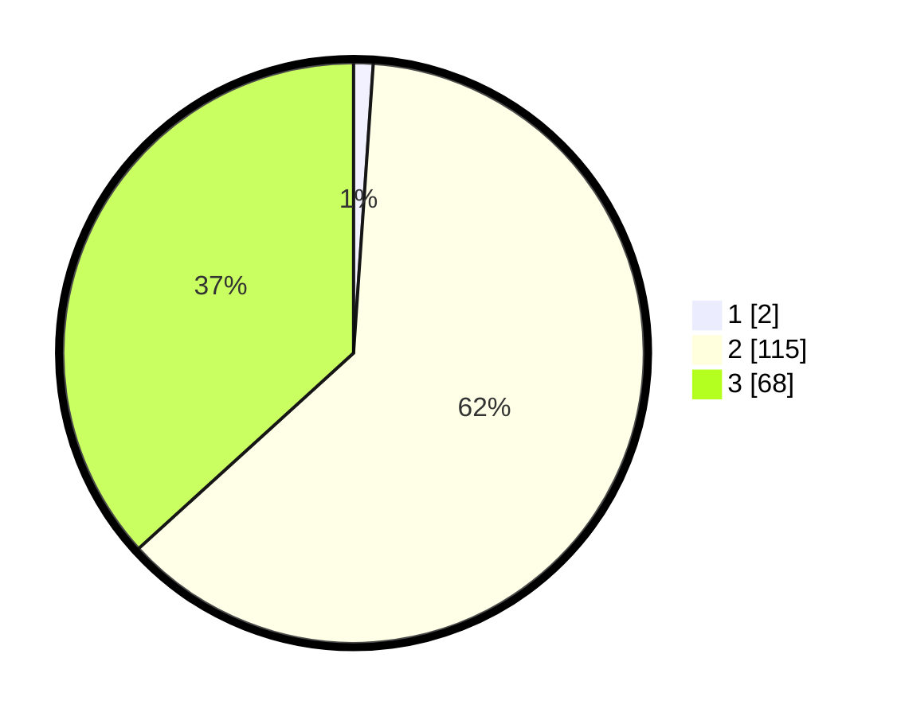

# Hasil

## Grafik

## Tabel

| No. | Nama Paslon    | Suara | Suara (raw) | Persentase |
|:--- |:-------------- | -----:| -----------:| ----------:|
| 1   | ANIES MUHAIMIN | 2     | [2][p-1]    | 1,08       |
| 2   | PRABOWO GIBRAN | 115   | [115][p-2]  | 62,16      |
| 3   | GANJAR MAHFUD  | 68    | [68][p-3]   | 36,76      |

[p-1]: https://github.com/gigit-pemilu/pemilu-2024/blob/main/pilpres/hitung-suara/sub/12-sumatera-utara/sub/11-dairi/sub/04-siempat-nempu/sub/2002-sihorbo/sub/004-tps/sub/paslon-1.txt
[p-2]: https://github.com/gigit-pemilu/pemilu-2024/blob/main/pilpres/hitung-suara/sub/12-sumatera-utara/sub/11-dairi/sub/04-siempat-nempu/sub/2002-sihorbo/sub/004-tps/sub/paslon-2.txt
[p-3]: https://github.com/gigit-pemilu/pemilu-2024/blob/main/pilpres/hitung-suara/sub/12-sumatera-utara/sub/11-dairi/sub/04-siempat-nempu/sub/2002-sihorbo/sub/004-tps/sub/paslon-3.txt

## Foto C Plano

https://sirekap-obj-formc.kpu.go.id/c0d6/pemilu/ppwp/12/11/04/20/02/1211042002004-20240214-215729--7be9c0cc-be01-477e-955b-2de97f0ab8b1.jpg

https://sirekap-obj-formc.kpu.go.id/c0d6/pemilu/ppwp/12/11/04/20/02/1211042002004-20240214-215509--41b2a3da-5eb9-4d10-a47d-7c9dd17aea4d.jpg

https://sirekap-obj-formc.kpu.go.id/c0d6/pemilu/ppwp/12/11/04/20/02/1211042002004-20240214-215919--7878e7fc-d1e2-4a82-bcd5-61734dd5e17e.jpg

## Metadata

| Key        | Value               |
| ---------- | ------------------- |
| Time Stamp | 2024-02-16 11:00:29 |

