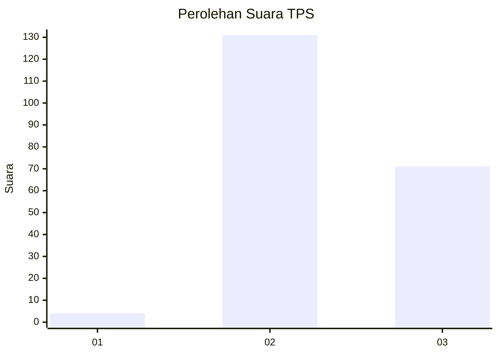
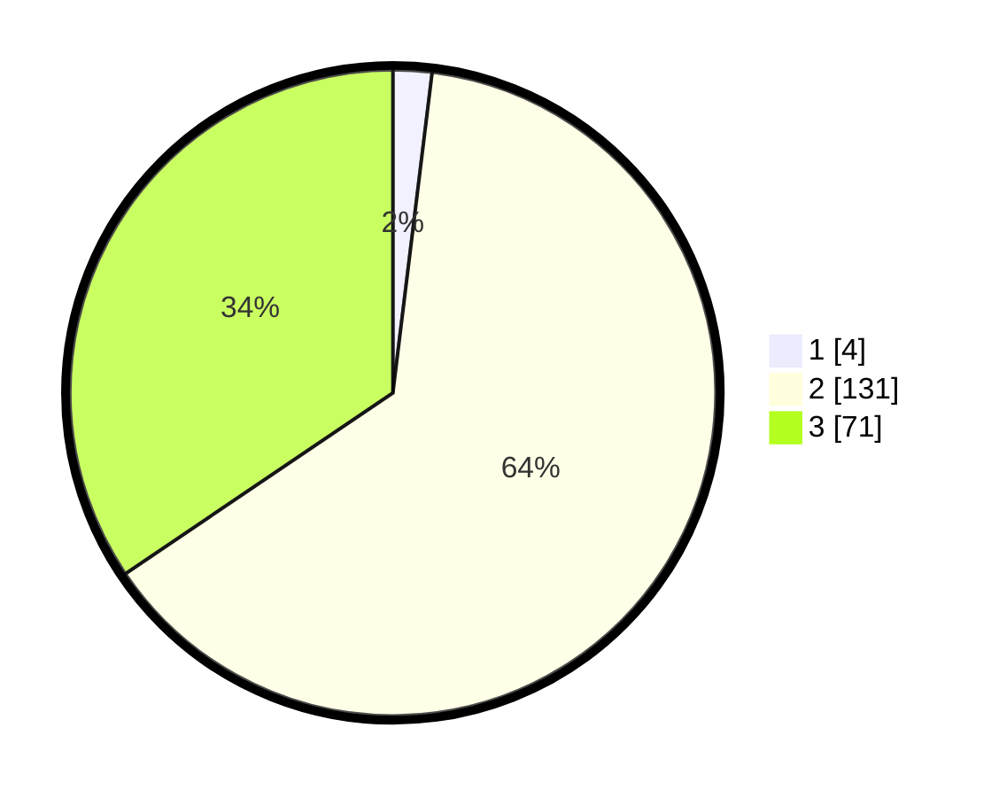

# Hasil

## Grafik

## Tabel

| No. | Nama Paslon    | Suara | Suara (raw) | Persentase |
|:--- |:-------------- | -----:| -----------:| ----------:|
| 1   | ANIES MUHAIMIN | 4     | [4][p-1]    | 1,94       |
| 2   | PRABOWO GIBRAN | 131   | [131][p-2]  | 63,59      |
| 3   | GANJAR MAHFUD  | 71    | [71][p-3]   | 34,47      |

[p-1]: https://github.com/gigit-pemilu/pemilu-2024/blob/main/pilpres/hitung-suara/sub/12-sumatera-utara/sub/11-dairi/sub/04-siempat-nempu/sub/2006-juma-siulok/sub/002-tps/sub/paslon-1.txt
[p-2]: https://github.com/gigit-pemilu/pemilu-2024/blob/main/pilpres/hitung-suara/sub/12-sumatera-utara/sub/11-dairi/sub/04-siempat-nempu/sub/2006-juma-siulok/sub/002-tps/sub/paslon-2.txt
[p-3]: https://github.com/gigit-pemilu/pemilu-2024/blob/main/pilpres/hitung-suara/sub/12-sumatera-utara/sub/11-dairi/sub/04-siempat-nempu/sub/2006-juma-siulok/sub/002-tps/sub/paslon-3.txt

## Foto C Plano

https://sirekap-obj-formc.kpu.go.id/bf2c/pemilu/ppwp/12/11/04/20/06/1211042006002-20240214-231810--301ac5a3-8b78-4442-a023-c72acf554b8a.jpg

https://sirekap-obj-formc.kpu.go.id/bf2c/pemilu/ppwp/12/11/04/20/06/1211042006002-20240214-231931--78d08c66-0931-447d-bcea-1ebbcbfb94e8.jpg

https://sirekap-obj-formc.kpu.go.id/bf2c/pemilu/ppwp/12/11/04/20/06/1211042006002-20240214-231902--6fc15b4b-2bf7-46af-92b0-b0929b41d358.jpg

## Metadata

| Key        | Value               |
| ---------- | ------------------- |
| Time Stamp | 2024-02-16 12:51:22 |

