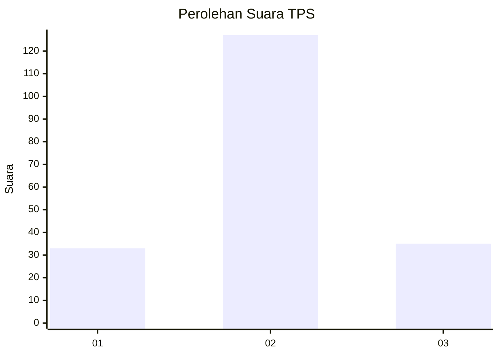
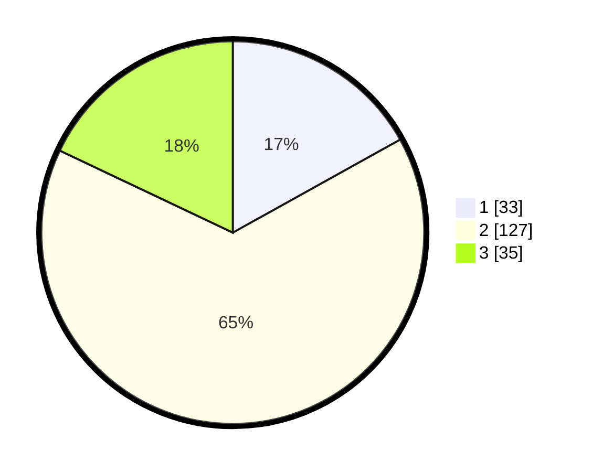

# Hasil

## Grafik

## Tabel

| No. | Nama Paslon    | Suara | Suara (raw) | Persentase |
|:--- |:-------------- | -----:| -----------:| ----------:|
| 1   | ANIES MUHAIMIN | 33    | [33][p-1]   | 16,92      |
| 2   | PRABOWO GIBRAN | 127   | [127][p-2]  | 65,13      |
| 3   | GANJAR MAHFUD  | 35    | [35][p-3]   | 17,95      |

[p-1]: https://github.com/gigit-pemilu/pemilu-2024/blob/main/pilpres/hitung-suara/sub/12-sumatera-utara/sub/11-dairi/sub/05-silima-pungga-pungga/sub/1014-parongil/sub/003-tps/sub/paslon-1.txt
[p-2]: https://github.com/gigit-pemilu/pemilu-2024/blob/main/pilpres/hitung-suara/sub/12-sumatera-utara/sub/11-dairi/sub/05-silima-pungga-pungga/sub/1014-parongil/sub/003-tps/sub/paslon-2.txt
[p-3]: https://github.com/gigit-pemilu/pemilu-2024/blob/main/pilpres/hitung-suara/sub/12-sumatera-utara/sub/11-dairi/sub/05-silima-pungga-pungga/sub/1014-parongil/sub/003-tps/sub/paslon-3.txt

## Foto C Plano

https://sirekap-obj-formc.kpu.go.id/27b3/pemilu/ppwp/12/11/05/10/14/1211051014003-20240214-224006--b3e72475-872d-44f0-a24f-fdcf84614129.jpg

https://sirekap-obj-formc.kpu.go.id/27b3/pemilu/ppwp/12/11/05/10/14/1211051014003-20240214-224143--728d2f9b-547c-4c95-b476-6e036265c9ec.jpg

https://sirekap-obj-formc.kpu.go.id/27b3/pemilu/ppwp/12/11/05/10/14/1211051014003-20240214-224413--a5cb0d6c-bb90-4b14-8561-b95212f05aee.jpg

## Metadata

| Key        | Value               |
| ---------- | ------------------- |
| Time Stamp | 2024-02-15 23:29:50 |

