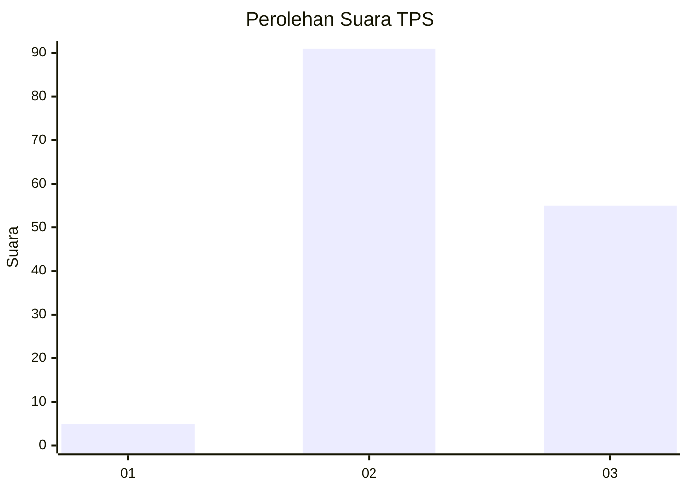
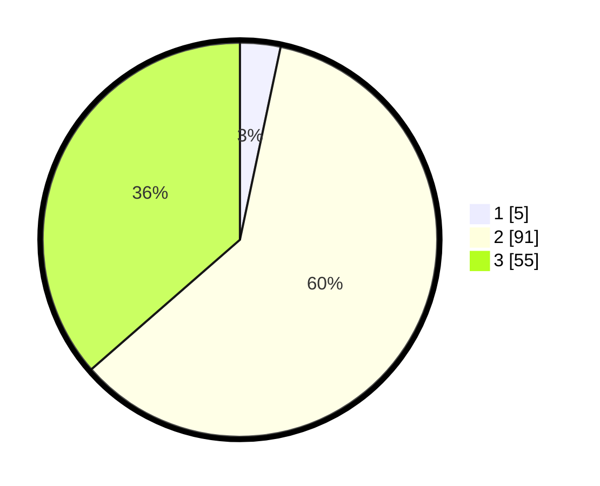

# Hasil

## Grafik

## Tabel

| No. | Nama Paslon    | Suara | Suara (raw) | Persentase |
|:--- |:-------------- | -----:| -----------:| ----------:|
| 1   | ANIES MUHAIMIN | 5     | [5][p-1]    | 3,31       |
| 2   | PRABOWO GIBRAN | 91    | [91][p-2]   | 60,26      |
| 3   | GANJAR MAHFUD  | 55    | [55][p-3]   | 36,42      |

[p-1]: https://github.com/gigit-pemilu/pemilu-2024-12-sumatera-utara/blob/main/pilpres/hitung-suara/sub/12-sumatera-utara/sub/11-dairi/sub/05-silima-pungga-pungga/sub/2008-palipi/sub/001-tps/sub/paslon-1.txt
[p-2]: https://github.com/gigit-pemilu/pemilu-2024-12-sumatera-utara/blob/main/pilpres/hitung-suara/sub/12-sumatera-utara/sub/11-dairi/sub/05-silima-pungga-pungga/sub/2008-palipi/sub/001-tps/sub/paslon-2.txt
[p-3]: https://github.com/gigit-pemilu/pemilu-2024-12-sumatera-utara/blob/main/pilpres/hitung-suara/sub/12-sumatera-utara/sub/11-dairi/sub/05-silima-pungga-pungga/sub/2008-palipi/sub/001-tps/sub/paslon-3.txt

## Foto C Plano

https://sirekap-obj-formc.kpu.go.id/6faa/pemilu/ppwp/12/11/05/20/08/1211052008001-20240214-224550--8544d92a-2c64-47d7-b771-f629e44ca344.jpg

https://sirekap-obj-formc.kpu.go.id/6faa/pemilu/ppwp/12/11/05/20/08/1211052008001-20240214-224758--8ada542c-a659-4529-a7e4-db31d9a2e39c.jpg

https://sirekap-obj-formc.kpu.go.id/6faa/pemilu/ppwp/12/11/05/20/08/1211052008001-20240214-224934--17a418a9-489e-4579-9b3d-746a76b32167.jpg

## Metadata

| Key        | Value               |
| ---------- | ------------------- |
| Time Stamp | 2024-02-15 19:00:26 |

