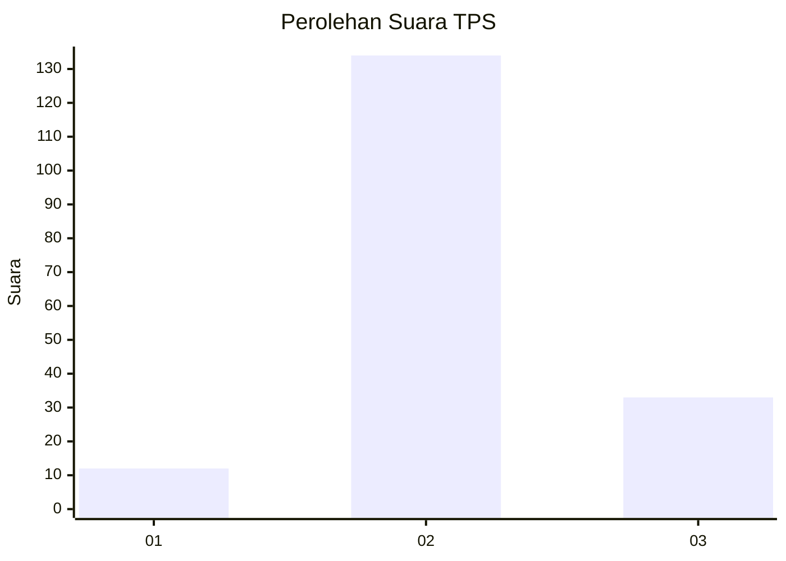
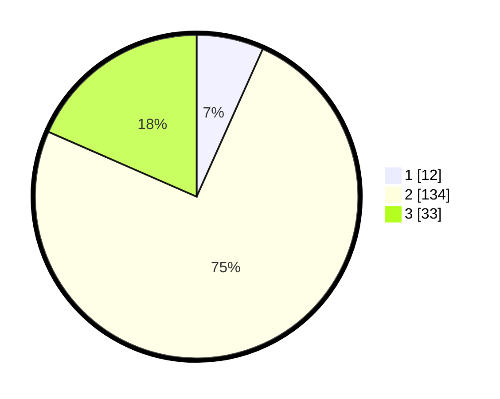

# Hasil

## Grafik

## Tabel

| No. | Nama Paslon    | Suara | Suara (raw) | Persentase |
|:--- |:-------------- | -----:| -----------:| ----------:|
| 1   | ANIES MUHAIMIN | 12    | [12][p-1]   | 6,70       |
| 2   | PRABOWO GIBRAN | 134   | [134][p-2]  | 74,86      |
| 3   | GANJAR MAHFUD  | 33    | [33][p-3]   | 18,44      |

[p-1]: https://github.com/gigit-pemilu/pemilu-2024-12-sumatera-utara/blob/main/pilpres/hitung-suara/sub/12-sumatera-utara/sub/11-dairi/sub/05-silima-pungga-pungga/sub/2010-longkotan/sub/001-tps/sub/paslon-1.txt
[p-2]: https://github.com/gigit-pemilu/pemilu-2024-12-sumatera-utara/blob/main/pilpres/hitung-suara/sub/12-sumatera-utara/sub/11-dairi/sub/05-silima-pungga-pungga/sub/2010-longkotan/sub/001-tps/sub/paslon-2.txt
[p-3]: https://github.com/gigit-pemilu/pemilu-2024-12-sumatera-utara/blob/main/pilpres/hitung-suara/sub/12-sumatera-utara/sub/11-dairi/sub/05-silima-pungga-pungga/sub/2010-longkotan/sub/001-tps/sub/paslon-3.txt

## Foto C Plano

https://sirekap-obj-formc.kpu.go.id/24cb/pemilu/ppwp/12/11/05/20/10/1211052010001-20240214-214409--1616e9bc-bc50-4a49-b503-2637fec13897.jpg

https://sirekap-obj-formc.kpu.go.id/24cb/pemilu/ppwp/12/11/05/20/10/1211052010001-20240214-214836--62d28dba-6295-41d0-bce9-53903993ad7b.jpg

https://sirekap-obj-formc.kpu.go.id/24cb/pemilu/ppwp/12/11/05/20/10/1211052010001-20240214-215156--f1eaebdf-255f-44e0-b123-2921133ec22f.jpg

## Metadata

| Key        | Value               |
| ---------- | ------------------- |
| Time Stamp | 2024-02-15 23:29:50 |

