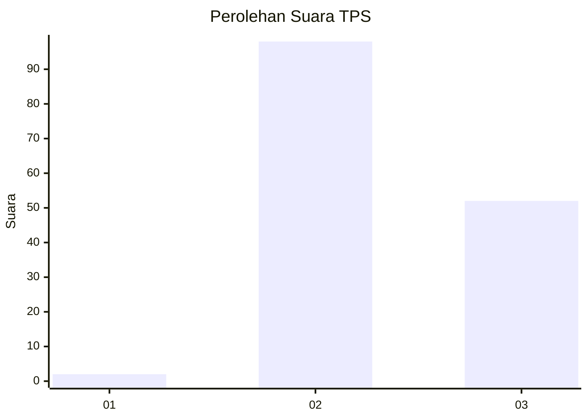
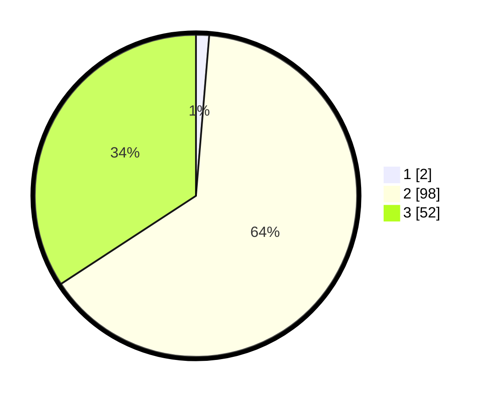

# Hasil

## Grafik

## Tabel

| No. | Nama Paslon    | Suara | Suara (raw) | Persentase |
|:--- |:-------------- | -----:| -----------:| ----------:|
| 1   | ANIES MUHAIMIN | 2     | [2][p-1]    | 1,32       |
| 2   | PRABOWO GIBRAN | 98    | [98][p-2]   | 64,47      |
| 3   | GANJAR MAHFUD  | 52    | [52][p-3]   | 34,21      |

[p-1]: https://github.com/gigit-pemilu/pemilu-2024-12-sumatera-utara/blob/main/pilpres/hitung-suara/sub/12-sumatera-utara/sub/11-dairi/sub/06-tanah-pinem/sub/2002-gunung-tua/sub/001-tps/sub/paslon-1.txt
[p-2]: https://github.com/gigit-pemilu/pemilu-2024-12-sumatera-utara/blob/main/pilpres/hitung-suara/sub/12-sumatera-utara/sub/11-dairi/sub/06-tanah-pinem/sub/2002-gunung-tua/sub/001-tps/sub/paslon-2.txt
[p-3]: https://github.com/gigit-pemilu/pemilu-2024-12-sumatera-utara/blob/main/pilpres/hitung-suara/sub/12-sumatera-utara/sub/11-dairi/sub/06-tanah-pinem/sub/2002-gunung-tua/sub/001-tps/sub/paslon-3.txt

## Foto C Plano

https://sirekap-obj-formc.kpu.go.id/b759/pemilu/ppwp/12/11/06/20/02/1211062002001-20240215-002458--319802e2-5b0d-4248-8838-2b439eb85254.jpg

https://sirekap-obj-formc.kpu.go.id/b759/pemilu/ppwp/12/11/06/20/02/1211062002001-20240215-002828--c34cfdd6-492f-488a-8c25-861a57b82ad3.jpg

https://sirekap-obj-formc.kpu.go.id/b759/pemilu/ppwp/12/11/06/20/02/1211062002001-20240215-003845--ccd347a4-1681-4bc1-b96e-fbce075ba024.jpg

## Metadata

| Key        | Value               |
| ---------- | ------------------- |
| Time Stamp | 2024-02-15 23:29:50 |

