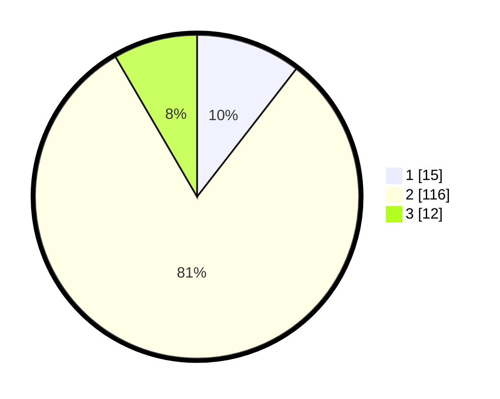

# Hasil

## Grafik

## Tabel

| No. | Nama Paslon    | Suara | Suara (raw) | Persentase |
|:--- |:-------------- | -----:| -----------:| ----------:|
| 1   | ANIES MUHAIMIN | 15    | [15][p-1]   | 10,49      |
| 2   | PRABOWO GIBRAN | 116   | [116][p-2]  | 81,12      |
| 3   | GANJAR MAHFUD  | 12    | [12][p-3]   | 8,39       |

[p-1]: https://github.com/gigit-pemilu/pemilu-2024/blob/main/pilpres/hitung-suara/sub/12-sumatera-utara/sub/11-dairi/sub/06-tanah-pinem/sub/2007-tanah-pinem/sub/004-tps/sub/paslon-1.txt
[p-2]: https://github.com/gigit-pemilu/pemilu-2024/blob/main/pilpres/hitung-suara/sub/12-sumatera-utara/sub/11-dairi/sub/06-tanah-pinem/sub/2007-tanah-pinem/sub/004-tps/sub/paslon-2.txt
[p-3]: https://github.com/gigit-pemilu/pemilu-2024/blob/main/pilpres/hitung-suara/sub/12-sumatera-utara/sub/11-dairi/sub/06-tanah-pinem/sub/2007-tanah-pinem/sub/004-tps/sub/paslon-3.txt

## Foto C Plano

https://sirekap-obj-formc.kpu.go.id/c81d/pemilu/ppwp/12/11/06/20/07/1211062007004-20240214-225555--80eb419d-7b37-49a7-a204-01b6e2f1ea2e.jpg

https://sirekap-obj-formc.kpu.go.id/c81d/pemilu/ppwp/12/11/06/20/07/1211062007004-20240214-225558--62f16cc5-aec0-4024-b885-350d13f1044f.jpg

https://sirekap-obj-formc.kpu.go.id/c81d/pemilu/ppwp/12/11/06/20/07/1211062007004-20240214-225601--5828640c-c2b9-4e02-ba3d-0282c69d67b3.jpg

## Metadata

| Key        | Value               |
| ---------- | ------------------- |
| Time Stamp | 2024-02-15 23:29:50 |

