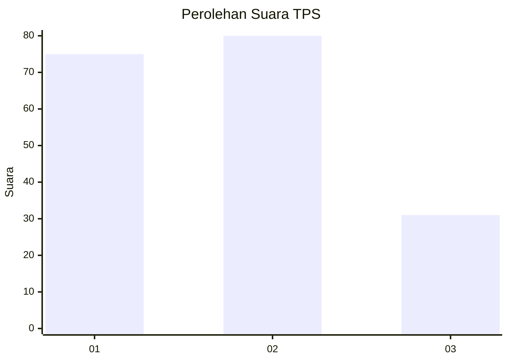
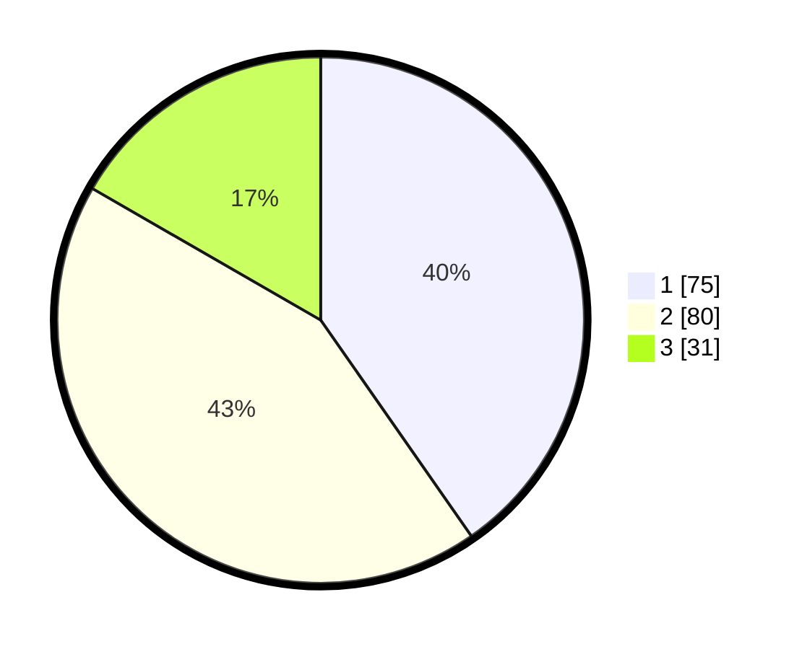

# Hasil

## Grafik

## Tabel

| No. | Nama Paslon    | Suara | Suara (raw) | Persentase |
|:--- |:-------------- | -----:| -----------:| ----------:|
| 1   | ANIES MUHAIMIN | 75    | [75][p-1]   | 40,32      |
| 2   | PRABOWO GIBRAN | 80    | [80][p-2]   | 43,01      |
| 3   | GANJAR MAHFUD  | 31    | [31][p-3]   | 16,67      |

[p-1]: https://github.com/gigit-pemilu/pemilu-2024/blob/main/pilpres/hitung-suara/sub/12-sumatera-utara/sub/11-dairi/sub/06-tanah-pinem/sub/2017-lau-njuhar-i/sub/004-tps/sub/paslon-1.txt
[p-2]: https://github.com/gigit-pemilu/pemilu-2024/blob/main/pilpres/hitung-suara/sub/12-sumatera-utara/sub/11-dairi/sub/06-tanah-pinem/sub/2017-lau-njuhar-i/sub/004-tps/sub/paslon-2.txt
[p-3]: https://github.com/gigit-pemilu/pemilu-2024/blob/main/pilpres/hitung-suara/sub/12-sumatera-utara/sub/11-dairi/sub/06-tanah-pinem/sub/2017-lau-njuhar-i/sub/004-tps/sub/paslon-3.txt

## Foto C Plano

https://sirekap-obj-formc.kpu.go.id/2b20/pemilu/ppwp/12/11/06/20/17/1211062017004-20240215-102652--d5b3cbbe-d2f6-4042-aedb-2e1a0b7ad0e4.jpg

https://sirekap-obj-formc.kpu.go.id/2b20/pemilu/ppwp/12/11/06/20/17/1211062017004-20240215-102848--8744b615-1c0c-44db-94ca-ca8ffde4cc3a.jpg

https://sirekap-obj-formc.kpu.go.id/2b20/pemilu/ppwp/12/11/06/20/17/1211062017004-20240215-102942--2cfc9958-5ccd-4da3-bb92-03ab95bca9f0.jpg

## Metadata

| Key        | Value               |
| ---------- | ------------------- |
| Time Stamp | 2024-02-15 23:29:50 |

