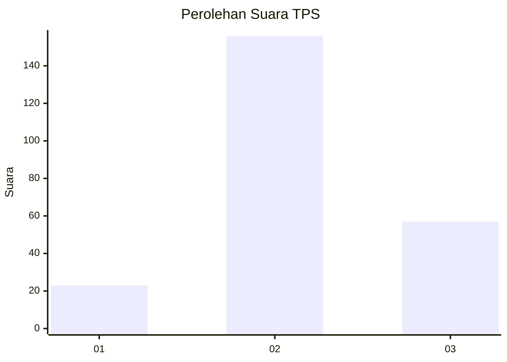
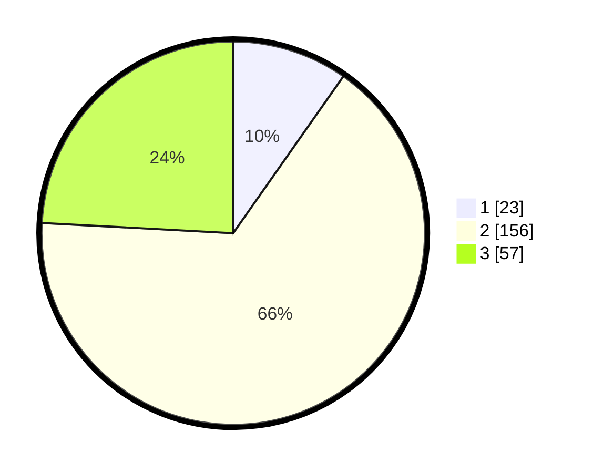

# Hasil

## Grafik

## Tabel

| No. | Nama Paslon    | Suara | Suara (raw) | Persentase |
|:--- |:-------------- | -----:| -----------:| ----------:|
| 1   | ANIES MUHAIMIN | 23    | [23][p-1]   | 9,75       |
| 2   | PRABOWO GIBRAN | 156   | [156][p-2]  | 66,10      |
| 3   | GANJAR MAHFUD  | 57    | [57][p-3]   | 24,15      |

[p-1]: https://github.com/gigit-pemilu/pemilu-2024/blob/main/pilpres/hitung-suara/sub/12-sumatera-utara/sub/11-dairi/sub/07-siempat-nempu-hulu/sub/2001-tambahan/sub/004-tps/sub/paslon-1.txt
[p-2]: https://github.com/gigit-pemilu/pemilu-2024/blob/main/pilpres/hitung-suara/sub/12-sumatera-utara/sub/11-dairi/sub/07-siempat-nempu-hulu/sub/2001-tambahan/sub/004-tps/sub/paslon-2.txt
[p-3]: https://github.com/gigit-pemilu/pemilu-2024/blob/main/pilpres/hitung-suara/sub/12-sumatera-utara/sub/11-dairi/sub/07-siempat-nempu-hulu/sub/2001-tambahan/sub/004-tps/sub/paslon-3.txt

## Foto C Plano

https://sirekap-obj-formc.kpu.go.id/c66c/pemilu/ppwp/12/11/07/20/01/1211072001004-20240214-230553--96acf8a1-8a14-43f9-93b8-3f8750378580.jpg

https://sirekap-obj-formc.kpu.go.id/c66c/pemilu/ppwp/12/11/07/20/01/1211072001004-20240214-230923--3e51cd88-fac2-4975-8c5a-ae1ba77c211b.jpg

https://sirekap-obj-formc.kpu.go.id/c66c/pemilu/ppwp/12/11/07/20/01/1211072001004-20240214-231521--6b865c84-1e67-4f45-b51c-e0abb8bd9564.jpg

## Metadata

| Key        | Value               |
| ---------- | ------------------- |
| Time Stamp | 2024-02-15 23:29:50 |

