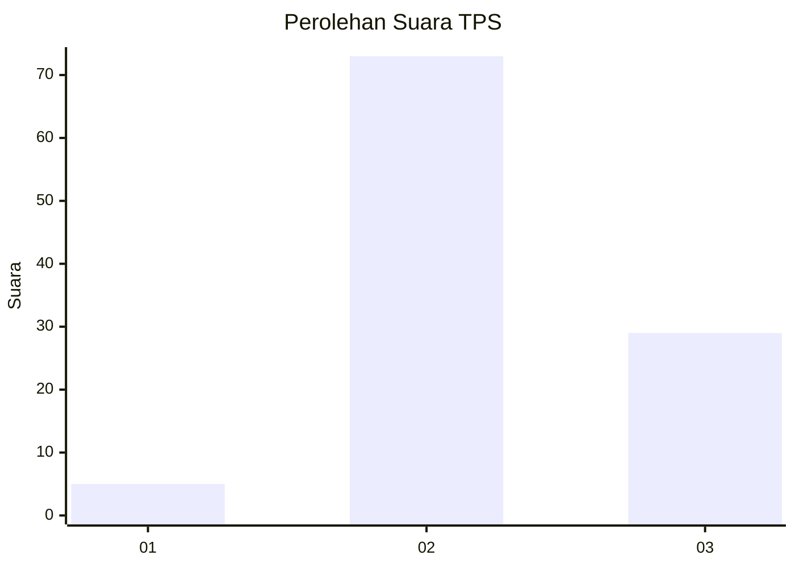
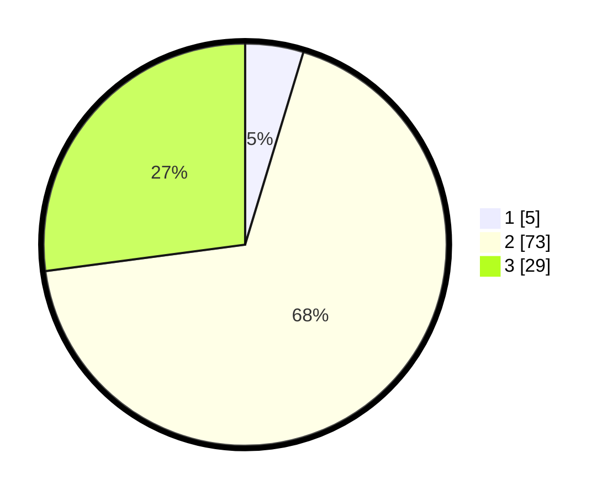

# Hasil

## Grafik

## Tabel

| No. | Nama Paslon    | Suara | Suara (raw) | Persentase |
|:--- |:-------------- | -----:| -----------:| ----------:|
| 1   | ANIES MUHAIMIN | 5     | [5][p-1]    | 4,67       |
| 2   | PRABOWO GIBRAN | 73    | [73][p-2]   | 68,22      |
| 3   | GANJAR MAHFUD  | 29    | [29][p-3]   | 27,10      |

[p-1]: https://github.com/gigit-pemilu/pemilu-2024/blob/main/pilpres/hitung-suara/sub/12-sumatera-utara/sub/11-dairi/sub/08-siempat-nempu-hilir/sub/2002-lae-luhung/sub/002-tps/sub/paslon-1.txt
[p-2]: https://github.com/gigit-pemilu/pemilu-2024/blob/main/pilpres/hitung-suara/sub/12-sumatera-utara/sub/11-dairi/sub/08-siempat-nempu-hilir/sub/2002-lae-luhung/sub/002-tps/sub/paslon-2.txt
[p-3]: https://github.com/gigit-pemilu/pemilu-2024/blob/main/pilpres/hitung-suara/sub/12-sumatera-utara/sub/11-dairi/sub/08-siempat-nempu-hilir/sub/2002-lae-luhung/sub/002-tps/sub/paslon-3.txt

## Foto C Plano

https://sirekap-obj-formc.kpu.go.id/a4fb/pemilu/ppwp/12/11/08/20/02/1211082002002-20240215-090200--a2aae746-1baf-4700-a6a1-292bdd0084fe.jpg

https://sirekap-obj-formc.kpu.go.id/a4fb/pemilu/ppwp/12/11/08/20/02/1211082002002-20240214-215832--69aef89e-01b4-4e95-ae77-91f70285ad25.jpg

https://sirekap-obj-formc.kpu.go.id/a4fb/pemilu/ppwp/12/11/08/20/02/1211082002002-20240214-215948--ba1c08a4-71fa-4aa3-b775-a7f4b600ce73.jpg

## Metadata

| Key        | Value               |
| ---------- | ------------------- |
| Time Stamp | 2024-02-15 23:29:50 |

