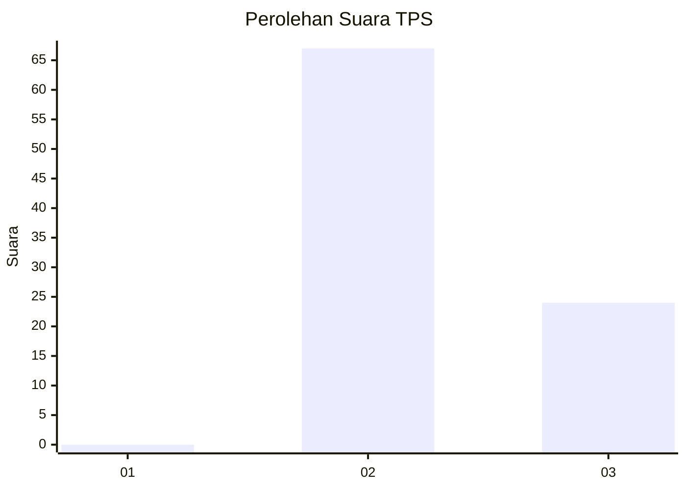
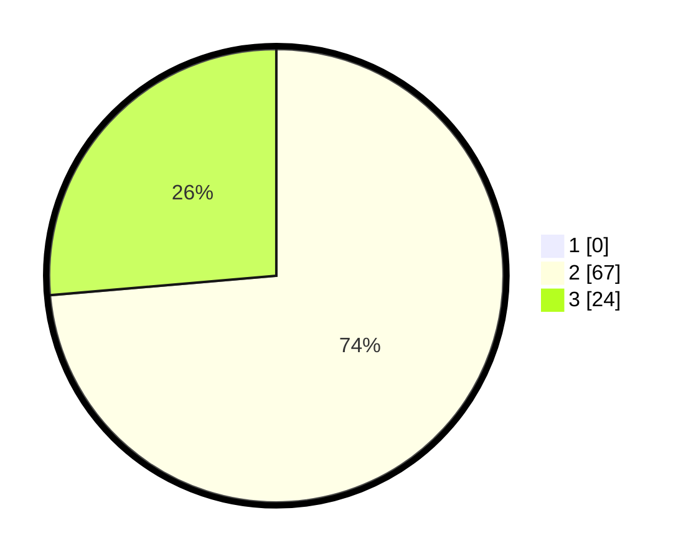

# Hasil

## Grafik

## Tabel

| No. | Nama Paslon    | Suara | Suara (raw) | Persentase |
|:--- |:-------------- | -----:| -----------:| ----------:|
| 1   | ANIES MUHAIMIN | 0     | [0][p-1]    | 0,00       |
| 2   | PRABOWO GIBRAN | 67    | [67][p-2]   | 73,63      |
| 3   | GANJAR MAHFUD  | 24    | [24][p-3]   | 26,37      |

[p-1]: https://github.com/gigit-pemilu/pemilu-2024-12-sumatera-utara/blob/main/pilpres/hitung-suara/sub/12-sumatera-utara/sub/11-dairi/sub/08-siempat-nempu-hilir/sub/2005-jambur-indonesia/sub/001-tps/sub/paslon-1.txt
[p-2]: https://github.com/gigit-pemilu/pemilu-2024-12-sumatera-utara/blob/main/pilpres/hitung-suara/sub/12-sumatera-utara/sub/11-dairi/sub/08-siempat-nempu-hilir/sub/2005-jambur-indonesia/sub/001-tps/sub/paslon-2.txt
[p-3]: https://github.com/gigit-pemilu/pemilu-2024-12-sumatera-utara/blob/main/pilpres/hitung-suara/sub/12-sumatera-utara/sub/11-dairi/sub/08-siempat-nempu-hilir/sub/2005-jambur-indonesia/sub/001-tps/sub/paslon-3.txt

## Foto C Plano

https://sirekap-obj-formc.kpu.go.id/4187/pemilu/ppwp/12/11/08/20/05/1211082005001-20240214-221058--230b48c6-687a-4403-b9ac-a00db9436995.jpg

https://sirekap-obj-formc.kpu.go.id/4187/pemilu/ppwp/12/11/08/20/05/1211082005001-20240214-221628--7074a839-3623-48d1-87d8-d9d13dd02595.jpg

https://sirekap-obj-formc.kpu.go.id/4187/pemilu/ppwp/12/11/08/20/05/1211082005001-20240214-222129--d1a103db-08cd-4a33-bd7c-50da48c2fe2a.jpg

## Metadata

| Key        | Value               |
| ---------- | ------------------- |
| Time Stamp | 2024-02-15 19:00:26 |

