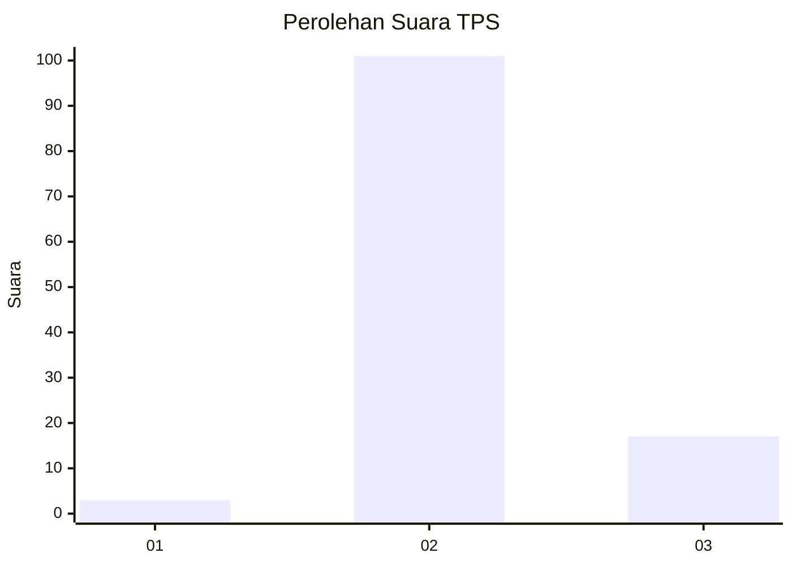
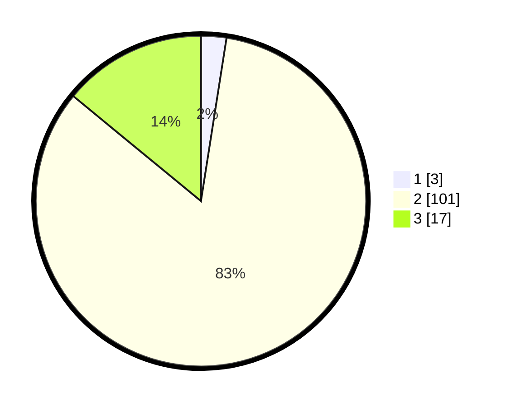

# Hasil

## Grafik

## Tabel

| No. | Nama Paslon    | Suara | Suara (raw) | Persentase |
|:--- |:-------------- | -----:| -----------:| ----------:|
| 1   | ANIES MUHAIMIN | 3     | [3][p-1]    | 2,48       |
| 2   | PRABOWO GIBRAN | 101   | [101][p-2]  | 83,47      |
| 3   | GANJAR MAHFUD  | 17    | [17][p-3]   | 14,05      |

[p-1]: https://github.com/gigit-pemilu/pemilu-2024-12-sumatera-utara/blob/main/pilpres/hitung-suara/sub/12-sumatera-utara/sub/11-dairi/sub/08-siempat-nempu-hilir/sub/2008-sopo-butar/sub/001-tps/sub/paslon-1.txt
[p-2]: https://github.com/gigit-pemilu/pemilu-2024-12-sumatera-utara/blob/main/pilpres/hitung-suara/sub/12-sumatera-utara/sub/11-dairi/sub/08-siempat-nempu-hilir/sub/2008-sopo-butar/sub/001-tps/sub/paslon-2.txt
[p-3]: https://github.com/gigit-pemilu/pemilu-2024-12-sumatera-utara/blob/main/pilpres/hitung-suara/sub/12-sumatera-utara/sub/11-dairi/sub/08-siempat-nempu-hilir/sub/2008-sopo-butar/sub/001-tps/sub/paslon-3.txt

## Foto C Plano

https://sirekap-obj-formc.kpu.go.id/64a4/pemilu/ppwp/12/11/08/20/08/1211082008001-20240214-155617--a35dca79-c093-400b-9924-c9f1384724fb.jpg

https://sirekap-obj-formc.kpu.go.id/64a4/pemilu/ppwp/12/11/08/20/08/1211082008001-20240214-155829--24ca3617-b9b1-4529-802e-9139429b4ee9.jpg

https://sirekap-obj-formc.kpu.go.id/64a4/pemilu/ppwp/12/11/08/20/08/1211082008001-20240214-160110--9db5b355-42f2-4546-a5a5-32411902e286.jpg

## Metadata

| Key        | Value               |
| ---------- | ------------------- |
| Time Stamp | 2024-02-16 00:00:26 |

