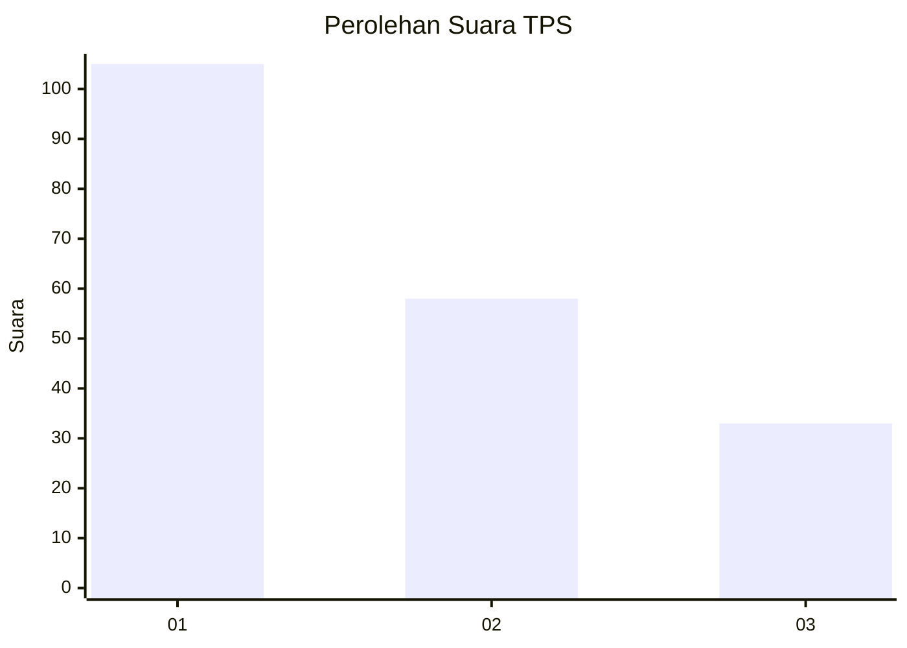
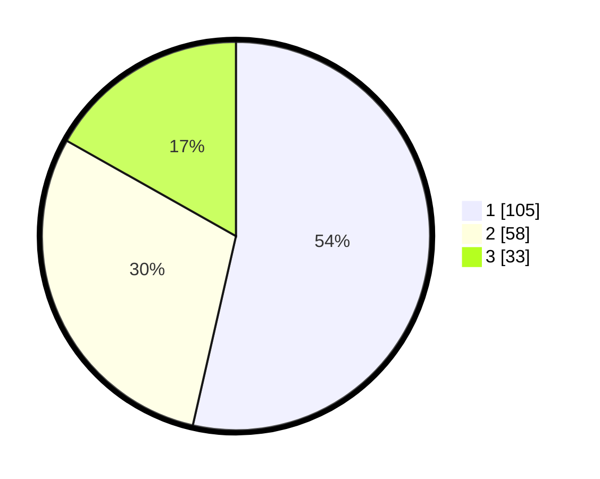

# Hasil

## Grafik

## Tabel

| No. | Nama Paslon    | Suara | Suara (raw) | Persentase |
|:--- |:-------------- | -----:| -----------:| ----------:|
| 1   | ANIES MUHAIMIN | 105   | [105][p-1]  | 53,57      |
| 2   | PRABOWO GIBRAN | 58    | [58][p-2]   | 29,59      |
| 3   | GANJAR MAHFUD  | 33    | [33][p-3]   | 16,84      |

[p-1]: https://github.com/gigit-pemilu/pemilu-2024-12-sumatera-utara/blob/main/pilpres/hitung-suara/sub/12-sumatera-utara/sub/11-dairi/sub/09-pegagan-hilir/sub/2007-bukit-tinggi/sub/001-tps/sub/paslon-1.txt
[p-2]: https://github.com/gigit-pemilu/pemilu-2024-12-sumatera-utara/blob/main/pilpres/hitung-suara/sub/12-sumatera-utara/sub/11-dairi/sub/09-pegagan-hilir/sub/2007-bukit-tinggi/sub/001-tps/sub/paslon-2.txt
[p-3]: https://github.com/gigit-pemilu/pemilu-2024-12-sumatera-utara/blob/main/pilpres/hitung-suara/sub/12-sumatera-utara/sub/11-dairi/sub/09-pegagan-hilir/sub/2007-bukit-tinggi/sub/001-tps/sub/paslon-3.txt

## Foto C Plano

https://sirekap-obj-formc.kpu.go.id/5ec3/pemilu/ppwp/12/11/09/20/07/1211092007001-20240214-204156--4986106b-d046-4af9-bb4e-bbb9137f2e9f.jpg

https://sirekap-obj-formc.kpu.go.id/5ec3/pemilu/ppwp/12/11/09/20/07/1211092007001-20240214-204348--d2b7735b-daf3-41c0-9b82-aeb9b8ca435f.jpg

https://sirekap-obj-formc.kpu.go.id/5ec3/pemilu/ppwp/12/11/09/20/07/1211092007001-20240214-204554--ffc99ffa-e0d3-456f-8862-483b880d73c1.jpg

## Metadata

| Key        | Value               |
| ---------- | ------------------- |
| Time Stamp | 2024-02-15 23:29:50 |

