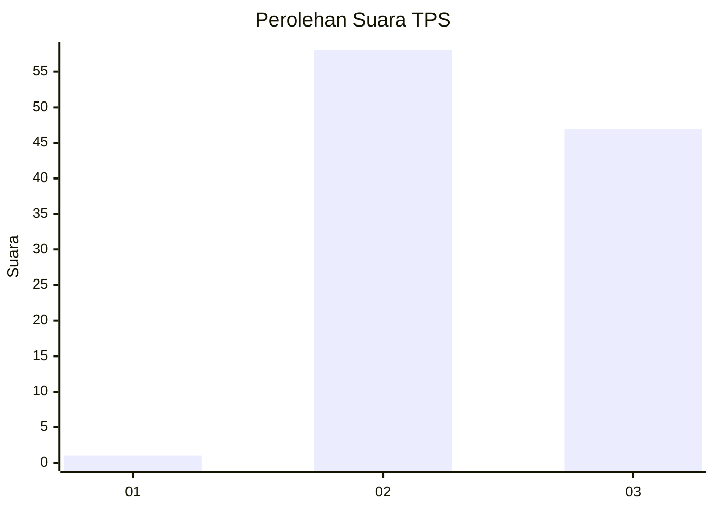
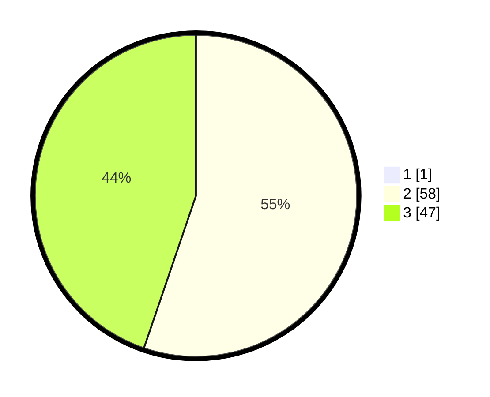

# Hasil

## Grafik

## Tabel

| No. | Nama Paslon    | Suara | Suara (raw) | Persentase |
|:--- |:-------------- | -----:| -----------:| ----------:|
| 1   | ANIES MUHAIMIN | 1     | [1][p-1]    | 0,94       |
| 2   | PRABOWO GIBRAN | 58    | [58][p-2]   | 54,72      |
| 3   | GANJAR MAHFUD  | 47    | [47][p-3]   | 44,34      |

[p-1]: https://github.com/gigit-pemilu/pemilu-2024/blob/main/pilpres/hitung-suara/sub/12-sumatera-utara/sub/11-dairi/sub/09-pegagan-hilir/sub/2009-kuta-usang/sub/003-tps/sub/paslon-1.txt
[p-2]: https://github.com/gigit-pemilu/pemilu-2024/blob/main/pilpres/hitung-suara/sub/12-sumatera-utara/sub/11-dairi/sub/09-pegagan-hilir/sub/2009-kuta-usang/sub/003-tps/sub/paslon-2.txt
[p-3]: https://github.com/gigit-pemilu/pemilu-2024/blob/main/pilpres/hitung-suara/sub/12-sumatera-utara/sub/11-dairi/sub/09-pegagan-hilir/sub/2009-kuta-usang/sub/003-tps/sub/paslon-3.txt

## Foto C Plano

https://sirekap-obj-formc.kpu.go.id/8d8c/pemilu/ppwp/12/11/09/20/09/1211092009003-20240214-233951--a0bf9881-ea65-40ec-8b92-d7f800d8c72f.jpg

https://sirekap-obj-formc.kpu.go.id/8d8c/pemilu/ppwp/12/11/09/20/09/1211092009003-20240215-021806--e0b18a17-9ed5-40eb-9cf7-5dd72c98afba.jpg

https://sirekap-obj-formc.kpu.go.id/8d8c/pemilu/ppwp/12/11/09/20/09/1211092009003-20240214-234437--f5fb85f0-1083-4527-860e-3634dccdc1cd.jpg

## Metadata

| Key        | Value               |
| ---------- | ------------------- |
| Time Stamp | 2024-02-15 23:29:50 |

