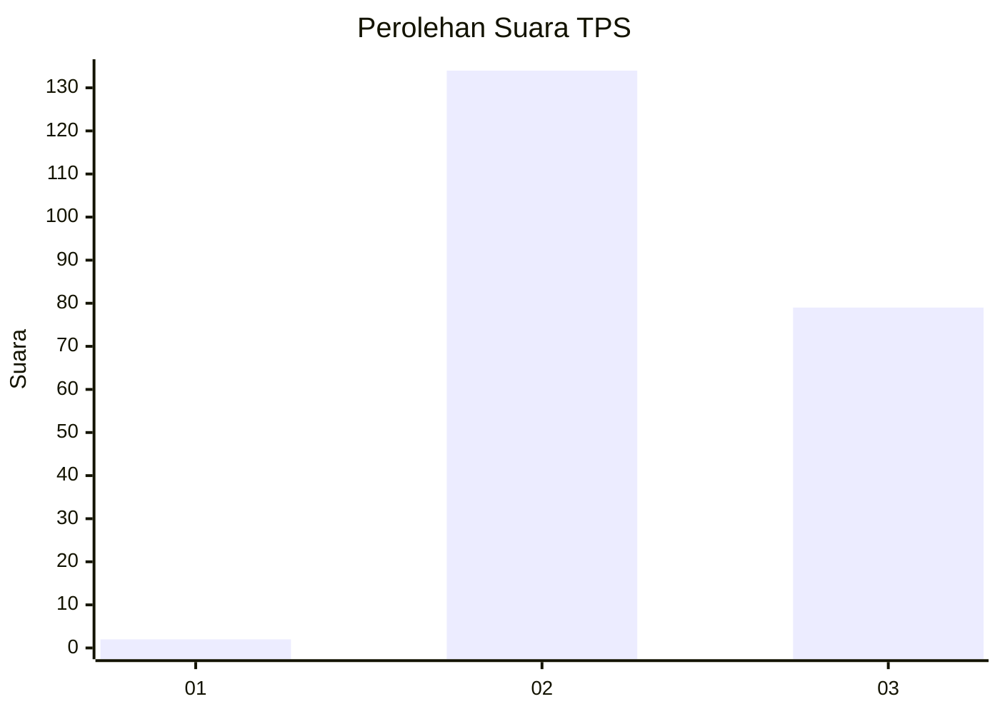
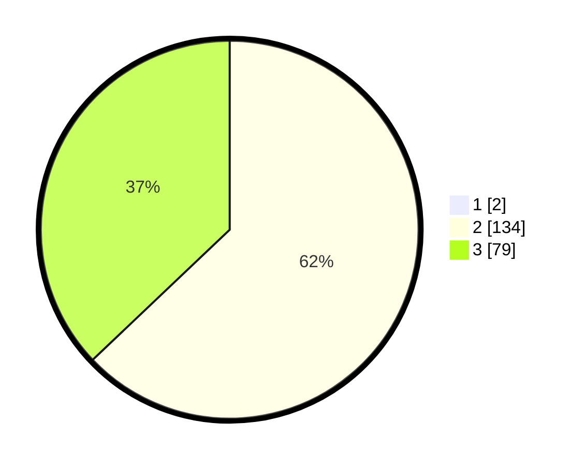

# Hasil

## Grafik

## Tabel

| No. | Nama Paslon    | Suara | Suara (raw) | Persentase |
|:--- |:-------------- | -----:| -----------:| ----------:|
| 1   | ANIES MUHAIMIN | 2     | [2][p-1]    | 0,93       |
| 2   | PRABOWO GIBRAN | 134   | [134][p-2]  | 62,33      |
| 3   | GANJAR MAHFUD  | 79    | [79][p-3]   | 36,74      |

[p-1]: https://github.com/gigit-pemilu/pemilu-2024/blob/main/pilpres/hitung-suara/sub/12-sumatera-utara/sub/11-dairi/sub/09-pegagan-hilir/sub/2009-kuta-usang/sub/004-tps/sub/paslon-1.txt
[p-2]: https://github.com/gigit-pemilu/pemilu-2024/blob/main/pilpres/hitung-suara/sub/12-sumatera-utara/sub/11-dairi/sub/09-pegagan-hilir/sub/2009-kuta-usang/sub/004-tps/sub/paslon-2.txt
[p-3]: https://github.com/gigit-pemilu/pemilu-2024/blob/main/pilpres/hitung-suara/sub/12-sumatera-utara/sub/11-dairi/sub/09-pegagan-hilir/sub/2009-kuta-usang/sub/004-tps/sub/paslon-3.txt

## Foto C Plano

https://sirekap-obj-formc.kpu.go.id/47e8/pemilu/ppwp/12/11/09/20/09/1211092009004-20240215-011716--fb590c51-dc36-4c5d-97b1-ac3b6e21cdb8.jpg

https://sirekap-obj-formc.kpu.go.id/47e8/pemilu/ppwp/12/11/09/20/09/1211092009004-20240214-192050--3fe8817d-adf3-426e-88a0-d555e71bda7e.jpg

https://sirekap-obj-formc.kpu.go.id/47e8/pemilu/ppwp/12/11/09/20/09/1211092009004-20240224-190236--5546913e-1f92-43d9-a2a5-b53fc610b491.jpg

## Metadata

| Key        | Value               |
| ---------- | ------------------- |
| Time Stamp | 2024-02-24 22:31:28 |

