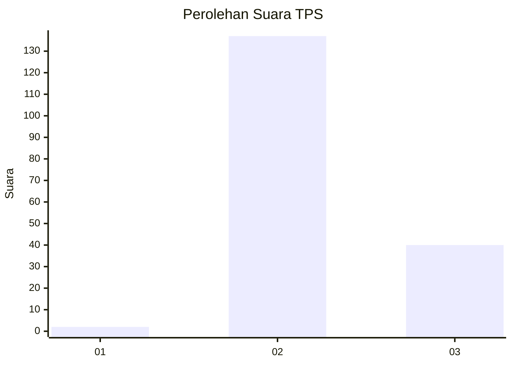
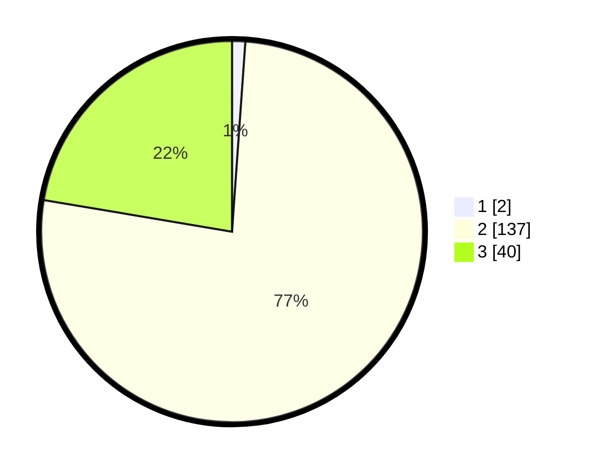

# Hasil

## Grafik

## Tabel

| No. | Nama Paslon    | Suara | Suara (raw) | Persentase |
|:--- |:-------------- | -----:| -----------:| ----------:|
| 1   | ANIES MUHAIMIN | 2     | [2][p-1]    | 1,12       |
| 2   | PRABOWO GIBRAN | 137   | [137][p-2]  | 76,54      |
| 3   | GANJAR MAHFUD  | 40    | [40][p-3]   | 22,35      |

[p-1]: https://github.com/gigit-pemilu/pemilu-2024-12-sumatera-utara/blob/main/pilpres/hitung-suara/sub/12-sumatera-utara/sub/11-dairi/sub/10-parbuluan/sub/2001-bangun/sub/003-tps/sub/paslon-1.txt
[p-2]: https://github.com/gigit-pemilu/pemilu-2024-12-sumatera-utara/blob/main/pilpres/hitung-suara/sub/12-sumatera-utara/sub/11-dairi/sub/10-parbuluan/sub/2001-bangun/sub/003-tps/sub/paslon-2.txt
[p-3]: https://github.com/gigit-pemilu/pemilu-2024-12-sumatera-utara/blob/main/pilpres/hitung-suara/sub/12-sumatera-utara/sub/11-dairi/sub/10-parbuluan/sub/2001-bangun/sub/003-tps/sub/paslon-3.txt

## Foto C Plano

https://sirekap-obj-formc.kpu.go.id/d4ab/pemilu/ppwp/12/11/10/20/01/1211102001003-20240214-155827--6046da3a-7a2e-4143-b0b0-8bbb260ab06d.jpg

https://sirekap-obj-formc.kpu.go.id/d4ab/pemilu/ppwp/12/11/10/20/01/1211102001003-20240214-155833--e4d1935b-39b7-462f-8a21-e0661600c666.jpg

https://sirekap-obj-formc.kpu.go.id/d4ab/pemilu/ppwp/12/11/10/20/01/1211102001003-20240214-155838--f22737c1-c2e3-4f7f-bc23-6f7931a5e5b7.jpg

## Metadata

| Key        | Value               |
| ---------- | ------------------- |
| Time Stamp | 2024-02-15 23:29:50 |

