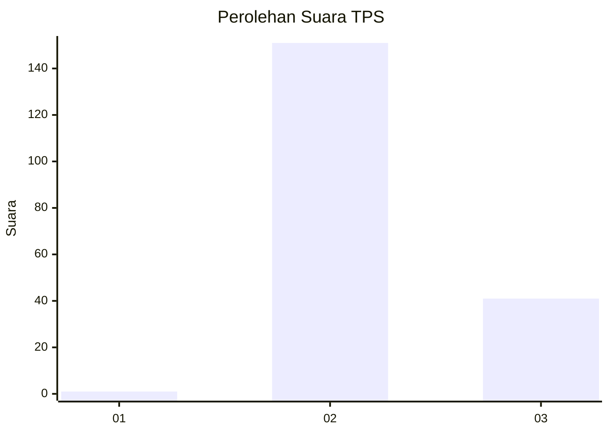
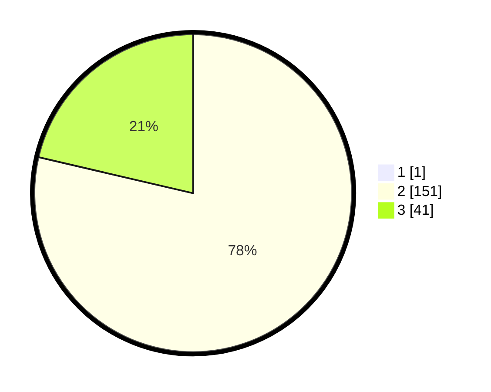

# Hasil

## Grafik

## Tabel

| No. | Nama Paslon    | Suara | Suara (raw) | Persentase |
|:--- |:-------------- | -----:| -----------:| ----------:|
| 1   | ANIES MUHAIMIN | 1     | [1][p-1]    | 0,52       |
| 2   | PRABOWO GIBRAN | 151   | [151][p-2]  | 78,24      |
| 3   | GANJAR MAHFUD  | 41    | [41][p-3]   | 21,24      |

[p-1]: https://github.com/gigit-pemilu/pemilu-2024/blob/main/pilpres/hitung-suara/sub/12-sumatera-utara/sub/11-dairi/sub/10-parbuluan/sub/2001-bangun/sub/004-tps/sub/paslon-1.txt
[p-2]: https://github.com/gigit-pemilu/pemilu-2024/blob/main/pilpres/hitung-suara/sub/12-sumatera-utara/sub/11-dairi/sub/10-parbuluan/sub/2001-bangun/sub/004-tps/sub/paslon-2.txt
[p-3]: https://github.com/gigit-pemilu/pemilu-2024/blob/main/pilpres/hitung-suara/sub/12-sumatera-utara/sub/11-dairi/sub/10-parbuluan/sub/2001-bangun/sub/004-tps/sub/paslon-3.txt

## Foto C Plano

https://sirekap-obj-formc.kpu.go.id/b3f7/pemilu/ppwp/12/11/10/20/01/1211102001004-20240214-190053--bbe74cb7-9b86-40b8-baeb-5201d0fa4bc4.jpg

https://sirekap-obj-formc.kpu.go.id/b3f7/pemilu/ppwp/12/11/10/20/01/1211102001004-20240214-190101--d174f655-d7e1-413f-a71c-73321cadae87.jpg

https://sirekap-obj-formc.kpu.go.id/b3f7/pemilu/ppwp/12/11/10/20/01/1211102001004-20240214-190107--2e1d1485-f357-44f8-9175-9348bc7fce25.jpg

## Metadata

| Key        | Value               |
| ---------- | ------------------- |
| Time Stamp | 2024-02-15 23:29:50 |

