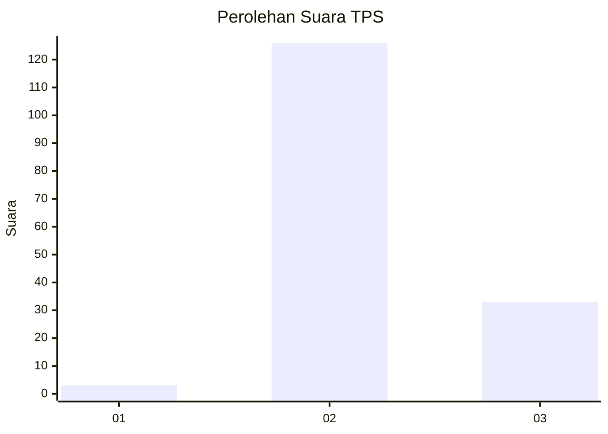

# Hasil

## Grafik

## Tabel

| No. | Nama Paslon    | Suara | Suara (raw) | Persentase |
|:--- |:-------------- | -----:| -----------:| ----------:|
| 1   | ANIES MUHAIMIN | 3     | [3][p-1]    | 1,85       |
| 2   | PRABOWO GIBRAN | 126   | [126][p-2]  | 77,78      |
| 3   | GANJAR MAHFUD  | 33    | [33][p-3]   | 20,37      |

[p-1]: https://github.com/gigit-pemilu/pemilu-2024/blob/main/pilpres/hitung-suara/sub/12-sumatera-utara/sub/11-dairi/sub/10-parbuluan/sub/2003-parbuluan-iv/sub/002-tps/sub/paslon-1.txt
[p-2]: https://github.com/gigit-pemilu/pemilu-2024/blob/main/pilpres/hitung-suara/sub/12-sumatera-utara/sub/11-dairi/sub/10-parbuluan/sub/2003-parbuluan-iv/sub/002-tps/sub/paslon-2.txt
[p-3]: https://github.com/gigit-pemilu/pemilu-2024/blob/main/pilpres/hitung-suara/sub/12-sumatera-utara/sub/11-dairi/sub/10-parbuluan/sub/2003-parbuluan-iv/sub/002-tps/sub/paslon-3.txt

## Foto C Plano

https://sirekap-obj-formc.kpu.go.id/8f2b/pemilu/ppwp/12/11/10/20/03/1211102003002-20240214-141446--8bbb985c-345d-40cb-a3c5-99afca73819e.jpg

https://sirekap-obj-formc.kpu.go.id/8f2b/pemilu/ppwp/12/11/10/20/03/1211102003002-20240214-141543--a3a878a1-fccb-414f-9104-3df36f37d327.jpg

https://sirekap-obj-formc.kpu.go.id/8f2b/pemilu/ppwp/12/11/10/20/03/1211102003002-20240214-141650--8b5d31a2-053f-40df-9a72-e108760973fb.jpg

## Metadata

| Key        | Value               |
| ---------- | ------------------- |
| Time Stamp | 2024-02-15 23:29:50 |

