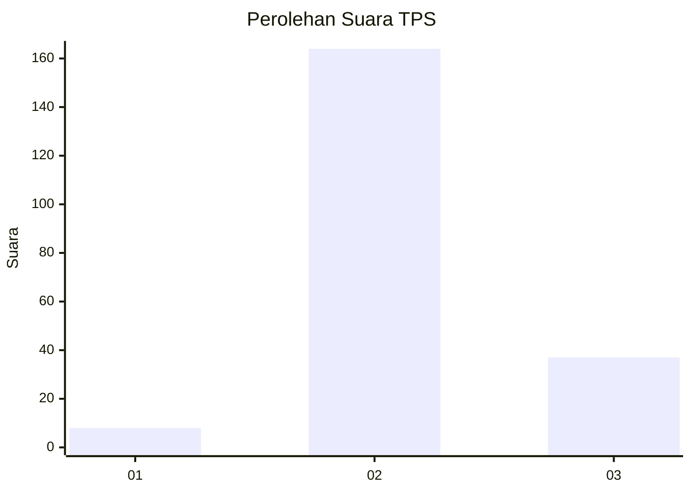

# Hasil

## Grafik

## Tabel

| No. | Nama Paslon    | Suara | Suara (raw) | Persentase |
|:--- |:-------------- | -----:| -----------:| ----------:|
| 1   | ANIES MUHAIMIN | 8     | [8][p-1]    | 3,83       |
| 2   | PRABOWO GIBRAN | 164   | [164][p-2]  | 78,47      |
| 3   | GANJAR MAHFUD  | 37    | [37][p-3]   | 17,70      |

[p-1]: https://github.com/gigit-pemilu/pemilu-2024/blob/main/pilpres/hitung-suara/sub/12-sumatera-utara/sub/11-dairi/sub/10-parbuluan/sub/2004-parbuluan-iii/sub/003-tps/sub/paslon-1.txt
[p-2]: https://github.com/gigit-pemilu/pemilu-2024/blob/main/pilpres/hitung-suara/sub/12-sumatera-utara/sub/11-dairi/sub/10-parbuluan/sub/2004-parbuluan-iii/sub/003-tps/sub/paslon-2.txt
[p-3]: https://github.com/gigit-pemilu/pemilu-2024/blob/main/pilpres/hitung-suara/sub/12-sumatera-utara/sub/11-dairi/sub/10-parbuluan/sub/2004-parbuluan-iii/sub/003-tps/sub/paslon-3.txt

## Foto C Plano

https://sirekap-obj-formc.kpu.go.id/a251/pemilu/ppwp/12/11/10/20/04/1211102004003-20240214-205442--7f3cd3f0-1d8b-48b0-b98c-5011f6cbf25c.jpg

https://sirekap-obj-formc.kpu.go.id/a251/pemilu/ppwp/12/11/10/20/04/1211102004003-20240214-205656--fa36d4af-268c-42ba-b94e-b95851bde5ef.jpg

https://sirekap-obj-formc.kpu.go.id/a251/pemilu/ppwp/12/11/10/20/04/1211102004003-20240214-205754--a1c03534-dd57-4be9-93b1-7d0b71cd9b9e.jpg

## Metadata

| Key        | Value               |
| ---------- | ------------------- |
| Time Stamp | 2024-02-15 23:29:50 |

