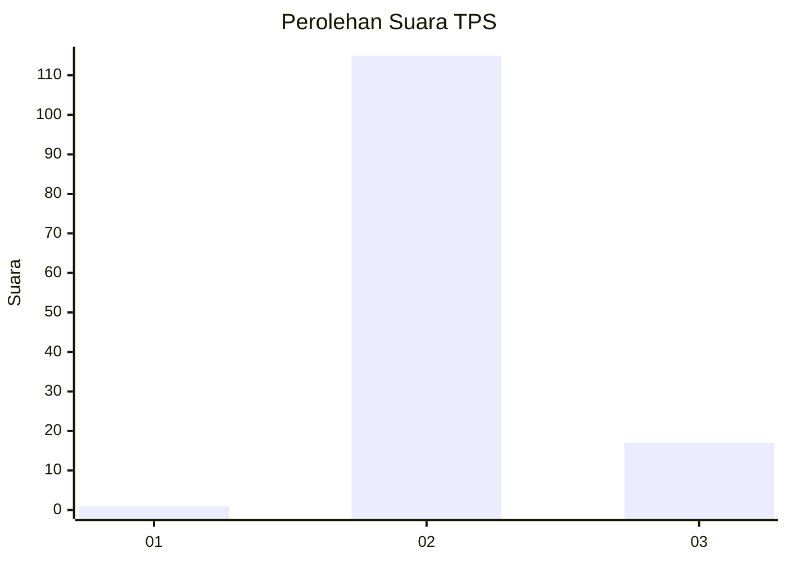
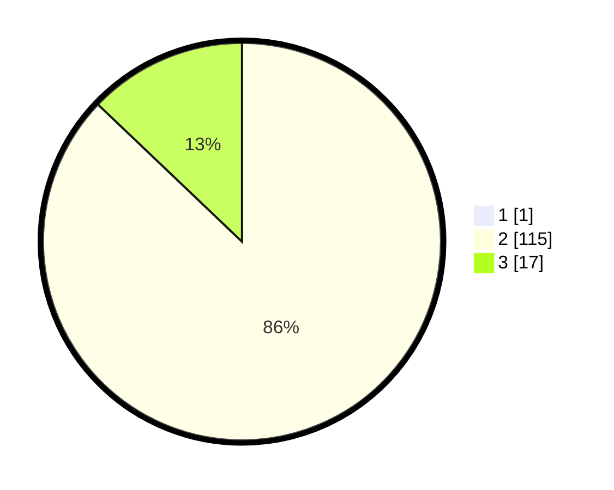

# Hasil

## Grafik

## Tabel

| No. | Nama Paslon    | Suara | Suara (raw) | Persentase |
|:--- |:-------------- | -----:| -----------:| ----------:|
| 1   | ANIES MUHAIMIN | 1     | [1][p-1]    | 0,75       |
| 2   | PRABOWO GIBRAN | 115   | [115][p-2]  | 86,47      |
| 3   | GANJAR MAHFUD  | 17    | [17][p-3]   | 12,78      |

[p-1]: https://github.com/gigit-pemilu/pemilu-2024-12-sumatera-utara/blob/main/pilpres/hitung-suara/sub/12-sumatera-utara/sub/11-dairi/sub/11-lae-parira/sub/2001-sumbul/sub/004-tps/sub/paslon-1.txt
[p-2]: https://github.com/gigit-pemilu/pemilu-2024-12-sumatera-utara/blob/main/pilpres/hitung-suara/sub/12-sumatera-utara/sub/11-dairi/sub/11-lae-parira/sub/2001-sumbul/sub/004-tps/sub/paslon-2.txt
[p-3]: https://github.com/gigit-pemilu/pemilu-2024-12-sumatera-utara/blob/main/pilpres/hitung-suara/sub/12-sumatera-utara/sub/11-dairi/sub/11-lae-parira/sub/2001-sumbul/sub/004-tps/sub/paslon-3.txt

## Foto C Plano

https://sirekap-obj-formc.kpu.go.id/18d3/pemilu/ppwp/12/11/11/20/01/1211112001004-20240215-040823--cbaa9f7f-004f-4b48-9dda-1a5c3b15a569.jpg

https://sirekap-obj-formc.kpu.go.id/18d3/pemilu/ppwp/12/11/11/20/01/1211112001004-20240215-040848--bf5ce358-2cfb-43a4-9d04-69589a083d15.jpg

https://sirekap-obj-formc.kpu.go.id/18d3/pemilu/ppwp/12/11/11/20/01/1211112001004-20240215-040909--7ceea074-ce6d-45d3-ae33-6bcab7c14274.jpg

## Metadata

| Key        | Value               |
| ---------- | ------------------- |
| Time Stamp | 2024-02-15 23:29:50 |

