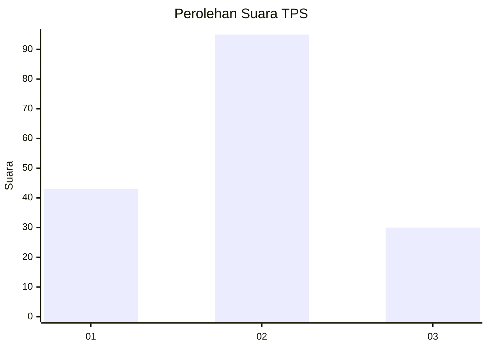
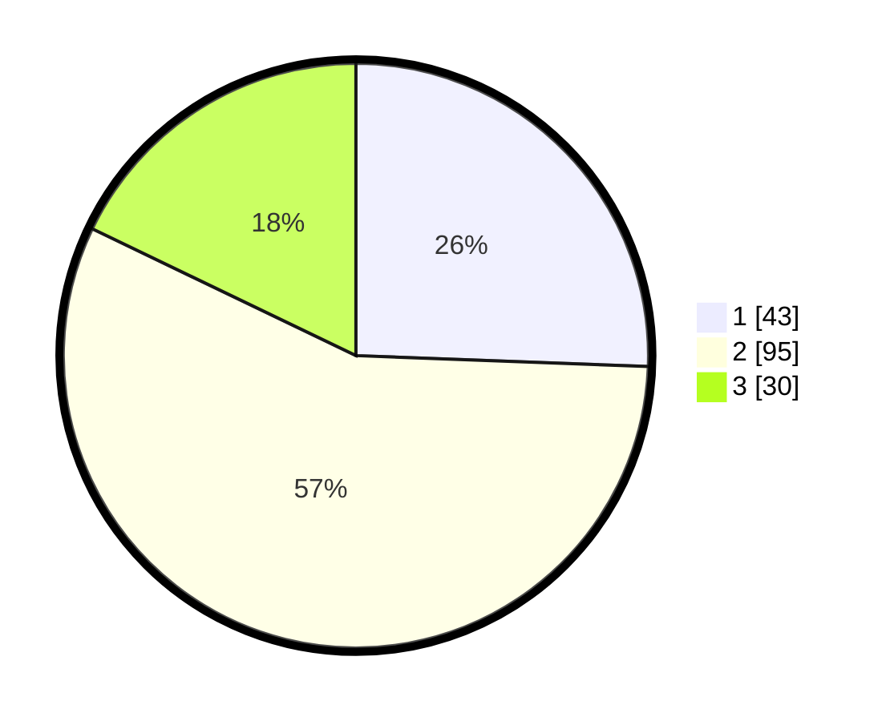

# Hasil

## Grafik

## Tabel

| No. | Nama Paslon    | Suara | Suara (raw) | Persentase |
|:--- |:-------------- | -----:| -----------:| ----------:|
| 1   | ANIES MUHAIMIN | 43    | [43][p-1]   | 25,60      |
| 2   | PRABOWO GIBRAN | 95    | [95][p-2]   | 56,55      |
| 3   | GANJAR MAHFUD  | 30    | [30][p-3]   | 17,86      |

[p-1]: https://github.com/gigit-pemilu/pemilu-2024-12-sumatera-utara/blob/main/pilpres/hitung-suara/sub/12-sumatera-utara/sub/11-dairi/sub/11-lae-parira/sub/2002-kentara/sub/001-tps/sub/paslon-1.txt
[p-2]: https://github.com/gigit-pemilu/pemilu-2024-12-sumatera-utara/blob/main/pilpres/hitung-suara/sub/12-sumatera-utara/sub/11-dairi/sub/11-lae-parira/sub/2002-kentara/sub/001-tps/sub/paslon-2.txt
[p-3]: https://github.com/gigit-pemilu/pemilu-2024-12-sumatera-utara/blob/main/pilpres/hitung-suara/sub/12-sumatera-utara/sub/11-dairi/sub/11-lae-parira/sub/2002-kentara/sub/001-tps/sub/paslon-3.txt

## Foto C Plano

https://sirekap-obj-formc.kpu.go.id/a1fe/pemilu/ppwp/12/11/11/20/02/1211112002001-20240214-221145--665b5bcc-566c-46b0-b2c8-82a966b2db25.jpg

https://sirekap-obj-formc.kpu.go.id/a1fe/pemilu/ppwp/12/11/11/20/02/1211112002001-20240215-021312--a3deadf9-4260-4efa-a2c3-401182aee7ac.jpg

https://sirekap-obj-formc.kpu.go.id/a1fe/pemilu/ppwp/12/11/11/20/02/1211112002001-20240215-022403--7b46b154-2a33-46ca-aa57-d36d2c36eb41.jpg

## Metadata

| Key        | Value               |
| ---------- | ------------------- |
| Time Stamp | 2024-02-15 23:29:50 |

