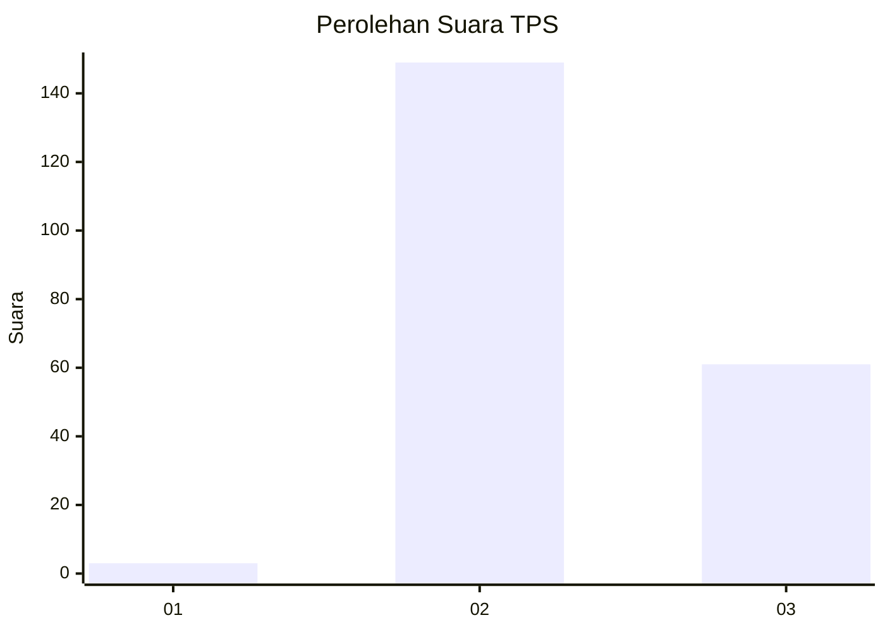

# Hasil

## Grafik

## Tabel

| No. | Nama Paslon    | Suara | Suara (raw) | Persentase |
|:--- |:-------------- | -----:| -----------:| ----------:|
| 1   | ANIES MUHAIMIN | 3     | [3][p-1]    | 1,41       |
| 2   | PRABOWO GIBRAN | 149   | [149][p-2]  | 69,95      |
| 3   | GANJAR MAHFUD  | 61    | [61][p-3]   | 28,64      |

[p-1]: https://github.com/gigit-pemilu/pemilu-2024-12-sumatera-utara/blob/main/pilpres/hitung-suara/sub/12-sumatera-utara/sub/11-dairi/sub/12-gunung-sitember/sub/2001-bukit-lau-kersik/sub/005-tps/sub/paslon-1.txt
[p-2]: https://github.com/gigit-pemilu/pemilu-2024-12-sumatera-utara/blob/main/pilpres/hitung-suara/sub/12-sumatera-utara/sub/11-dairi/sub/12-gunung-sitember/sub/2001-bukit-lau-kersik/sub/005-tps/sub/paslon-2.txt
[p-3]: https://github.com/gigit-pemilu/pemilu-2024-12-sumatera-utara/blob/main/pilpres/hitung-suara/sub/12-sumatera-utara/sub/11-dairi/sub/12-gunung-sitember/sub/2001-bukit-lau-kersik/sub/005-tps/sub/paslon-3.txt

## Foto C Plano

https://sirekap-obj-formc.kpu.go.id/9ab6/pemilu/ppwp/12/11/12/20/01/1211122001005-20240215-123153--fe8ea2a9-126f-43a0-8070-8145502b2f1d.jpg

https://sirekap-obj-formc.kpu.go.id/9ab6/pemilu/ppwp/12/11/12/20/01/1211122001005-20240215-015845--6c967593-c04e-4e49-bd32-62b98bd9332f.jpg

https://sirekap-obj-formc.kpu.go.id/9ab6/pemilu/ppwp/12/11/12/20/01/1211122001005-20240215-020155--55eba96d-18fb-4e65-8b10-048fadc4cfc0.jpg

## Metadata

| Key        | Value               |
| ---------- | ------------------- |
| Time Stamp | 2024-02-25 16:00:00 |

