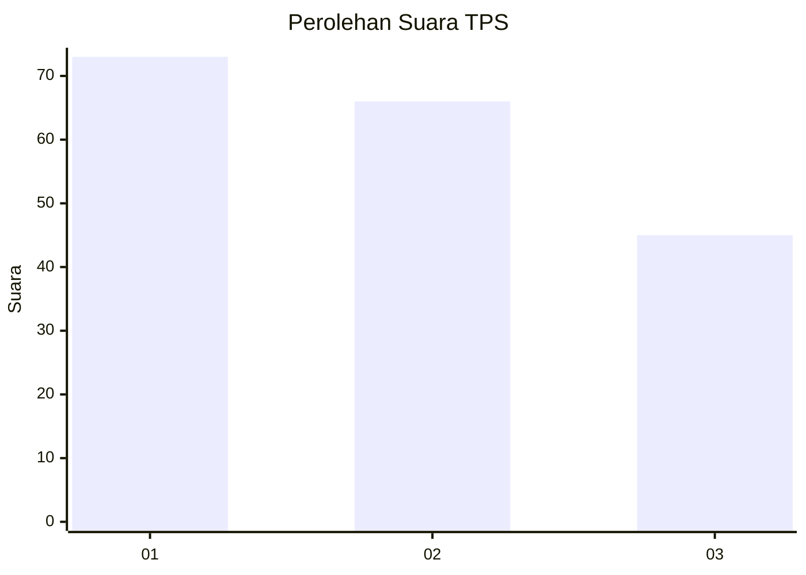
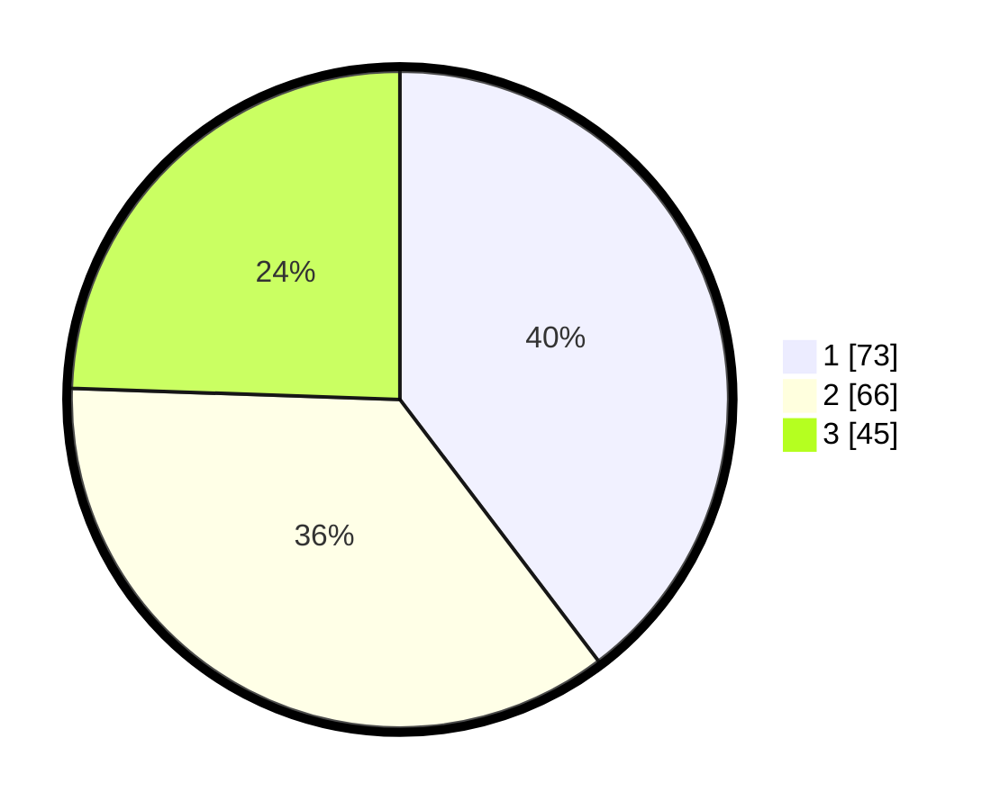

# Hasil

## Grafik

## Tabel

| No. | Nama Paslon    | Suara | Suara (raw) | Persentase |
|:--- |:-------------- | -----:| -----------:| ----------:|
| 1   | ANIES MUHAIMIN | 73    | [73][p-1]   | 39,67      |
| 2   | PRABOWO GIBRAN | 66    | [66][p-2]   | 35,87      |
| 3   | GANJAR MAHFUD  | 45    | [45][p-3]   | 24,46      |

[p-1]: https://github.com/gigit-pemilu/pemilu-2024/blob/main/pilpres/hitung-suara/sub/12-sumatera-utara/sub/11-dairi/sub/12-gunung-sitember/sub/2002-gunung-sitember/sub/005-tps/sub/paslon-1.txt
[p-2]: https://github.com/gigit-pemilu/pemilu-2024/blob/main/pilpres/hitung-suara/sub/12-sumatera-utara/sub/11-dairi/sub/12-gunung-sitember/sub/2002-gunung-sitember/sub/005-tps/sub/paslon-2.txt
[p-3]: https://github.com/gigit-pemilu/pemilu-2024/blob/main/pilpres/hitung-suara/sub/12-sumatera-utara/sub/11-dairi/sub/12-gunung-sitember/sub/2002-gunung-sitember/sub/005-tps/sub/paslon-3.txt

## Foto C Plano

https://sirekap-obj-formc.kpu.go.id/918d/pemilu/ppwp/12/11/12/20/02/1211122002005-20240215-094114--67d910ea-d97f-4f8a-ab44-6c430de3cdb6.jpg

https://sirekap-obj-formc.kpu.go.id/918d/pemilu/ppwp/12/11/12/20/02/1211122002005-20240215-094216--0201e058-a3fd-4bae-b430-57cd93498cd4.jpg

https://sirekap-obj-formc.kpu.go.id/918d/pemilu/ppwp/12/11/12/20/02/1211122002005-20240215-094324--82f5a532-e12c-4bc4-bcf8-4d7d16ec7847.jpg

## Metadata

| Key        | Value               |
| ---------- | ------------------- |
| Time Stamp | 2024-02-24 22:31:28 |

