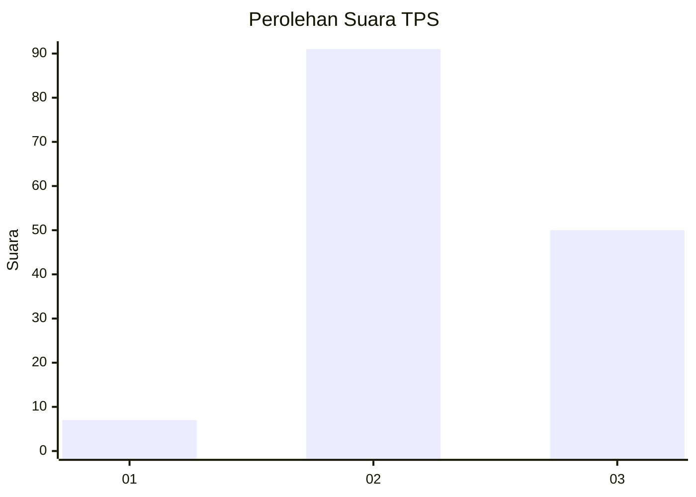
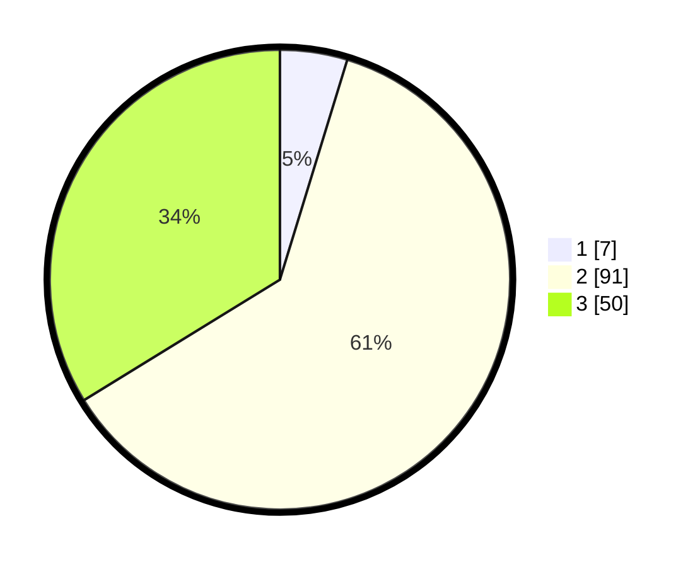

# Hasil

## Grafik

## Tabel

| No. | Nama Paslon    | Suara | Suara (raw) | Persentase |
|:--- |:-------------- | -----:| -----------:| ----------:|
| 1   | ANIES MUHAIMIN | 7     | [7][p-1]    | 4,73       |
| 2   | PRABOWO GIBRAN | 91    | [91][p-2]   | 61,49      |
| 3   | GANJAR MAHFUD  | 50    | [50][p-3]   | 33,78      |

[p-1]: https://github.com/gigit-pemilu/pemilu-2024/blob/main/pilpres/hitung-suara/sub/12-sumatera-utara/sub/11-dairi/sub/12-gunung-sitember/sub/2007-lau-lebah/sub/002-tps/sub/paslon-1.txt
[p-2]: https://github.com/gigit-pemilu/pemilu-2024/blob/main/pilpres/hitung-suara/sub/12-sumatera-utara/sub/11-dairi/sub/12-gunung-sitember/sub/2007-lau-lebah/sub/002-tps/sub/paslon-2.txt
[p-3]: https://github.com/gigit-pemilu/pemilu-2024/blob/main/pilpres/hitung-suara/sub/12-sumatera-utara/sub/11-dairi/sub/12-gunung-sitember/sub/2007-lau-lebah/sub/002-tps/sub/paslon-3.txt

## Foto C Plano

https://sirekap-obj-formc.kpu.go.id/55fa/pemilu/ppwp/12/11/12/20/07/1211122007002-20240215-003826--696a9855-4dbf-4fea-91d3-99f0f3f05dac.jpg

https://sirekap-obj-formc.kpu.go.id/55fa/pemilu/ppwp/12/11/12/20/07/1211122007002-20240215-093502--66283253-fb0d-4d70-b467-9c0e3c6ca736.jpg

https://sirekap-obj-formc.kpu.go.id/55fa/pemilu/ppwp/12/11/12/20/07/1211122007002-20240215-093658--6c8efcf9-7ec9-49cd-99f7-abfa2a94df63.jpg

## Metadata

| Key        | Value               |
| ---------- | ------------------- |
| Time Stamp | 2024-02-16 12:51:22 |

