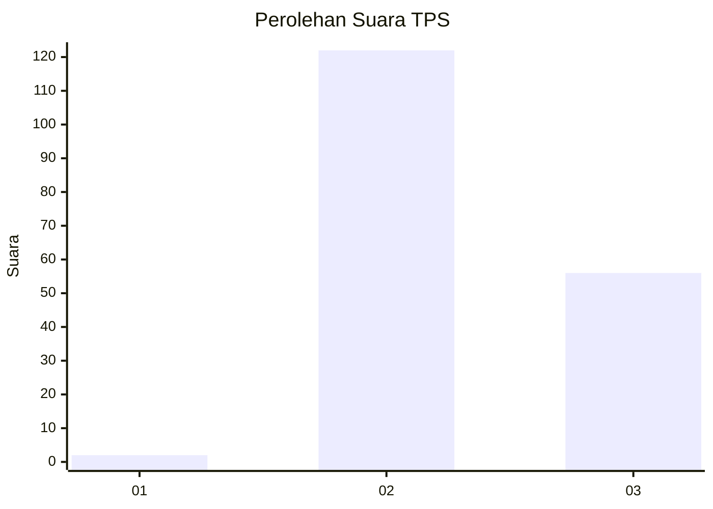
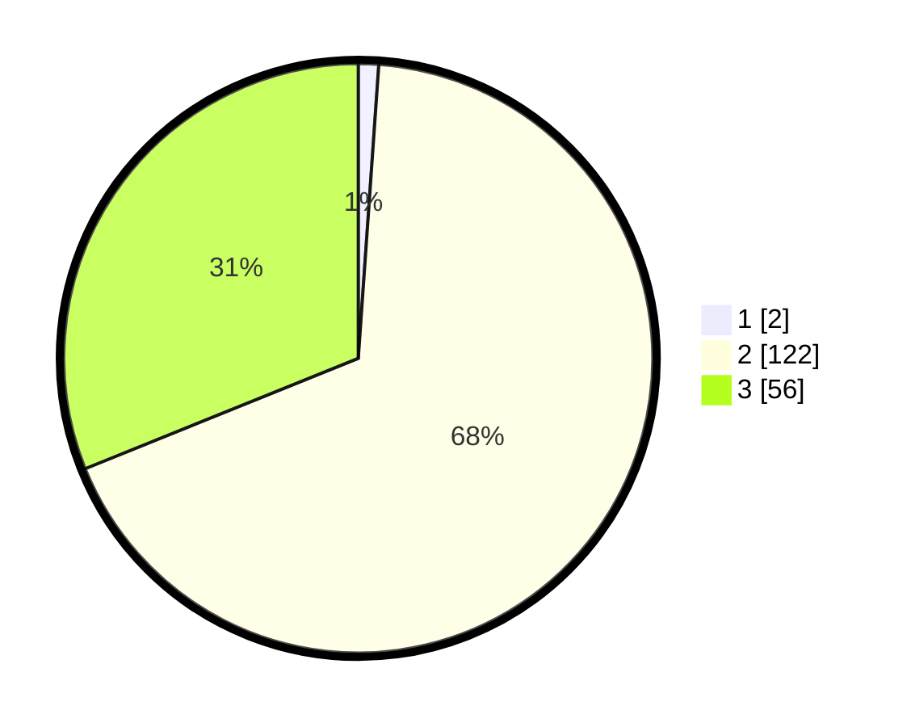

# Hasil

## Grafik

## Tabel

| No. | Nama Paslon    | Suara | Suara (raw) | Persentase |
|:--- |:-------------- | -----:| -----------:| ----------:|
| 1   | ANIES MUHAIMIN | 2     | [2][p-1]    | 1,11       |
| 2   | PRABOWO GIBRAN | 122   | [122][p-2]  | 67,78      |
| 3   | GANJAR MAHFUD  | 56    | [56][p-3]   | 31,11      |

[p-1]: https://github.com/gigit-pemilu/pemilu-2024-12-sumatera-utara/blob/main/pilpres/hitung-suara/sub/12-sumatera-utara/sub/11-dairi/sub/13-berampu/sub/2001-sambaliang/sub/001-tps/sub/paslon-1.txt
[p-2]: https://github.com/gigit-pemilu/pemilu-2024-12-sumatera-utara/blob/main/pilpres/hitung-suara/sub/12-sumatera-utara/sub/11-dairi/sub/13-berampu/sub/2001-sambaliang/sub/001-tps/sub/paslon-2.txt
[p-3]: https://github.com/gigit-pemilu/pemilu-2024-12-sumatera-utara/blob/main/pilpres/hitung-suara/sub/12-sumatera-utara/sub/11-dairi/sub/13-berampu/sub/2001-sambaliang/sub/001-tps/sub/paslon-3.txt

## Foto C Plano

https://sirekap-obj-formc.kpu.go.id/70bb/pemilu/ppwp/12/11/13/20/01/1211132001001-20240214-221722--016d4282-a7ea-4dfc-b8f2-e715ac88cbd1.jpg

https://sirekap-obj-formc.kpu.go.id/70bb/pemilu/ppwp/12/11/13/20/01/1211132001001-20240214-222018--5d158395-0337-478f-9a54-c02dc40935cb.jpg

https://sirekap-obj-formc.kpu.go.id/70bb/pemilu/ppwp/12/11/13/20/01/1211132001001-20240214-222150--1c5a873a-a15c-4578-805c-583bc58a54d9.jpg

## Metadata

| Key        | Value               |
| ---------- | ------------------- |
| Time Stamp | 2024-02-15 23:29:50 |

