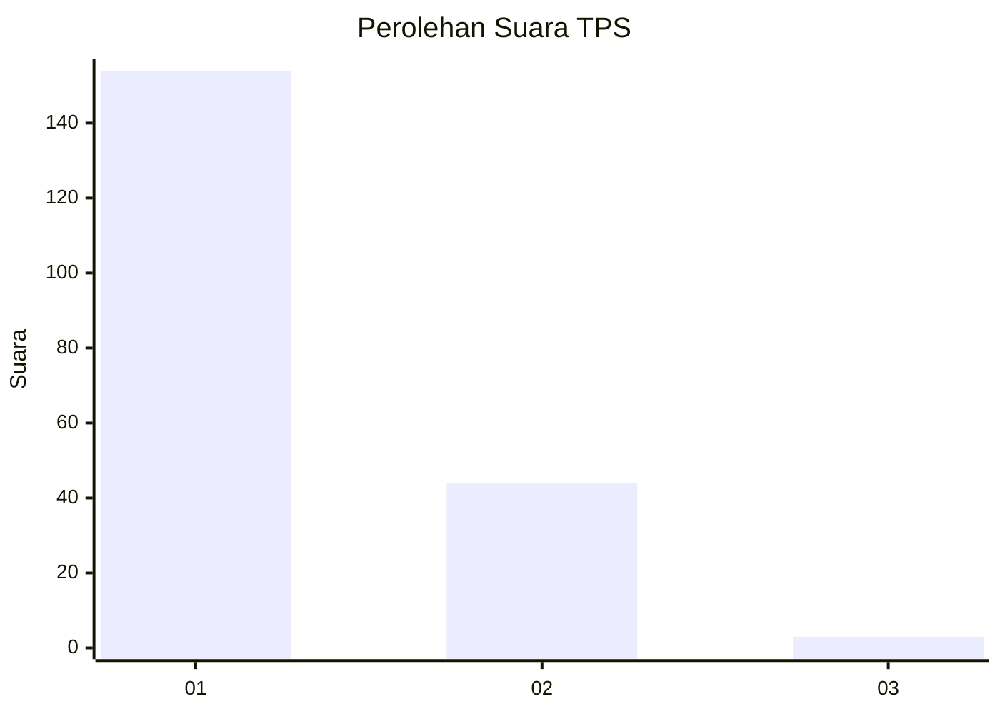
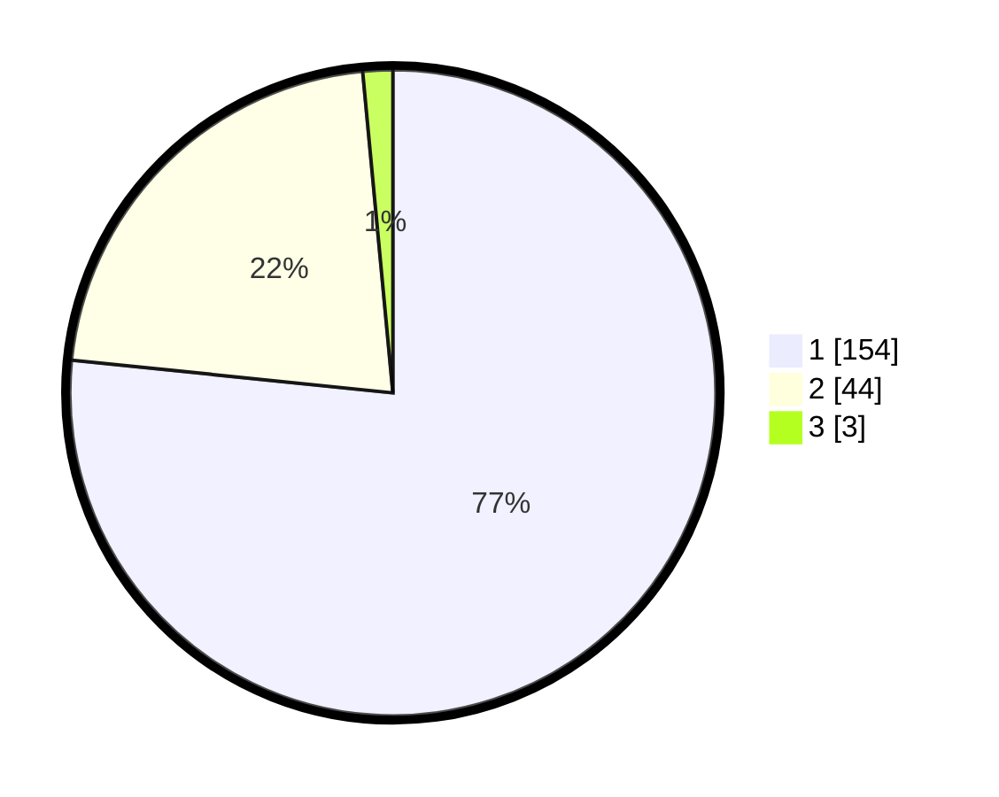

# Hasil

## Grafik

## Tabel

| No. | Nama Paslon    | Suara | Suara (raw) | Persentase |
|:--- |:-------------- | -----:| -----------:| ----------:|
| 1   | ANIES MUHAIMIN | 154   | [154][p-1]  | 76,62      |
| 2   | PRABOWO GIBRAN | 44    | [44][p-2]   | 21,89      |
| 3   | GANJAR MAHFUD  | 3     | [3][p-3]    | 1,49       |

[p-1]: https://github.com/gigit-pemilu/pemilu-2024-12-sumatera-utara/blob/main/pilpres/hitung-suara/sub/12-sumatera-utara/sub/11-dairi/sub/13-berampu/sub/2002-pasi/sub/001-tps/sub/paslon-1.txt
[p-2]: https://github.com/gigit-pemilu/pemilu-2024-12-sumatera-utara/blob/main/pilpres/hitung-suara/sub/12-sumatera-utara/sub/11-dairi/sub/13-berampu/sub/2002-pasi/sub/001-tps/sub/paslon-2.txt
[p-3]: https://github.com/gigit-pemilu/pemilu-2024-12-sumatera-utara/blob/main/pilpres/hitung-suara/sub/12-sumatera-utara/sub/11-dairi/sub/13-berampu/sub/2002-pasi/sub/001-tps/sub/paslon-3.txt

## Foto C Plano

https://sirekap-obj-formc.kpu.go.id/d636/pemilu/ppwp/12/11/13/20/02/1211132002001-20240215-002204--88a5bd43-cd8b-4f30-91d0-9d569ac56b20.jpg

https://sirekap-obj-formc.kpu.go.id/d636/pemilu/ppwp/12/11/13/20/02/1211132002001-20240215-003801--f6dd3aea-2a32-43f0-9702-e266df7a8356.jpg

https://sirekap-obj-formc.kpu.go.id/d636/pemilu/ppwp/12/11/13/20/02/1211132002001-20240215-003250--04e8c5c4-d5f7-49a2-a0e2-cb90cd065edb.jpg

## Metadata

| Key        | Value               |
| ---------- | ------------------- |
| Time Stamp | 2024-02-15 23:29:50 |

