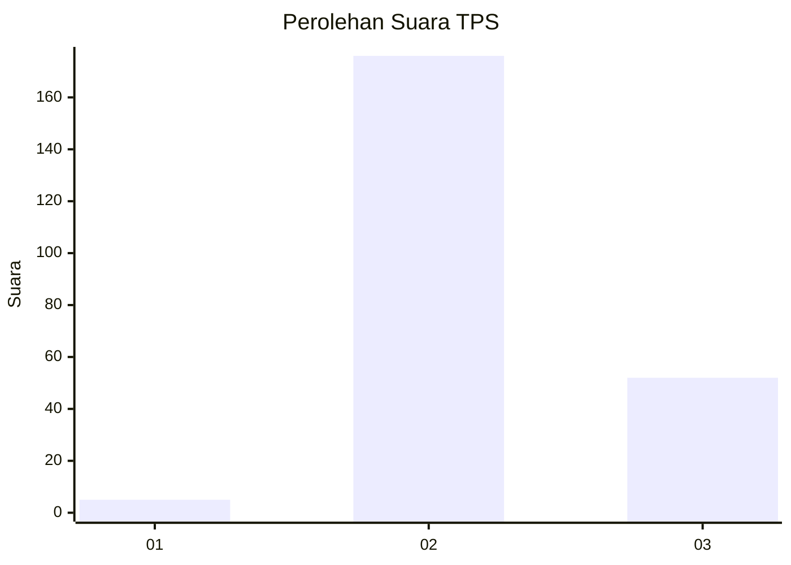
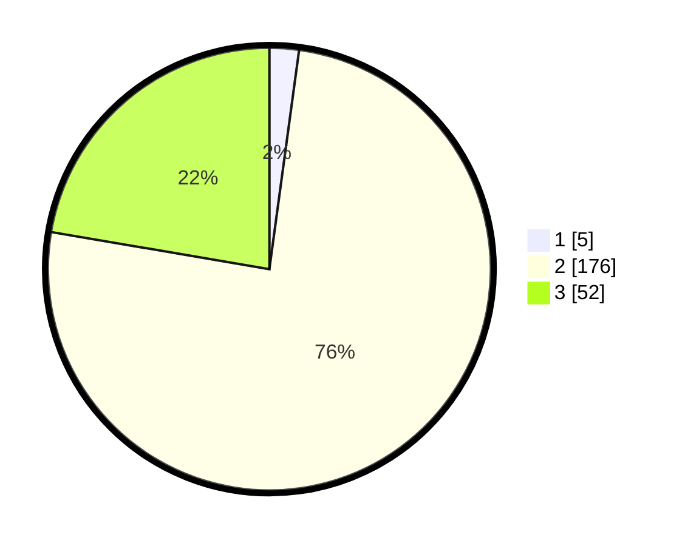

# Hasil

## Grafik

## Tabel

| No. | Nama Paslon    | Suara | Suara (raw) | Persentase |
|:--- |:-------------- | -----:| -----------:| ----------:|
| 1   | ANIES MUHAIMIN | 5     | [5][p-1]    | 2,15       |
| 2   | PRABOWO GIBRAN | 176   | [176][p-2]  | 75,54      |
| 3   | GANJAR MAHFUD  | 52    | [52][p-3]   | 22,32      |

[p-1]: https://github.com/gigit-pemilu/pemilu-2024/blob/main/pilpres/hitung-suara/sub/12-sumatera-utara/sub/11-dairi/sub/14-silahisabungan/sub/2001-silalahi-ii/sub/003-tps/sub/paslon-1.txt
[p-2]: https://github.com/gigit-pemilu/pemilu-2024/blob/main/pilpres/hitung-suara/sub/12-sumatera-utara/sub/11-dairi/sub/14-silahisabungan/sub/2001-silalahi-ii/sub/003-tps/sub/paslon-2.txt
[p-3]: https://github.com/gigit-pemilu/pemilu-2024/blob/main/pilpres/hitung-suara/sub/12-sumatera-utara/sub/11-dairi/sub/14-silahisabungan/sub/2001-silalahi-ii/sub/003-tps/sub/paslon-3.txt

## Foto C Plano

https://sirekap-obj-formc.kpu.go.id/5748/pemilu/ppwp/12/11/14/20/01/1211142001003-20240215-013935--12f7bd2d-9d93-471f-b1f1-0e8f721949d4.jpg

https://sirekap-obj-formc.kpu.go.id/5748/pemilu/ppwp/12/11/14/20/01/1211142001003-20240216-151640--e486a2ee-8ef0-472b-9201-5c5c1c8e66fa.jpg

https://sirekap-obj-formc.kpu.go.id/5748/pemilu/ppwp/12/11/14/20/01/1211142001003-20240216-151640--93cf38cc-06fb-4bbe-a693-9d473adaef7e.jpg

## Metadata

| Key        | Value               |
| ---------- | ------------------- |
| Time Stamp | 2024-02-16 21:01:00 |

