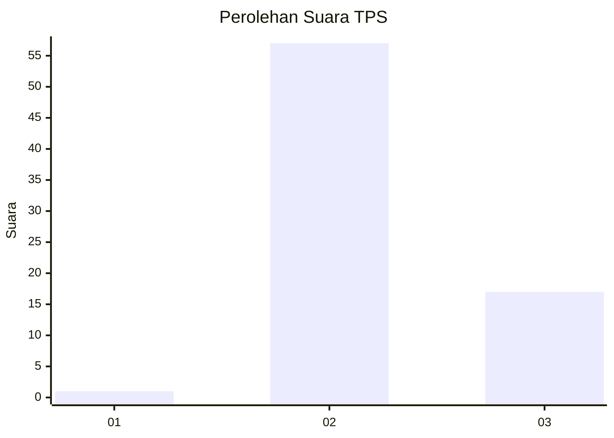
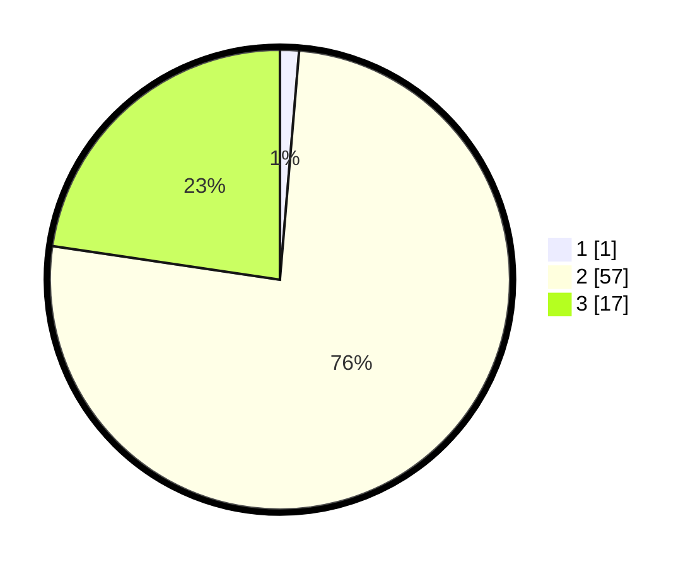

# Hasil

## Grafik

## Tabel

| No. | Nama Paslon    | Suara | Suara (raw) | Persentase |
|:--- |:-------------- | -----:| -----------:| ----------:|
| 1   | ANIES MUHAIMIN | 1     | [1][p-1]    | 1,33       |
| 2   | PRABOWO GIBRAN | 57    | [57][p-2]   | 76,00      |
| 3   | GANJAR MAHFUD  | 17    | [17][p-3]   | 22,67      |

[p-1]: https://github.com/gigit-pemilu/pemilu-2024/blob/main/pilpres/hitung-suara/sub/12-sumatera-utara/sub/11-dairi/sub/14-silahisabungan/sub/2001-silalahi-ii/sub/004-tps/sub/paslon-1.txt
[p-2]: https://github.com/gigit-pemilu/pemilu-2024/blob/main/pilpres/hitung-suara/sub/12-sumatera-utara/sub/11-dairi/sub/14-silahisabungan/sub/2001-silalahi-ii/sub/004-tps/sub/paslon-2.txt
[p-3]: https://github.com/gigit-pemilu/pemilu-2024/blob/main/pilpres/hitung-suara/sub/12-sumatera-utara/sub/11-dairi/sub/14-silahisabungan/sub/2001-silalahi-ii/sub/004-tps/sub/paslon-3.txt

## Foto C Plano

https://sirekap-obj-formc.kpu.go.id/5f4f/pemilu/ppwp/12/11/14/20/01/1211142001004-20240217-113721--aa34bdf8-3b00-4083-8c0c-57ebcef90ad6.jpg

https://sirekap-obj-formc.kpu.go.id/5f4f/pemilu/ppwp/12/11/14/20/01/1211142001004-20240217-113722--7ee825ec-2bb1-45ed-b9cc-a3b3e5bf124b.jpg

https://sirekap-obj-formc.kpu.go.id/5f4f/pemilu/ppwp/12/11/14/20/01/1211142001004-20240217-113722--20e5a58d-fe34-475d-bd81-4921c8e1e215.jpg

## Metadata

| Key        | Value               |
| ---------- | ------------------- |
| Time Stamp | 2024-02-19 13:00:00 |

## DATA PEMILIH TETAP

Jumlah pemilih dalam DPT: **93**.
 * L: **45**.
 * P: **48**.

## DATA PENGGUNA HAK PILIH

Jumlah pengguna hak pilih dalam DPT: **76**.
 * L: **42**.
 * P: **34**.

Jumlah pengguna hak pilih dalam DPTb: **1**.
 * L: **1**.
 * P: **0**.

Jumlah pengguna hak pilih dalam DPK: **0**.
 * L: **0**.
 * P: **0**.

Jumlah pengguna hak pilih: **77**.
 * L: **43**.
 * P: **34**.

## JUMLAH SUARA SAH DAN TIDAK SAH

JUMLAH SELURUH SUARA SAH: **75**.

JUMLAH SUARA TIDAK SAH: **2**.

JUMLAH SELURUH SUARA SAH DAN SUARA TIDAK SAH: **77**.

