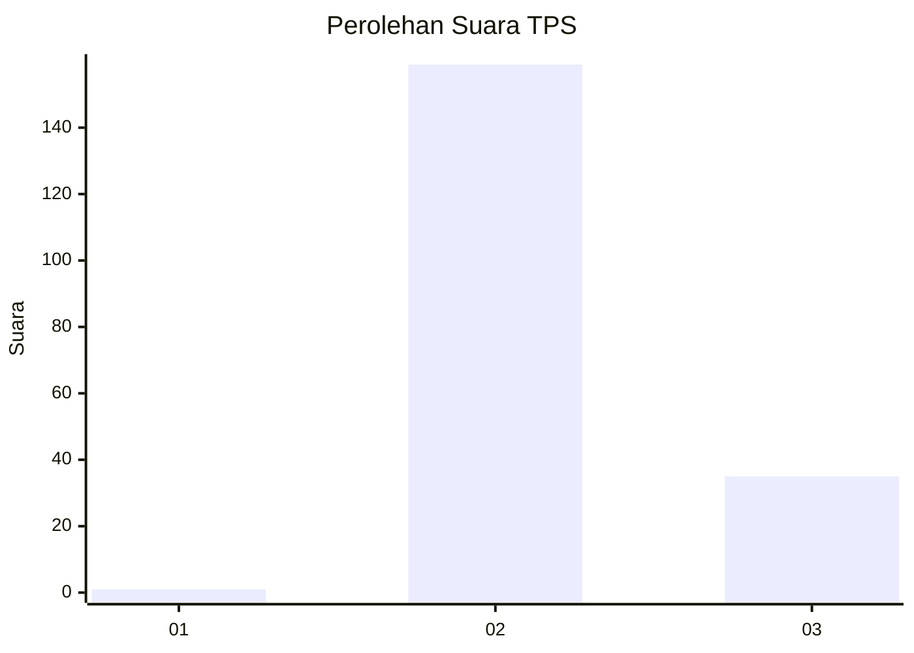
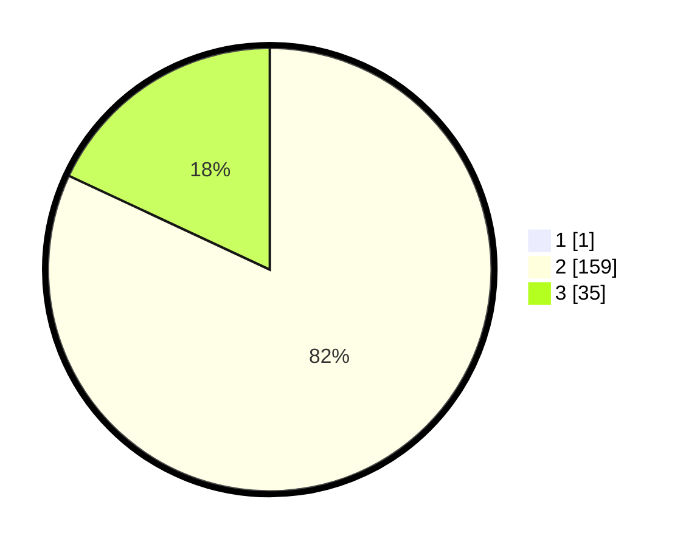

# Hasil

## Grafik

## Tabel

| No. | Nama Paslon    | Suara | Suara (raw) | Persentase |
|:--- |:-------------- | -----:| -----------:| ----------:|
| 1   | ANIES MUHAIMIN | 1     | [1][p-1]    | 0,51       |
| 2   | PRABOWO GIBRAN | 159   | [159][p-2]  | 81,54      |
| 3   | GANJAR MAHFUD  | 35    | [35][p-3]   | 17,95      |

[p-1]: https://github.com/gigit-pemilu/pemilu-2024-12-sumatera-utara/blob/main/pilpres/hitung-suara/sub/12-sumatera-utara/sub/11-dairi/sub/15-sitinjo/sub/1004-panji-dabutar/sub/001-tps/sub/paslon-1.txt
[p-2]: https://github.com/gigit-pemilu/pemilu-2024-12-sumatera-utara/blob/main/pilpres/hitung-suara/sub/12-sumatera-utara/sub/11-dairi/sub/15-sitinjo/sub/1004-panji-dabutar/sub/001-tps/sub/paslon-2.txt
[p-3]: https://github.com/gigit-pemilu/pemilu-2024-12-sumatera-utara/blob/main/pilpres/hitung-suara/sub/12-sumatera-utara/sub/11-dairi/sub/15-sitinjo/sub/1004-panji-dabutar/sub/001-tps/sub/paslon-3.txt

## Foto C Plano

https://sirekap-obj-formc.kpu.go.id/9be2/pemilu/ppwp/12/11/15/10/04/1211151004001-20240214-235002--d7458a47-817b-4f98-ba14-283374f33301.jpg

https://sirekap-obj-formc.kpu.go.id/9be2/pemilu/ppwp/12/11/15/10/04/1211151004001-20240214-235347--70629084-2099-4209-840c-6bd91928be94.jpg

https://sirekap-obj-formc.kpu.go.id/9be2/pemilu/ppwp/12/11/15/10/04/1211151004001-20240214-235518--5a765e58-5318-42fa-89e7-d07f8fd1f794.jpg

## Metadata

| Key        | Value               |
| ---------- | ------------------- |
| Time Stamp | 2024-02-15 23:29:50 |

