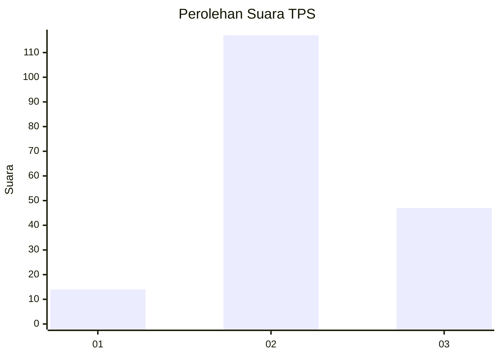

# Hasil

## Grafik

## Tabel

| No. | Nama Paslon    | Suara | Suara (raw) | Persentase |
|:--- |:-------------- | -----:| -----------:| ----------:|
| 1   | ANIES MUHAIMIN | 14    | [14][p-1]   | 7,87       |
| 2   | PRABOWO GIBRAN | 117   | [117][p-2]  | 65,73      |
| 3   | GANJAR MAHFUD  | 47    | [47][p-3]   | 26,40      |

[p-1]: https://github.com/gigit-pemilu/pemilu-2024/blob/main/pilpres/hitung-suara/sub/12-sumatera-utara/sub/11-dairi/sub/15-sitinjo/sub/1004-panji-dabutar/sub/006-tps/sub/paslon-1.txt
[p-2]: https://github.com/gigit-pemilu/pemilu-2024/blob/main/pilpres/hitung-suara/sub/12-sumatera-utara/sub/11-dairi/sub/15-sitinjo/sub/1004-panji-dabutar/sub/006-tps/sub/paslon-2.txt
[p-3]: https://github.com/gigit-pemilu/pemilu-2024/blob/main/pilpres/hitung-suara/sub/12-sumatera-utara/sub/11-dairi/sub/15-sitinjo/sub/1004-panji-dabutar/sub/006-tps/sub/paslon-3.txt

## Foto C Plano

https://sirekap-obj-formc.kpu.go.id/a268/pemilu/ppwp/12/11/15/10/04/1211151004006-20240214-213612--e13387e5-be23-400e-ba5c-0e55c069b402.jpg

https://sirekap-obj-formc.kpu.go.id/a268/pemilu/ppwp/12/11/15/10/04/1211151004006-20240214-213618--b16f09f1-7009-43b4-81eb-7b5c2c232989.jpg

https://sirekap-obj-formc.kpu.go.id/a268/pemilu/ppwp/12/11/15/10/04/1211151004006-20240214-213623--0c4c2225-2215-4b76-94c0-94a47c049881.jpg

## Metadata

| Key        | Value               |
| ---------- | ------------------- |
| Time Stamp | 2024-02-15 23:29:50 |

