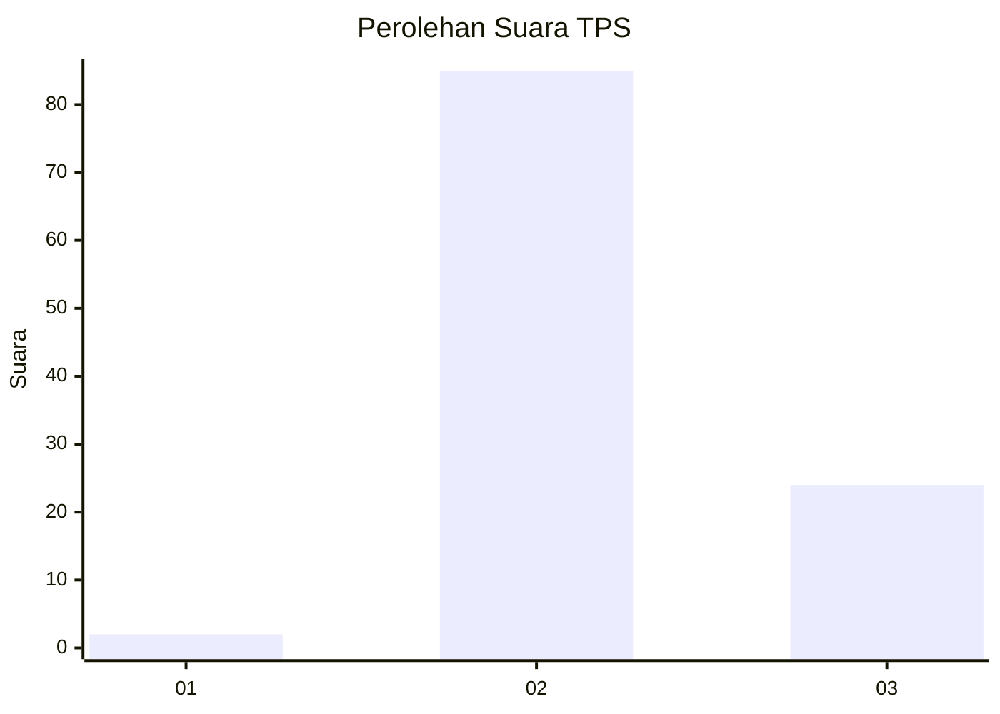
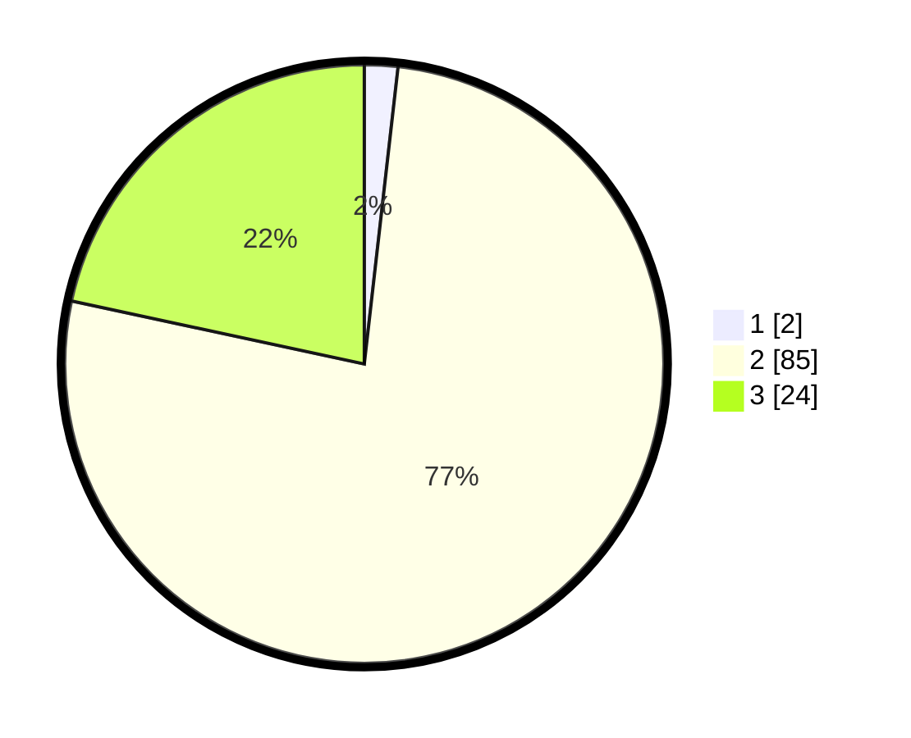

# Hasil

## Grafik

## Tabel

| No. | Nama Paslon    | Suara | Suara (raw) | Persentase |
|:--- |:-------------- | -----:| -----------:| ----------:|
| 1   | ANIES MUHAIMIN | 2     | [2][p-1]    | 1,80       |
| 2   | PRABOWO GIBRAN | 85    | [85][p-2]   | 76,58      |
| 3   | GANJAR MAHFUD  | 24    | [24][p-3]   | 21,62      |

[p-1]: https://github.com/gigit-pemilu/pemilu-2024/blob/main/pilpres/hitung-suara/sub/12-sumatera-utara/sub/12-toba/sub/01-balige/sub/2013-aek-bolon-julu/sub/002-tps/sub/paslon-1.txt
[p-2]: https://github.com/gigit-pemilu/pemilu-2024/blob/main/pilpres/hitung-suara/sub/12-sumatera-utara/sub/12-toba/sub/01-balige/sub/2013-aek-bolon-julu/sub/002-tps/sub/paslon-2.txt
[p-3]: https://github.com/gigit-pemilu/pemilu-2024/blob/main/pilpres/hitung-suara/sub/12-sumatera-utara/sub/12-toba/sub/01-balige/sub/2013-aek-bolon-julu/sub/002-tps/sub/paslon-3.txt

## Foto C Plano

https://sirekap-obj-formc.kpu.go.id/eb40/pemilu/ppwp/12/12/01/20/13/1212012013002-20240214-220039--a86aa092-ebd4-415b-a7c3-0e911a9df50f.jpg

https://sirekap-obj-formc.kpu.go.id/eb40/pemilu/ppwp/12/12/01/20/13/1212012013002-20240214-220147--e9b25bcc-ad53-4479-a03c-8cca5f3a94ad.jpg

https://sirekap-obj-formc.kpu.go.id/eb40/pemilu/ppwp/12/12/01/20/13/1212012013002-20240214-220248--f3ce8e77-b92d-4351-bec8-d0be3a706f6f.jpg

## Metadata

| Key        | Value               |
| ---------- | ------------------- |
| Time Stamp | 2024-02-19 09:00:00 |

