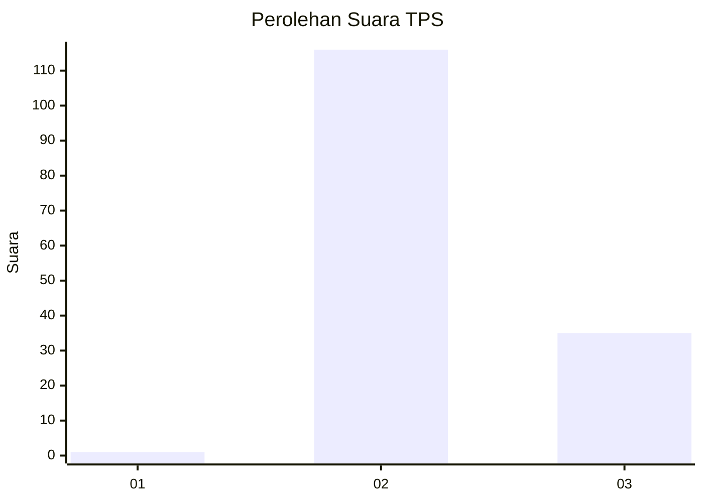
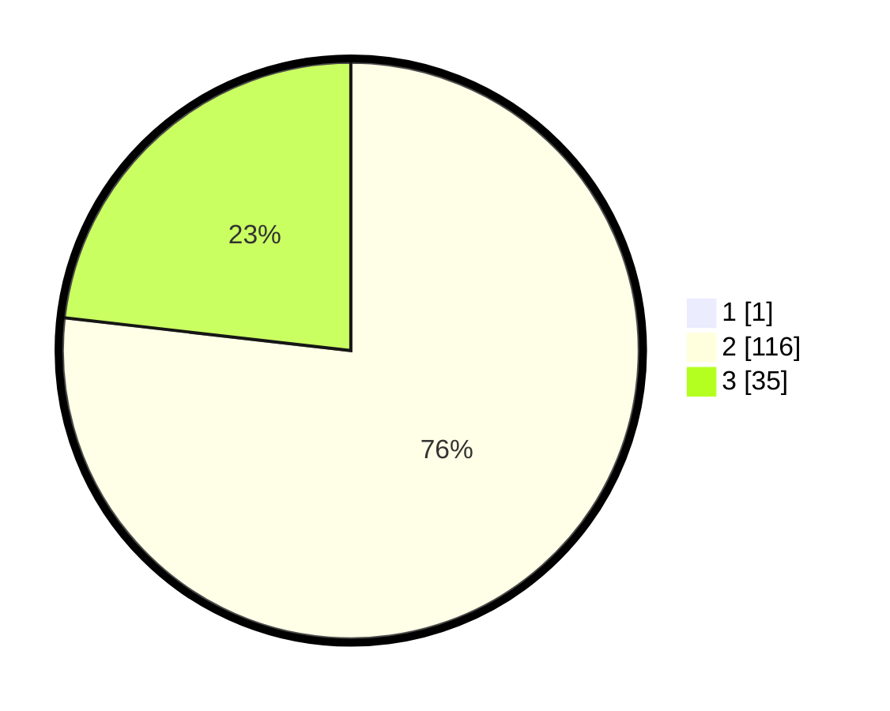

# Hasil

## Grafik

## Tabel

| No. | Nama Paslon    | Suara | Suara (raw) | Persentase |
|:--- |:-------------- | -----:| -----------:| ----------:|
| 1   | ANIES MUHAIMIN | 1     | [1][p-1]    | 0,66       |
| 2   | PRABOWO GIBRAN | 116   | [116][p-2]  | 76,32      |
| 3   | GANJAR MAHFUD  | 35    | [35][p-3]   | 23,03      |

[p-1]: https://github.com/gigit-pemilu/pemilu-2024/blob/main/pilpres/hitung-suara/sub/12-sumatera-utara/sub/12-toba/sub/01-balige/sub/2014-sibolahotang-sas/sub/003-tps/sub/paslon-1.txt
[p-2]: https://github.com/gigit-pemilu/pemilu-2024/blob/main/pilpres/hitung-suara/sub/12-sumatera-utara/sub/12-toba/sub/01-balige/sub/2014-sibolahotang-sas/sub/003-tps/sub/paslon-2.txt
[p-3]: https://github.com/gigit-pemilu/pemilu-2024/blob/main/pilpres/hitung-suara/sub/12-sumatera-utara/sub/12-toba/sub/01-balige/sub/2014-sibolahotang-sas/sub/003-tps/sub/paslon-3.txt

## Foto C Plano

https://sirekap-obj-formc.kpu.go.id/486c/pemilu/ppwp/12/12/01/20/14/1212012014003-20240215-031741--c164594c-0443-4269-bacd-0d5cff49de83.jpg

https://sirekap-obj-formc.kpu.go.id/486c/pemilu/ppwp/12/12/01/20/14/1212012014003-20240215-031753--8d98fb00-fdb5-42a5-9257-6f8576876979.jpg

https://sirekap-obj-formc.kpu.go.id/486c/pemilu/ppwp/12/12/01/20/14/1212012014003-20240215-031758--02064d44-4bf0-419a-9058-00e7873e33a8.jpg

## Metadata

| Key        | Value               |
| ---------- | ------------------- |
| Time Stamp | 2024-02-15 15:00:29 |

