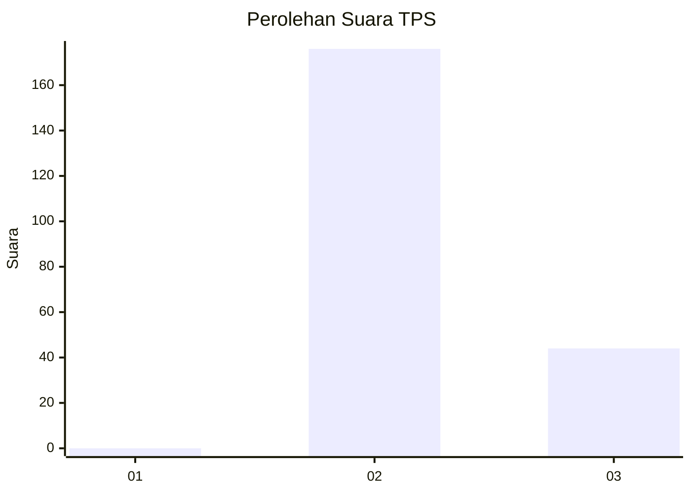
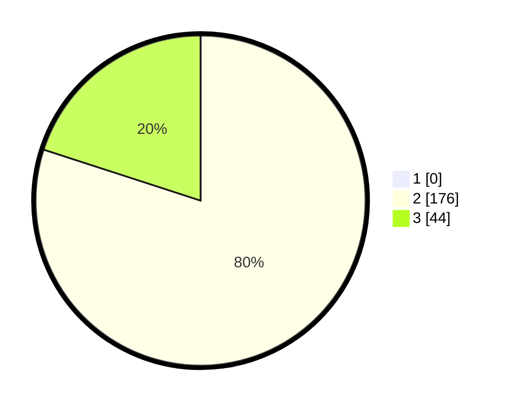

# Hasil

## Grafik

## Tabel

| No. | Nama Paslon    | Suara | Suara (raw) | Persentase |
|:--- |:-------------- | -----:| -----------:| ----------:|
| 1   | ANIES MUHAIMIN | 0     | [0][p-1]    | 0,00       |
| 2   | PRABOWO GIBRAN | 176   | [176][p-2]  | 80,00      |
| 3   | GANJAR MAHFUD  | 44    | [44][p-3]   | 20,00      |

[p-1]: https://github.com/gigit-pemilu/pemilu-2024/blob/main/pilpres/hitung-suara/sub/12-sumatera-utara/sub/12-toba/sub/01-balige/sub/2015-lumban-bulbul/sub/002-tps/sub/paslon-1.txt
[p-2]: https://github.com/gigit-pemilu/pemilu-2024/blob/main/pilpres/hitung-suara/sub/12-sumatera-utara/sub/12-toba/sub/01-balige/sub/2015-lumban-bulbul/sub/002-tps/sub/paslon-2.txt
[p-3]: https://github.com/gigit-pemilu/pemilu-2024/blob/main/pilpres/hitung-suara/sub/12-sumatera-utara/sub/12-toba/sub/01-balige/sub/2015-lumban-bulbul/sub/002-tps/sub/paslon-3.txt

## Foto C Plano

https://sirekap-obj-formc.kpu.go.id/c886/pemilu/ppwp/12/12/01/20/15/1212012015002-20240214-230403--944e673e-5997-4600-8d6d-9dad74cf22d7.jpg

https://sirekap-obj-formc.kpu.go.id/c886/pemilu/ppwp/12/12/01/20/15/1212012015002-20240214-230429--f83d2b9d-db2f-48cb-81d7-a0fc3b96a917.jpg

https://sirekap-obj-formc.kpu.go.id/c886/pemilu/ppwp/12/12/01/20/15/1212012015002-20240214-230453--28deb748-db4e-4eb5-a755-bb47d09eb94c.jpg

## Metadata

| Key        | Value               |
| ---------- | ------------------- |
| Time Stamp | 2024-02-19 10:00:00 |

