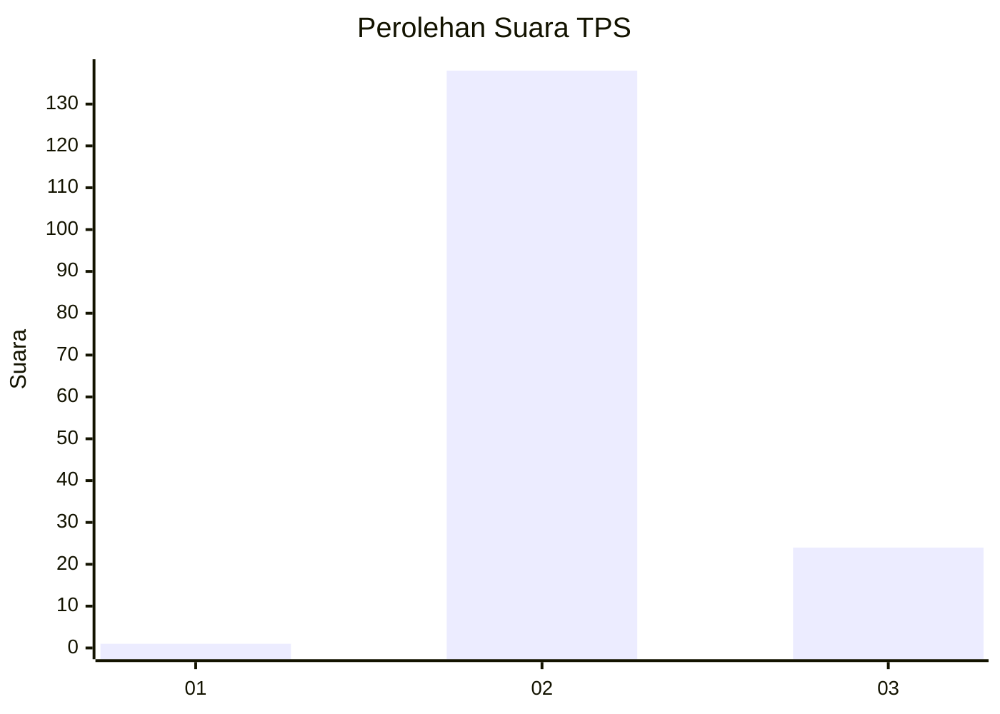
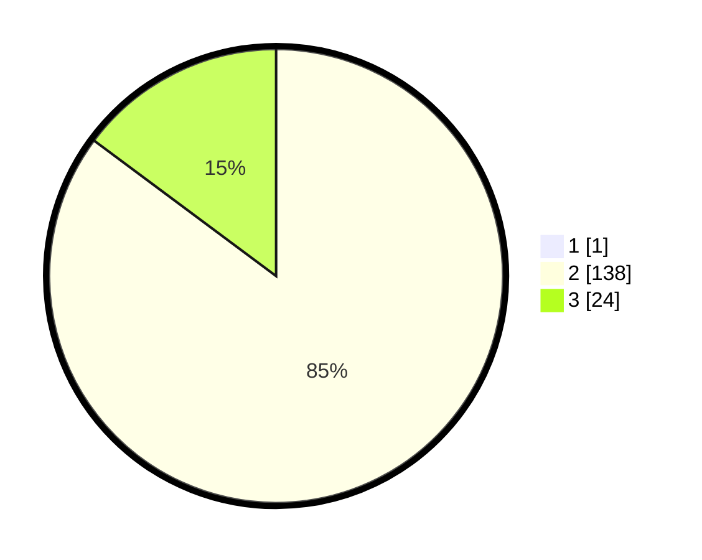

# Hasil

## Grafik

## Tabel

| No. | Nama Paslon    | Suara | Suara (raw) | Persentase |
|:--- |:-------------- | -----:| -----------:| ----------:|
| 1   | ANIES MUHAIMIN | 1     | [1][p-1]    | 0,61       |
| 2   | PRABOWO GIBRAN | 138   | [138][p-2]  | 84,66      |
| 3   | GANJAR MAHFUD  | 24    | [24][p-3]   | 14,72      |

[p-1]: https://github.com/gigit-pemilu/pemilu-2024/blob/main/pilpres/hitung-suara/sub/12-sumatera-utara/sub/12-toba/sub/04-habinsaran/sub/2018-batu-nabolon/sub/002-tps/sub/paslon-1.txt
[p-2]: https://github.com/gigit-pemilu/pemilu-2024/blob/main/pilpres/hitung-suara/sub/12-sumatera-utara/sub/12-toba/sub/04-habinsaran/sub/2018-batu-nabolon/sub/002-tps/sub/paslon-2.txt
[p-3]: https://github.com/gigit-pemilu/pemilu-2024/blob/main/pilpres/hitung-suara/sub/12-sumatera-utara/sub/12-toba/sub/04-habinsaran/sub/2018-batu-nabolon/sub/002-tps/sub/paslon-3.txt

## Foto C Plano

https://sirekap-obj-formc.kpu.go.id/30a9/pemilu/ppwp/12/12/04/20/18/1212042018002-20240215-093832--a0b95b7f-5ba8-4fc6-a287-b85f1148a1e1.jpg

https://sirekap-obj-formc.kpu.go.id/30a9/pemilu/ppwp/12/12/04/20/18/1212042018002-20240215-093912--2f1de851-40c1-47c0-892f-a15173165a9c.jpg

https://sirekap-obj-formc.kpu.go.id/30a9/pemilu/ppwp/12/12/04/20/18/1212042018002-20240215-094439--95a35860-7a7d-43b7-8d8c-393c1ae8a29a.jpg

## Metadata

| Key        | Value               |
| ---------- | ------------------- |
| Time Stamp | 2024-02-16 08:00:28 |

