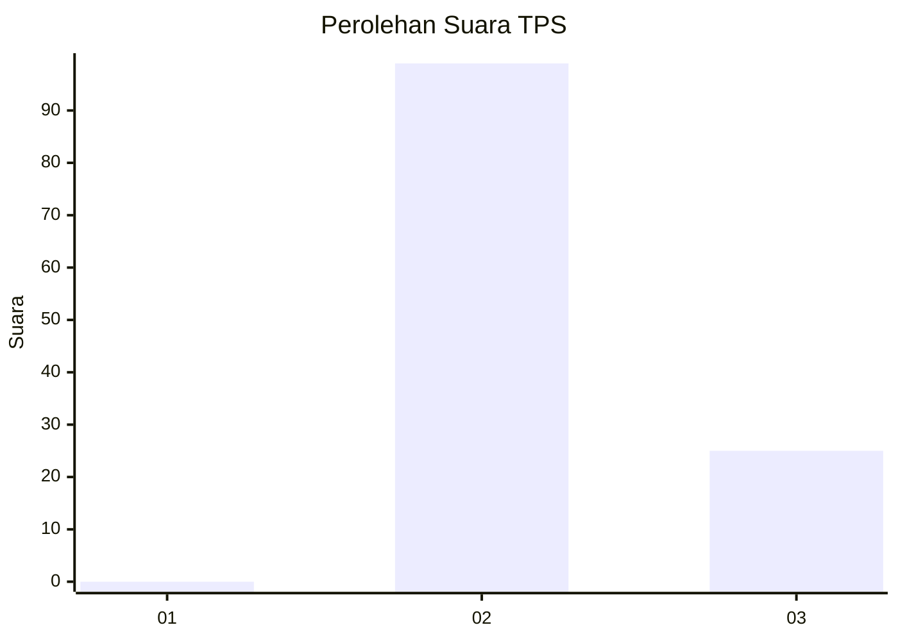
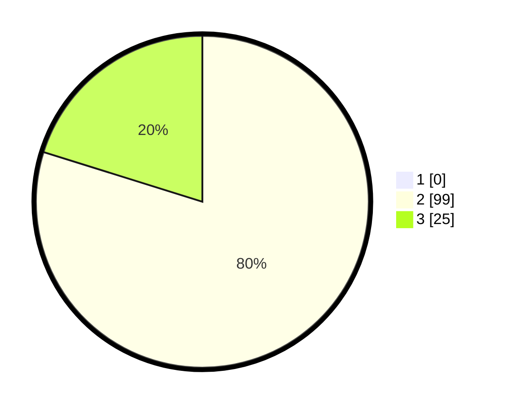

# Hasil

## Grafik

## Tabel

| No. | Nama Paslon    | Suara | Suara (raw) | Persentase |
|:--- |:-------------- | -----:| -----------:| ----------:|
| 1   | ANIES MUHAIMIN | 0     | [0][p-1]    | 0,00       |
| 2   | PRABOWO GIBRAN | 99    | [99][p-2]   | 79,84      |
| 3   | GANJAR MAHFUD  | 25    | [25][p-3]   | 20,16      |

[p-1]: https://github.com/gigit-pemilu/pemilu-2024/blob/main/pilpres/hitung-suara/sub/12-sumatera-utara/sub/12-toba/sub/04-habinsaran/sub/2018-batu-nabolon/sub/003-tps/sub/paslon-1.txt
[p-2]: https://github.com/gigit-pemilu/pemilu-2024/blob/main/pilpres/hitung-suara/sub/12-sumatera-utara/sub/12-toba/sub/04-habinsaran/sub/2018-batu-nabolon/sub/003-tps/sub/paslon-2.txt
[p-3]: https://github.com/gigit-pemilu/pemilu-2024/blob/main/pilpres/hitung-suara/sub/12-sumatera-utara/sub/12-toba/sub/04-habinsaran/sub/2018-batu-nabolon/sub/003-tps/sub/paslon-3.txt

## Foto C Plano

https://sirekap-obj-formc.kpu.go.id/5de7/pemilu/ppwp/12/12/04/20/18/1212042018003-20240215-094458--d2ac6e99-bfe7-46d0-9f29-7dd74a910458.jpg

https://sirekap-obj-formc.kpu.go.id/5de7/pemilu/ppwp/12/12/04/20/18/1212042018003-20240215-095218--f996de99-b91d-4a0f-8344-acc3dd35f0bc.jpg

https://sirekap-obj-formc.kpu.go.id/5de7/pemilu/ppwp/12/12/04/20/18/1212042018003-20240215-093304--b8fd6503-f8f7-45f5-82a1-7c1c67bf1f73.jpg

## Metadata

| Key        | Value               |
| ---------- | ------------------- |
| Time Stamp | 2024-02-15 15:30:25 |

