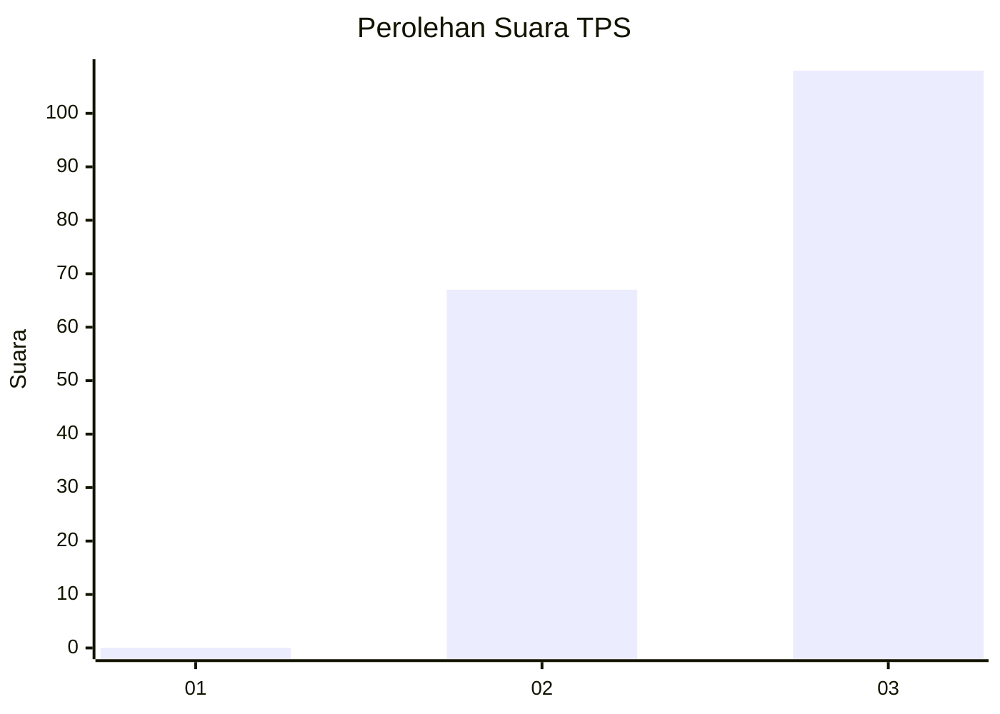
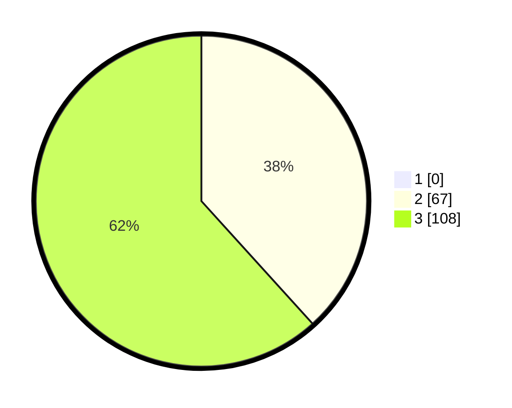

# Hasil

## Grafik

## Tabel

| No. | Nama Paslon    | Suara | Suara (raw) | Persentase |
|:--- |:-------------- | -----:| -----------:| ----------:|
| 1   | ANIES MUHAIMIN | 0     | [0][p-1]    | 0,00       |
| 2   | PRABOWO GIBRAN | 67    | [67][p-2]   | 38,29      |
| 3   | GANJAR MAHFUD  | 108   | [108][p-3]  | 61,71      |

[p-1]: https://github.com/gigit-pemilu/pemilu-2024-12-sumatera-utara/blob/main/pilpres/hitung-suara/sub/12-sumatera-utara/sub/12-toba/sub/04-habinsaran/sub/2019-lumban-gaol/sub/001-tps/sub/paslon-1.txt
[p-2]: https://github.com/gigit-pemilu/pemilu-2024-12-sumatera-utara/blob/main/pilpres/hitung-suara/sub/12-sumatera-utara/sub/12-toba/sub/04-habinsaran/sub/2019-lumban-gaol/sub/001-tps/sub/paslon-2.txt
[p-3]: https://github.com/gigit-pemilu/pemilu-2024-12-sumatera-utara/blob/main/pilpres/hitung-suara/sub/12-sumatera-utara/sub/12-toba/sub/04-habinsaran/sub/2019-lumban-gaol/sub/001-tps/sub/paslon-3.txt

## Foto C Plano

https://sirekap-obj-formc.kpu.go.id/09ee/pemilu/ppwp/12/12/04/20/19/1212042019001-20240215-085005--6a901b1d-c1cc-4922-8807-f41ddb07586d.jpg

https://sirekap-obj-formc.kpu.go.id/09ee/pemilu/ppwp/12/12/04/20/19/1212042019001-20240215-085200--f974d758-abed-45fc-97a1-8ce8aa494113.jpg

https://sirekap-obj-formc.kpu.go.id/09ee/pemilu/ppwp/12/12/04/20/19/1212042019001-20240215-085325--5f8dda9e-c2bd-418b-88b6-68552cc8e2a2.jpg

## Metadata

| Key        | Value               |
| ---------- | ------------------- |
| Time Stamp | 2024-02-16 08:00:28 |

