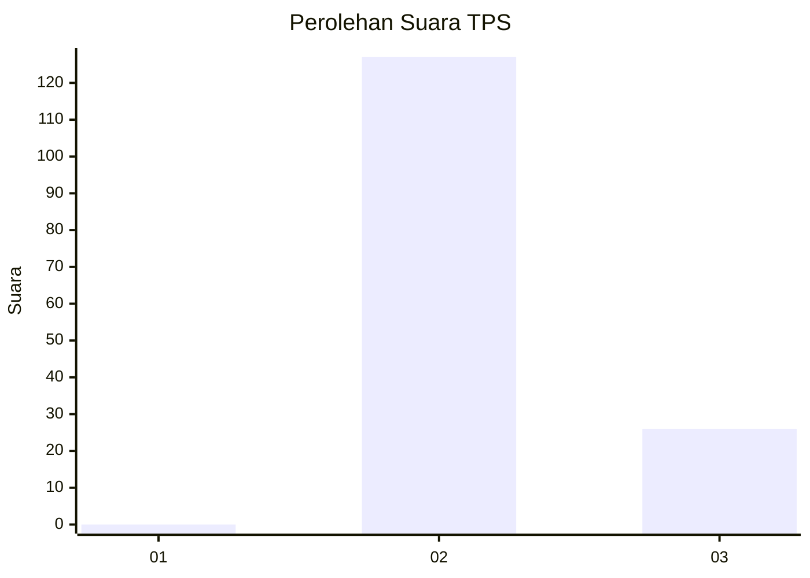
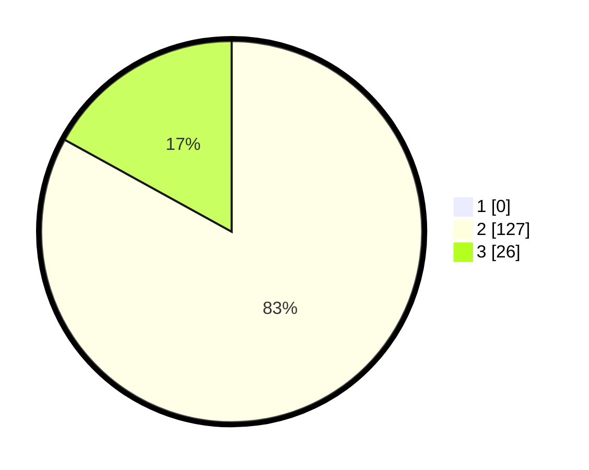

# Hasil

## Grafik

## Tabel

| No. | Nama Paslon    | Suara | Suara (raw) | Persentase |
|:--- |:-------------- | -----:| -----------:| ----------:|
| 1   | ANIES MUHAIMIN | 0     | [0][p-1]    | 0,00       |
| 2   | PRABOWO GIBRAN | 127   | [127][p-2]  | 83,01      |
| 3   | GANJAR MAHFUD  | 26    | [26][p-3]   | 16,99      |

[p-1]: https://github.com/gigit-pemilu/pemilu-2024-12-sumatera-utara/blob/main/pilpres/hitung-suara/sub/12-sumatera-utara/sub/12-toba/sub/06-borbor/sub/2015-pasar-borbor/sub/003-tps/sub/paslon-1.txt
[p-2]: https://github.com/gigit-pemilu/pemilu-2024-12-sumatera-utara/blob/main/pilpres/hitung-suara/sub/12-sumatera-utara/sub/12-toba/sub/06-borbor/sub/2015-pasar-borbor/sub/003-tps/sub/paslon-2.txt
[p-3]: https://github.com/gigit-pemilu/pemilu-2024-12-sumatera-utara/blob/main/pilpres/hitung-suara/sub/12-sumatera-utara/sub/12-toba/sub/06-borbor/sub/2015-pasar-borbor/sub/003-tps/sub/paslon-3.txt

## Foto C Plano

https://sirekap-obj-formc.kpu.go.id/7788/pemilu/ppwp/12/12/06/20/15/1212062015003-20240314-152704--aafc5bbc-fd4f-4169-bfbd-21b6d77c0dc5.jpg

https://sirekap-obj-formc.kpu.go.id/7788/pemilu/ppwp/12/12/06/20/15/1212062015003-20240214-235534--4889f8a3-e181-40c9-af75-4eb424a9b178.jpg

https://sirekap-obj-formc.kpu.go.id/7788/pemilu/ppwp/12/12/06/20/15/1212062015003-20240215-000224--118bf4a4-222f-4fc1-968c-8ea902a00a1e.jpg

## Metadata

| Key        | Value               |
| ---------- | ------------------- |
| Time Stamp | 2024-03-14 15:30:00 |

