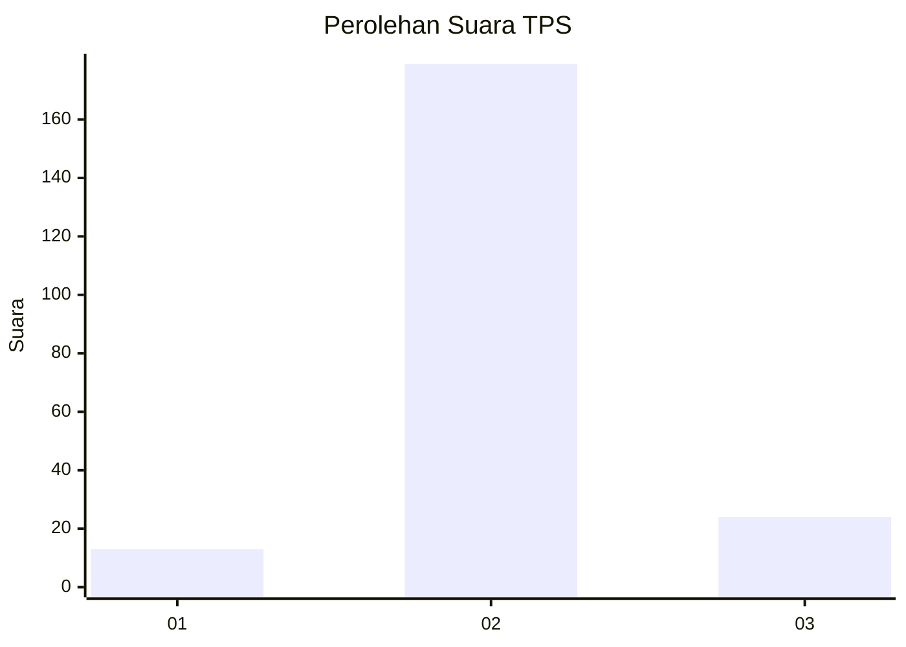
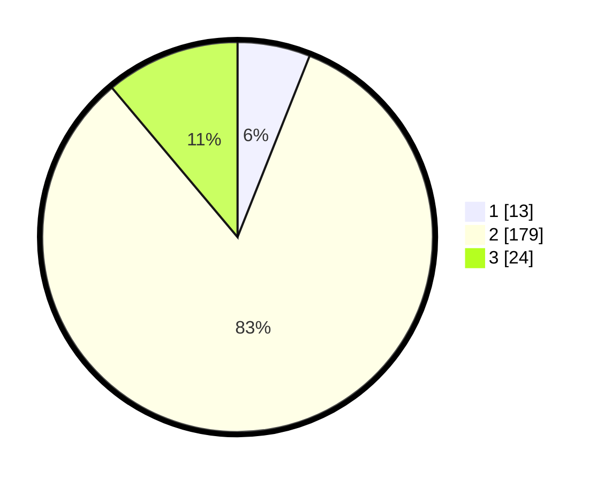

# Hasil

## Grafik

## Tabel

| No. | Nama Paslon    | Suara | Suara (raw) | Persentase |
|:--- |:-------------- | -----:| -----------:| ----------:|
| 1   | ANIES MUHAIMIN | 13    | [13][p-1]   | 6,02       |
| 2   | PRABOWO GIBRAN | 179   | [179][p-2]  | 82,87      |
| 3   | GANJAR MAHFUD  | 24    | [24][p-3]   | 11,11      |

[p-1]: https://github.com/gigit-pemilu/pemilu-2024-12-sumatera-utara/blob/main/pilpres/hitung-suara/sub/12-sumatera-utara/sub/12-toba/sub/09-lumban-julu/sub/2003-hatinggian/sub/002-tps/sub/paslon-1.txt
[p-2]: https://github.com/gigit-pemilu/pemilu-2024-12-sumatera-utara/blob/main/pilpres/hitung-suara/sub/12-sumatera-utara/sub/12-toba/sub/09-lumban-julu/sub/2003-hatinggian/sub/002-tps/sub/paslon-2.txt
[p-3]: https://github.com/gigit-pemilu/pemilu-2024-12-sumatera-utara/blob/main/pilpres/hitung-suara/sub/12-sumatera-utara/sub/12-toba/sub/09-lumban-julu/sub/2003-hatinggian/sub/002-tps/sub/paslon-3.txt

## Foto C Plano

https://sirekap-obj-formc.kpu.go.id/f483/pemilu/ppwp/12/12/09/20/03/1212092003002-20240215-014432--4143e295-a4a6-4e5e-870e-61a41b1ae59b.jpg

https://sirekap-obj-formc.kpu.go.id/f483/pemilu/ppwp/12/12/09/20/03/1212092003002-20240215-014158--5899e98c-460b-4cea-8457-bfd277b9e573.jpg

https://sirekap-obj-formc.kpu.go.id/f483/pemilu/ppwp/12/12/09/20/03/1212092003002-20240215-014400--29ac8e04-b13c-40c3-a3d6-30ca245e3903.jpg

## Metadata

| Key        | Value               |
| ---------- | ------------------- |
| Time Stamp | 2024-02-15 21:01:18 |

