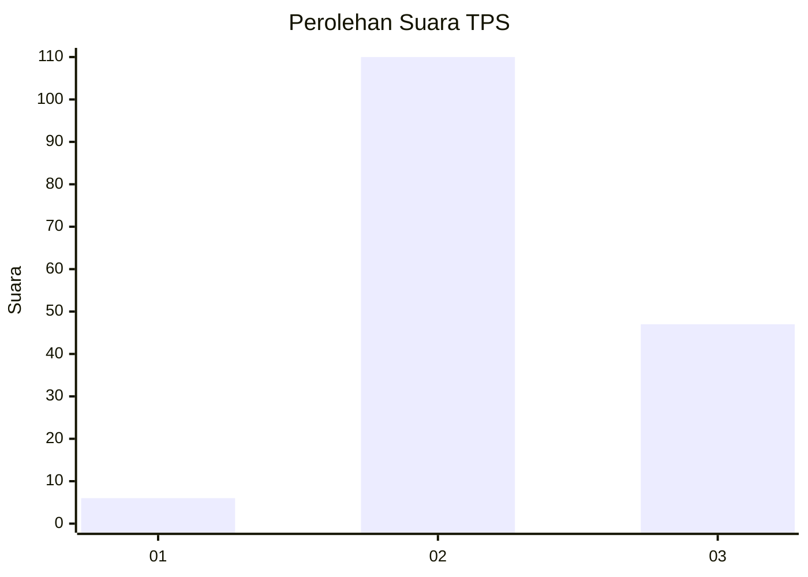

# Hasil

## Grafik

## Tabel

| No. | Nama Paslon    | Suara | Suara (raw) | Persentase |
|:--- |:-------------- | -----:| -----------:| ----------:|
| 1   | ANIES MUHAIMIN | 6     | [6][p-1]    | 3,68       |
| 2   | PRABOWO GIBRAN | 110   | [110][p-2]  | 67,48      |
| 3   | GANJAR MAHFUD  | 47    | [47][p-3]   | 28,83      |

[p-1]: https://github.com/gigit-pemilu/pemilu-2024/blob/main/pilpres/hitung-suara/sub/12-sumatera-utara/sub/12-toba/sub/09-lumban-julu/sub/2007-pasar-lumban-julu/sub/002-tps/sub/paslon-1.txt
[p-2]: https://github.com/gigit-pemilu/pemilu-2024/blob/main/pilpres/hitung-suara/sub/12-sumatera-utara/sub/12-toba/sub/09-lumban-julu/sub/2007-pasar-lumban-julu/sub/002-tps/sub/paslon-2.txt
[p-3]: https://github.com/gigit-pemilu/pemilu-2024/blob/main/pilpres/hitung-suara/sub/12-sumatera-utara/sub/12-toba/sub/09-lumban-julu/sub/2007-pasar-lumban-julu/sub/002-tps/sub/paslon-3.txt

## Foto C Plano

https://sirekap-obj-formc.kpu.go.id/e976/pemilu/ppwp/12/12/09/20/07/1212092007002-20240214-233837--7b1e0b34-f61b-4858-943c-50d9f754b3cc.jpg

https://sirekap-obj-formc.kpu.go.id/e976/pemilu/ppwp/12/12/09/20/07/1212092007002-20240214-234031--a0e47609-ccaa-4f4b-872d-6ea9fa389e30.jpg

https://sirekap-obj-formc.kpu.go.id/e976/pemilu/ppwp/12/12/09/20/07/1212092007002-20240214-223355--24892344-8660-458b-af16-f5da704b2edb.jpg

## Metadata

| Key        | Value               |
| ---------- | ------------------- |
| Time Stamp | 2024-02-15 16:00:26 |

