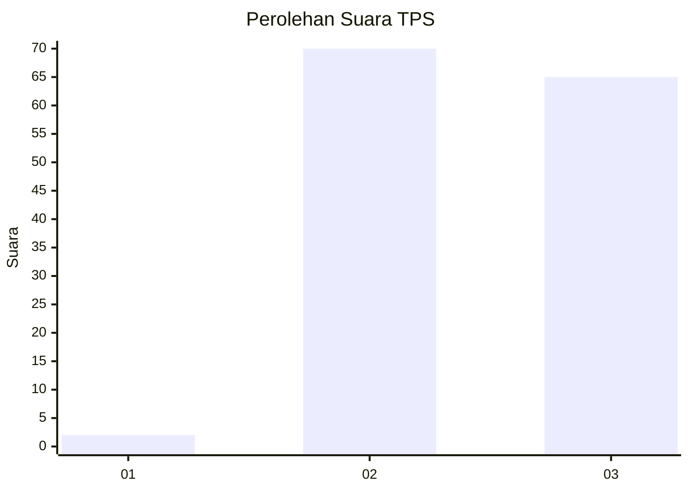
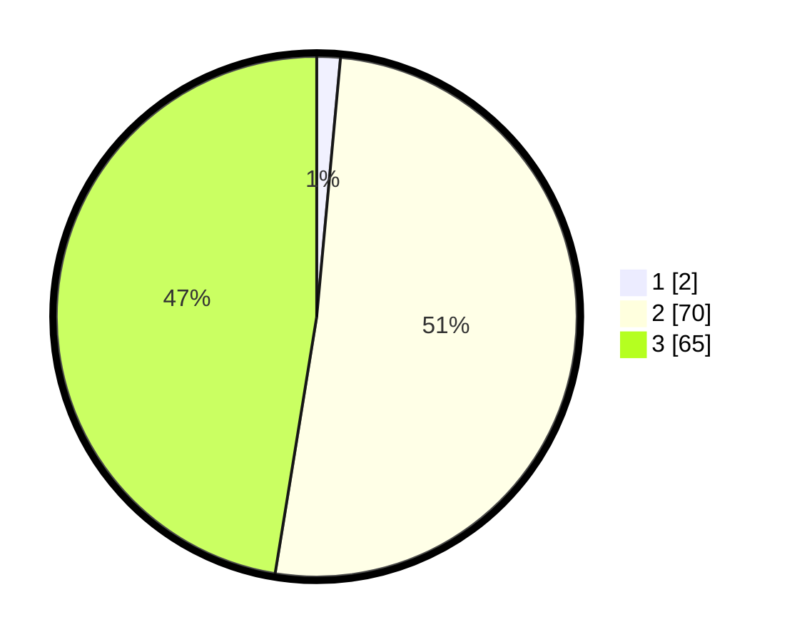

# Hasil

## Grafik

## Tabel

| No. | Nama Paslon    | Suara | Suara (raw) | Persentase |
|:--- |:-------------- | -----:| -----------:| ----------:|
| 1   | ANIES MUHAIMIN | 2     | [2][p-1]    | 1,46       |
| 2   | PRABOWO GIBRAN | 70    | [70][p-2]   | 51,09      |
| 3   | GANJAR MAHFUD  | 65    | [65][p-3]   | 47,45      |

[p-1]: https://github.com/gigit-pemilu/pemilu-2024-12-sumatera-utara/blob/main/pilpres/hitung-suara/sub/12-sumatera-utara/sub/12-toba/sub/09-lumban-julu/sub/2017-jonggi-nihuta/sub/001-tps/sub/paslon-1.txt
[p-2]: https://github.com/gigit-pemilu/pemilu-2024-12-sumatera-utara/blob/main/pilpres/hitung-suara/sub/12-sumatera-utara/sub/12-toba/sub/09-lumban-julu/sub/2017-jonggi-nihuta/sub/001-tps/sub/paslon-2.txt
[p-3]: https://github.com/gigit-pemilu/pemilu-2024-12-sumatera-utara/blob/main/pilpres/hitung-suara/sub/12-sumatera-utara/sub/12-toba/sub/09-lumban-julu/sub/2017-jonggi-nihuta/sub/001-tps/sub/paslon-3.txt

## Foto C Plano

https://sirekap-obj-formc.kpu.go.id/1d98/pemilu/ppwp/12/12/09/20/17/1212092017001-20240316-141331--c7adbffd-9ac1-438d-a8a2-aa6725f56650.jpg

https://sirekap-obj-formc.kpu.go.id/1d98/pemilu/ppwp/12/12/09/20/17/1212092017001-20240214-221647--fe436f9e-81c4-4a89-9d1d-08b795ae32b8.jpg

https://sirekap-obj-formc.kpu.go.id/1d98/pemilu/ppwp/12/12/09/20/17/1212092017001-20240316-141353--2787bf99-abdb-4ec9-bc38-8af878d208b5.jpg

## Metadata

| Key        | Value               |
| ---------- | ------------------- |
| Time Stamp | 2024-03-16 14:30:00 |

