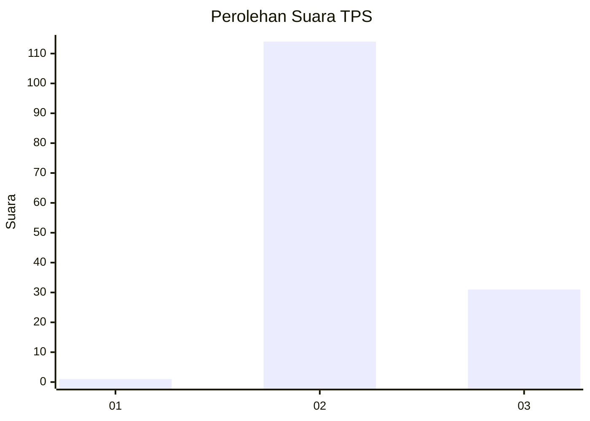
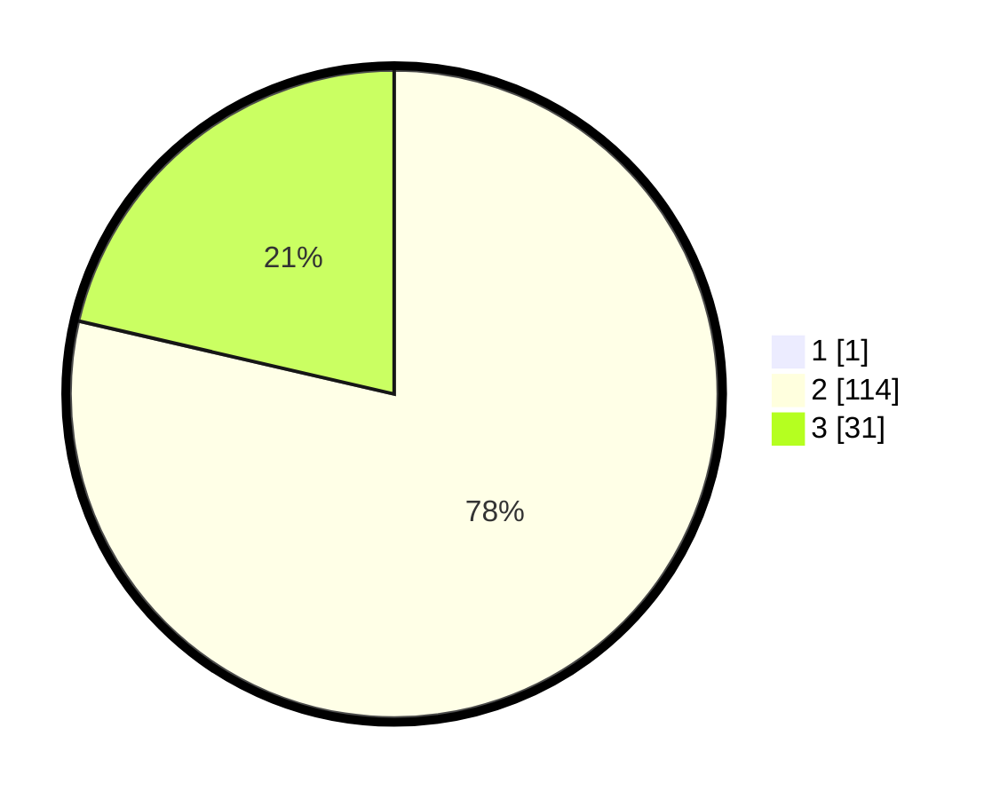

# Hasil

## Grafik

## Tabel

| No. | Nama Paslon    | Suara | Suara (raw) | Persentase |
|:--- |:-------------- | -----:| -----------:| ----------:|
| 1   | ANIES MUHAIMIN | 1     | [1][p-1]    | 0,68       |
| 2   | PRABOWO GIBRAN | 114   | [114][p-2]  | 78,08      |
| 3   | GANJAR MAHFUD  | 31    | [31][p-3]   | 21,23      |

[p-1]: https://github.com/gigit-pemilu/pemilu-2024/blob/main/pilpres/hitung-suara/sub/12-sumatera-utara/sub/12-toba/sub/10-uluan/sub/2001-dolok-saribu-janji-matogu/sub/002-tps/sub/paslon-1.txt
[p-2]: https://github.com/gigit-pemilu/pemilu-2024/blob/main/pilpres/hitung-suara/sub/12-sumatera-utara/sub/12-toba/sub/10-uluan/sub/2001-dolok-saribu-janji-matogu/sub/002-tps/sub/paslon-2.txt
[p-3]: https://github.com/gigit-pemilu/pemilu-2024/blob/main/pilpres/hitung-suara/sub/12-sumatera-utara/sub/12-toba/sub/10-uluan/sub/2001-dolok-saribu-janji-matogu/sub/002-tps/sub/paslon-3.txt

## Foto C Plano

https://sirekap-obj-formc.kpu.go.id/6eee/pemilu/ppwp/12/12/10/20/01/1212102001002-20240312-144252--35a31d4c-c843-4e1f-8f94-9dbce4a80826.jpg

https://sirekap-obj-formc.kpu.go.id/6eee/pemilu/ppwp/12/12/10/20/01/1212102001002-20240223-135304--951bd1e5-e66b-4ec2-92c0-ccb483e6a40c.jpg

https://sirekap-obj-formc.kpu.go.id/6eee/pemilu/ppwp/12/12/10/20/01/1212102001002-20240223-135329--976dfdaf-0346-401a-8977-678b458cc611.jpg

## Metadata

| Key        | Value               |
| ---------- | ------------------- |
| Time Stamp | 2024-03-12 15:00:00 |

