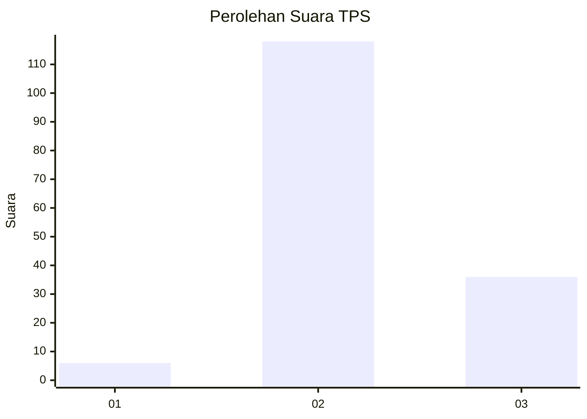
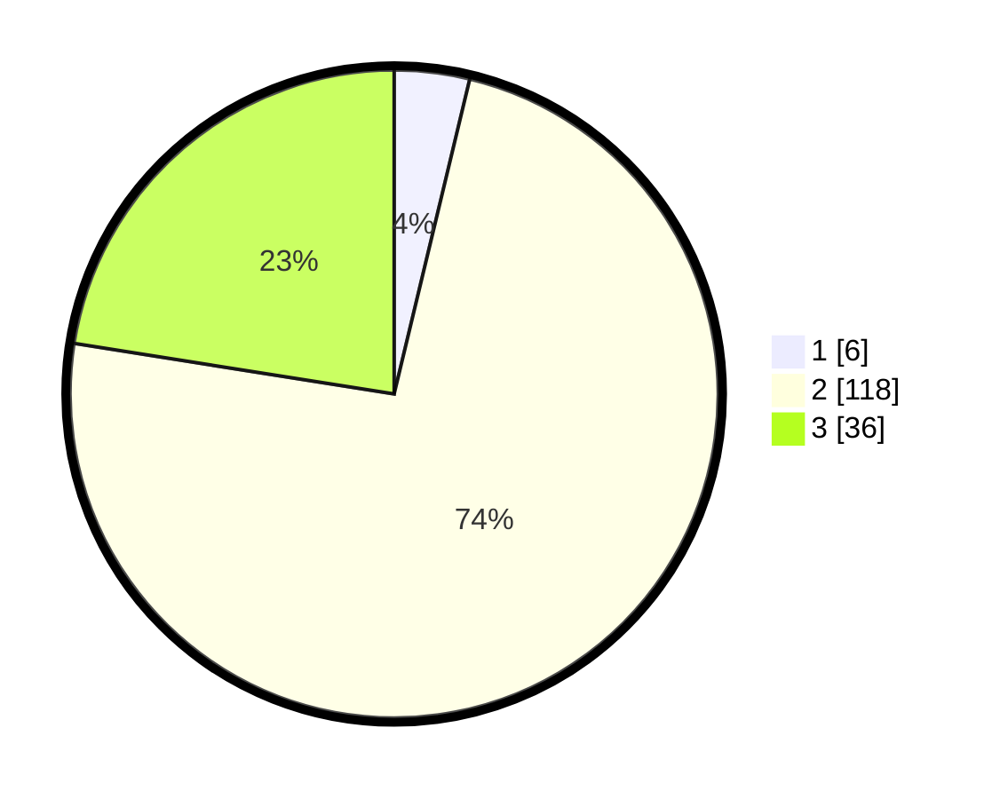

# Hasil

## Grafik

## Tabel

| No. | Nama Paslon    | Suara | Suara (raw) | Persentase |
|:--- |:-------------- | -----:| -----------:| ----------:|
| 1   | ANIES MUHAIMIN | 6     | [6][p-1]    | 3,75       |
| 2   | PRABOWO GIBRAN | 118   | [118][p-2]  | 73,75      |
| 3   | GANJAR MAHFUD  | 36    | [36][p-3]   | 22,50      |

[p-1]: https://github.com/gigit-pemilu/pemilu-2024/blob/main/pilpres/hitung-suara/sub/12-sumatera-utara/sub/12-toba/sub/21-nassau/sub/2003-lumban-rau-utara/sub/003-tps/sub/paslon-1.txt
[p-2]: https://github.com/gigit-pemilu/pemilu-2024/blob/main/pilpres/hitung-suara/sub/12-sumatera-utara/sub/12-toba/sub/21-nassau/sub/2003-lumban-rau-utara/sub/003-tps/sub/paslon-2.txt
[p-3]: https://github.com/gigit-pemilu/pemilu-2024/blob/main/pilpres/hitung-suara/sub/12-sumatera-utara/sub/12-toba/sub/21-nassau/sub/2003-lumban-rau-utara/sub/003-tps/sub/paslon-3.txt

## Foto C Plano

https://sirekap-obj-formc.kpu.go.id/caec/pemilu/ppwp/12/12/21/20/03/1212212003003-20240215-094100--e93ccac9-2811-478b-8140-4c2a366b8307.jpg

https://sirekap-obj-formc.kpu.go.id/caec/pemilu/ppwp/12/12/21/20/03/1212212003003-20240215-094432--f3f40097-2e95-423d-9285-d1dc5c7c8850.jpg

https://sirekap-obj-formc.kpu.go.id/caec/pemilu/ppwp/12/12/21/20/03/1212212003003-20240215-094448--5bf19191-8462-4ecf-be31-024b50613474.jpg

## Metadata

| Key        | Value               |
| ---------- | ------------------- |
| Time Stamp | 2024-02-17 09:00:02 |

