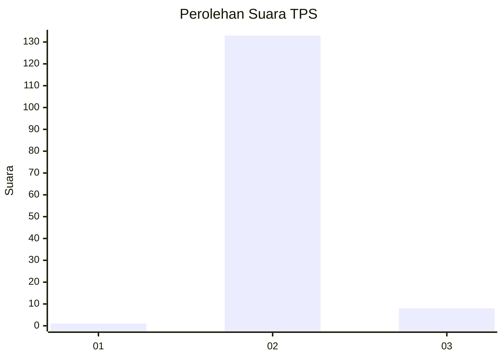
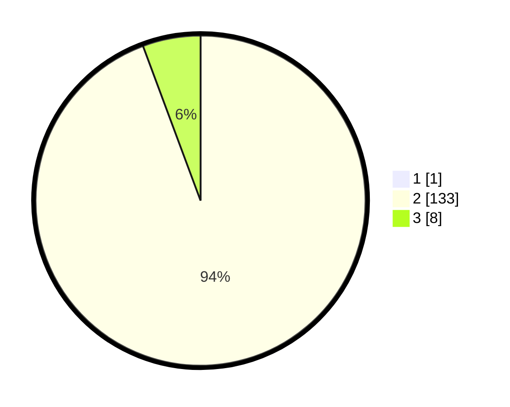

# Hasil

## Grafik

## Tabel

| No. | Nama Paslon    | Suara | Suara (raw) | Persentase |
|:--- |:-------------- | -----:| -----------:| ----------:|
| 1   | ANIES MUHAIMIN | 1     | [1][p-1]    | 0,70       |
| 2   | PRABOWO GIBRAN | 133   | [133][p-2]  | 93,66      |
| 3   | GANJAR MAHFUD  | 8     | [8][p-3]    | 5,63       |

[p-1]: https://github.com/gigit-pemilu/pemilu-2024-12-sumatera-utara/blob/main/pilpres/hitung-suara/sub/12-sumatera-utara/sub/12-toba/sub/21-nassau/sub/2009-cinta-damai/sub/003-tps/sub/paslon-1.txt
[p-2]: https://github.com/gigit-pemilu/pemilu-2024-12-sumatera-utara/blob/main/pilpres/hitung-suara/sub/12-sumatera-utara/sub/12-toba/sub/21-nassau/sub/2009-cinta-damai/sub/003-tps/sub/paslon-2.txt
[p-3]: https://github.com/gigit-pemilu/pemilu-2024-12-sumatera-utara/blob/main/pilpres/hitung-suara/sub/12-sumatera-utara/sub/12-toba/sub/21-nassau/sub/2009-cinta-damai/sub/003-tps/sub/paslon-3.txt

## Foto C Plano

https://sirekap-obj-formc.kpu.go.id/db8e/pemilu/ppwp/12/12/21/20/09/1212212009003-20240214-233046--ec1c2b69-f9a1-4a1f-9971-93ab05cd7bef.jpg

https://sirekap-obj-formc.kpu.go.id/db8e/pemilu/ppwp/12/12/21/20/09/1212212009003-20240214-230738--97e88c5e-4427-40b0-8f83-f8eec133dc7f.jpg

https://sirekap-obj-formc.kpu.go.id/db8e/pemilu/ppwp/12/12/21/20/09/1212212009003-20240214-230948--296129e0-4636-45c0-a5c0-5dd4cdacd17e.jpg

## Metadata

| Key        | Value               |
| ---------- | ------------------- |
| Time Stamp | 2024-02-15 20:30:46 |

