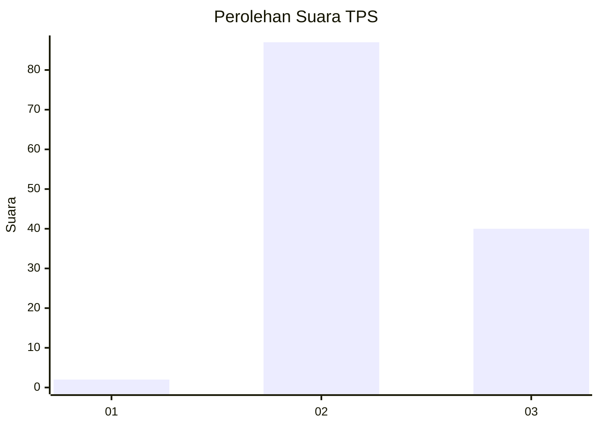
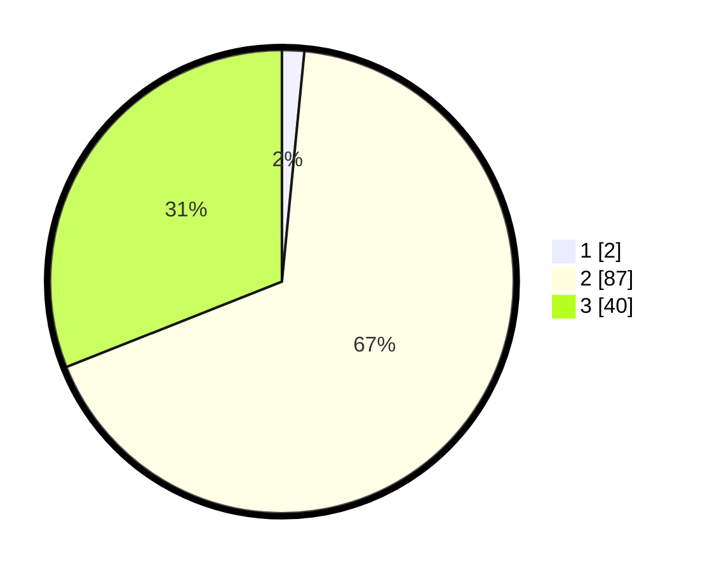

# Hasil

## Grafik

## Tabel

| No. | Nama Paslon    | Suara | Suara (raw) | Persentase |
|:--- |:-------------- | -----:| -----------:| ----------:|
| 1   | ANIES MUHAIMIN | 2     | [2][p-1]    | 1,55       |
| 2   | PRABOWO GIBRAN | 87    | [87][p-2]   | 67,44      |
| 3   | GANJAR MAHFUD  | 40    | [40][p-3]   | 31,01      |

[p-1]: https://github.com/gigit-pemilu/pemilu-2024/blob/main/pilpres/hitung-suara/sub/12-sumatera-utara/sub/12-toba/sub/23-bonatua-lunasi/sub/2003-lumban-lobu/sub/002-tps/sub/paslon-1.txt
[p-2]: https://github.com/gigit-pemilu/pemilu-2024/blob/main/pilpres/hitung-suara/sub/12-sumatera-utara/sub/12-toba/sub/23-bonatua-lunasi/sub/2003-lumban-lobu/sub/002-tps/sub/paslon-2.txt
[p-3]: https://github.com/gigit-pemilu/pemilu-2024/blob/main/pilpres/hitung-suara/sub/12-sumatera-utara/sub/12-toba/sub/23-bonatua-lunasi/sub/2003-lumban-lobu/sub/002-tps/sub/paslon-3.txt

## Foto C Plano

https://sirekap-obj-formc.kpu.go.id/a9b3/pemilu/ppwp/12/12/23/20/03/1212232003002-20240214-193902--e8422904-176a-4e59-94b7-9ad2c8e3fc3c.jpg

https://sirekap-obj-formc.kpu.go.id/a9b3/pemilu/ppwp/12/12/23/20/03/1212232003002-20240214-194116--48554053-825d-49a4-8210-48edfc1e6629.jpg

https://sirekap-obj-formc.kpu.go.id/a9b3/pemilu/ppwp/12/12/23/20/03/1212232003002-20240214-202132--40df3cfc-6e8d-4e46-b12e-c65c80daafb1.jpg

## Metadata

| Key        | Value               |
| ---------- | ------------------- |
| Time Stamp | 2024-02-14 21:46:01 |

