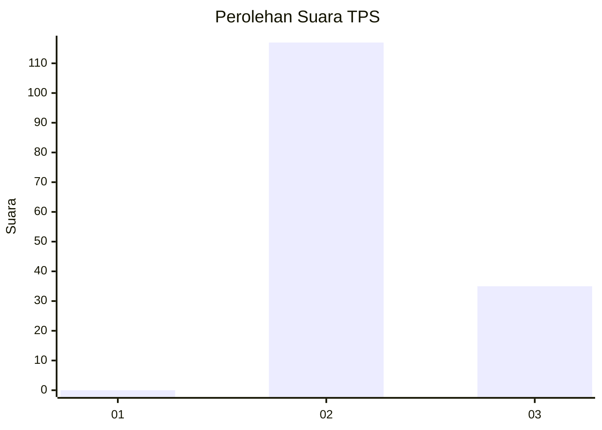
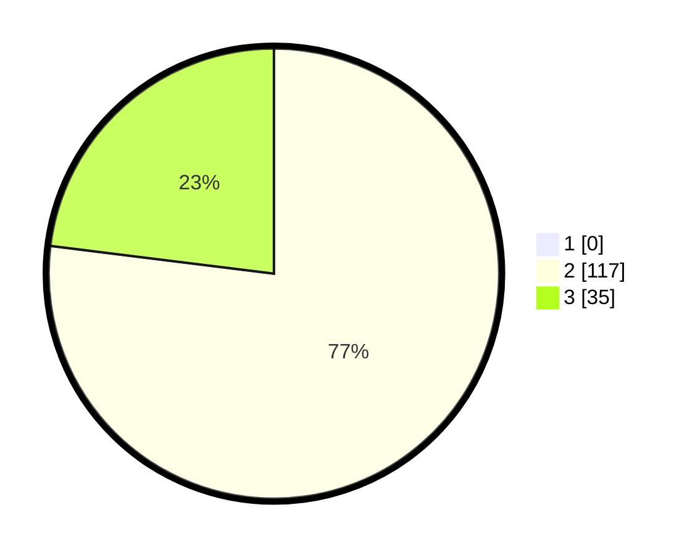

# Hasil

## Grafik

## Tabel

| No. | Nama Paslon    | Suara | Suara (raw) | Persentase |
|:--- |:-------------- | -----:| -----------:| ----------:|
| 1   | ANIES MUHAIMIN | 0     | [0][p-1]    | 0,00       |
| 2   | PRABOWO GIBRAN | 117   | [117][p-2]  | 76,97      |
| 3   | GANJAR MAHFUD  | 35    | [35][p-3]   | 23,03      |

[p-1]: https://github.com/gigit-pemilu/pemilu-2024/blob/main/pilpres/hitung-suara/sub/12-sumatera-utara/sub/12-toba/sub/24-parmaksian/sub/2001-siantar-utara/sub/003-tps/sub/paslon-1.txt
[p-2]: https://github.com/gigit-pemilu/pemilu-2024/blob/main/pilpres/hitung-suara/sub/12-sumatera-utara/sub/12-toba/sub/24-parmaksian/sub/2001-siantar-utara/sub/003-tps/sub/paslon-2.txt
[p-3]: https://github.com/gigit-pemilu/pemilu-2024/blob/main/pilpres/hitung-suara/sub/12-sumatera-utara/sub/12-toba/sub/24-parmaksian/sub/2001-siantar-utara/sub/003-tps/sub/paslon-3.txt

## Foto C Plano

https://sirekap-obj-formc.kpu.go.id/daca/pemilu/ppwp/12/12/24/20/01/1212242001003-20240314-151514--931e63a0-2a93-42a4-b874-2ad6240af3e1.jpg

https://sirekap-obj-formc.kpu.go.id/daca/pemilu/ppwp/12/12/24/20/01/1212242001003-20240215-124221--1c95cee3-c5f0-4ab7-8e53-9749f9be2f2c.jpg

https://sirekap-obj-formc.kpu.go.id/daca/pemilu/ppwp/12/12/24/20/01/1212242001003-20240314-151526--fc1c047a-4007-4d87-9fbb-ce53fb6b6084.jpg

## Metadata

| Key        | Value               |
| ---------- | ------------------- |
| Time Stamp | 2024-03-14 15:30:00 |

