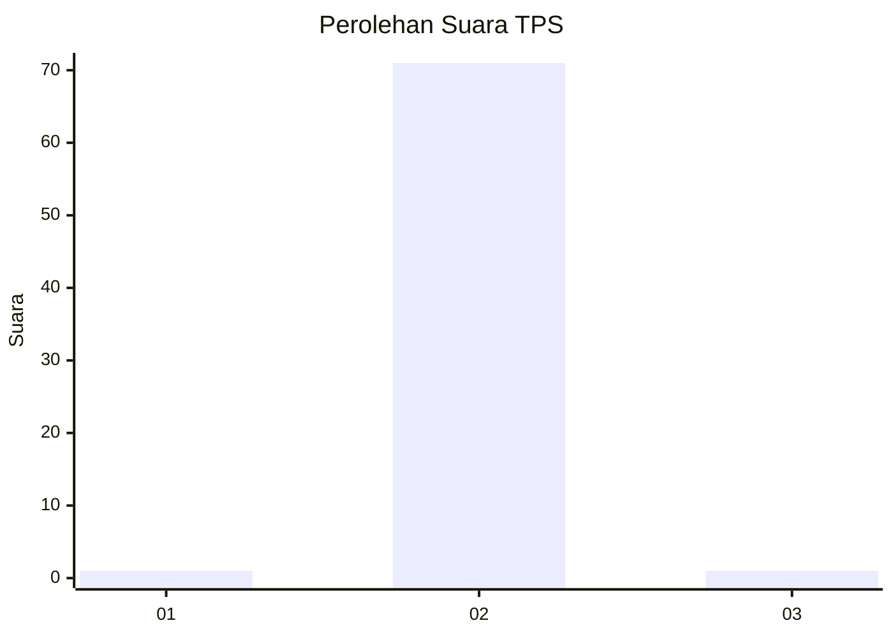
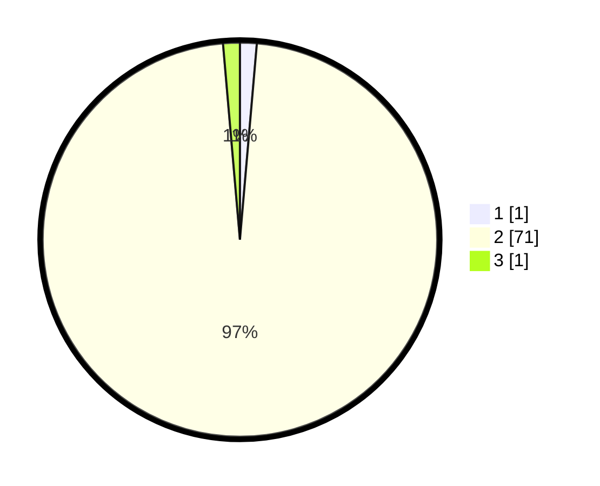

# Hasil

## Grafik

## Tabel

| No. | Nama Paslon    | Suara | Suara (raw) | Persentase |
|:--- |:-------------- | -----:| -----------:| ----------:|
| 1   | ANIES MUHAIMIN | 1     | [1][p-1]    | 1,37       |
| 2   | PRABOWO GIBRAN | 71    | [71][p-2]   | 97,26      |
| 3   | GANJAR MAHFUD  | 1     | [1][p-3]    | 1,37       |

[p-1]: https://github.com/gigit-pemilu/pemilu-2024-12-sumatera-utara/blob/main/pilpres/hitung-suara/sub/12-sumatera-utara/sub/13-mandailing-natal/sub/01-panyabungan/sub/1011-kota-siantar/sub/005-tps/sub/paslon-1.txt
[p-2]: https://github.com/gigit-pemilu/pemilu-2024-12-sumatera-utara/blob/main/pilpres/hitung-suara/sub/12-sumatera-utara/sub/13-mandailing-natal/sub/01-panyabungan/sub/1011-kota-siantar/sub/005-tps/sub/paslon-2.txt
[p-3]: https://github.com/gigit-pemilu/pemilu-2024-12-sumatera-utara/blob/main/pilpres/hitung-suara/sub/12-sumatera-utara/sub/13-mandailing-natal/sub/01-panyabungan/sub/1011-kota-siantar/sub/005-tps/sub/paslon-3.txt

## Foto C Plano

https://sirekap-obj-formc.kpu.go.id/b07a/pemilu/ppwp/12/13/01/10/11/1213011011005-20240222-202705--384b5c8f-a71b-4a20-b4fc-6843b0e77f69.jpg

https://sirekap-obj-formc.kpu.go.id/b07a/pemilu/ppwp/12/13/01/10/11/1213011011005-20240222-203941--1e48a30b-fe64-4f0e-9389-30bfc9659801.jpg

https://sirekap-obj-formc.kpu.go.id/b07a/pemilu/ppwp/12/13/01/10/11/1213011011005-20240222-204603--5fe5f06b-741e-48c4-87cf-7f7440df1a30.jpg

## Metadata

| Key        | Value               |
| ---------- | ------------------- |
| Time Stamp | 2024-02-22 21:00:00 |

## DATA PEMILIH TETAP

Jumlah pemilih dalam DPT: **446**.
 * L: **129**.
 * P: **140**.

## DATA PENGGUNA HAK PILIH

Jumlah pengguna hak pilih dalam DPT: **444**.
 * L: **82**.
 * P: **105**.

Jumlah pengguna hak pilih dalam DPTb: **444**.
 * L: **0**.
 * P: **0**.

Jumlah pengguna hak pilih dalam DPK: **444**.
 * L: **444**.
 * P: **440**.

Jumlah pengguna hak pilih: **525**.
 * L: **3**.
 * P: **144**.

## JUMLAH SUARA SAH DAN TIDAK SAH

JUMLAH SELURUH SUARA SAH: **220**.

JUMLAH SUARA TIDAK SAH: **250**.

JUMLAH SELURUH SUARA SAH DAN SUARA TIDAK SAH: **10**.

