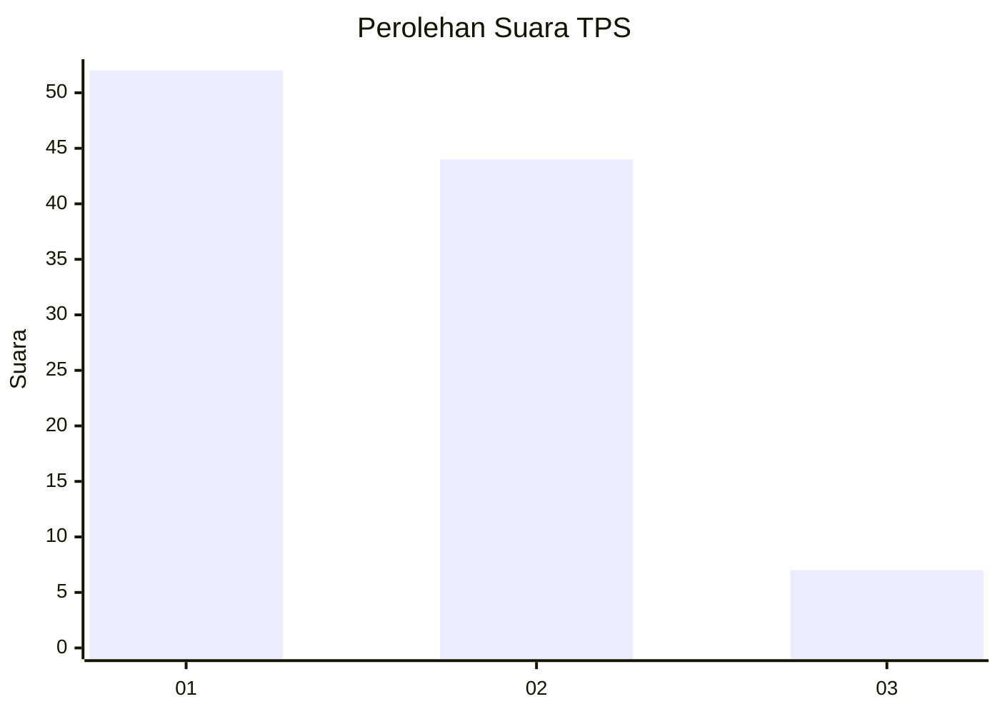
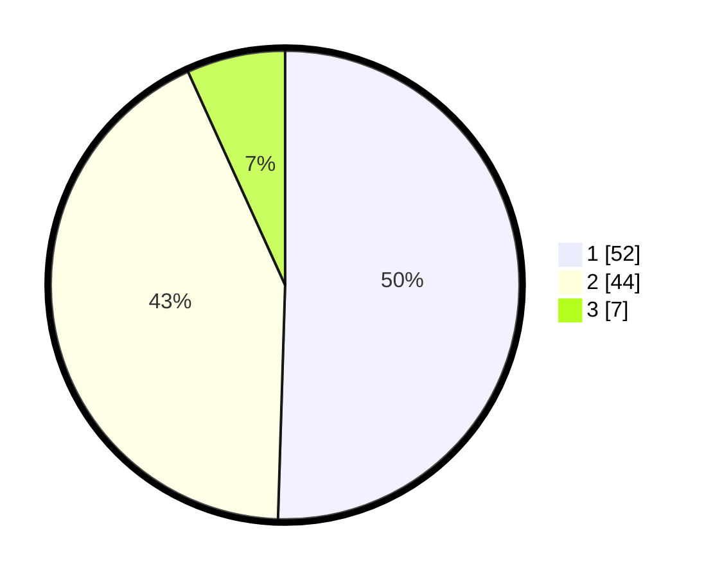

# Hasil

## Grafik

## Tabel

| No. | Nama Paslon    | Suara | Suara (raw) | Persentase |
|:--- |:-------------- | -----:| -----------:| ----------:|
| 1   | ANIES MUHAIMIN | 52    | [52][p-1]   | 50,49      |
| 2   | PRABOWO GIBRAN | 44    | [44][p-2]   | 42,72      |
| 3   | GANJAR MAHFUD  | 7     | [7][p-3]    | 6,80       |

[p-1]: https://github.com/gigit-pemilu/pemilu-2024-12-sumatera-utara/blob/main/pilpres/hitung-suara/sub/12-sumatera-utara/sub/13-mandailing-natal/sub/01-panyabungan/sub/1011-kota-siantar/sub/008-tps/sub/paslon-1.txt
[p-2]: https://github.com/gigit-pemilu/pemilu-2024-12-sumatera-utara/blob/main/pilpres/hitung-suara/sub/12-sumatera-utara/sub/13-mandailing-natal/sub/01-panyabungan/sub/1011-kota-siantar/sub/008-tps/sub/paslon-2.txt
[p-3]: https://github.com/gigit-pemilu/pemilu-2024-12-sumatera-utara/blob/main/pilpres/hitung-suara/sub/12-sumatera-utara/sub/13-mandailing-natal/sub/01-panyabungan/sub/1011-kota-siantar/sub/008-tps/sub/paslon-3.txt

## Foto C Plano

https://sirekap-obj-formc.kpu.go.id/22a3/pemilu/ppwp/12/13/01/10/11/1213011011008-20240222-165045--59e33a84-bdc9-43ba-946b-ede6add204c5.jpg

https://sirekap-obj-formc.kpu.go.id/22a3/pemilu/ppwp/12/13/01/10/11/1213011011008-20240222-165228--9431af9e-336f-4369-9d52-bfd0ed2397d9.jpg

https://sirekap-obj-formc.kpu.go.id/22a3/pemilu/ppwp/12/13/01/10/11/1213011011008-20240222-164612--662609c4-c55c-43ed-bcde-b7ca388f4fe8.jpg

## Metadata

| Key        | Value               |
| ---------- | ------------------- |
| Time Stamp | 2024-02-22 18:00:00 |

## DATA PEMILIH TETAP

Jumlah pemilih dalam DPT: **273**.
 * L: **141**.
 * P: **133**.

## DATA PENGGUNA HAK PILIH

Jumlah pengguna hak pilih dalam DPT: **212**.
 * L: **708**.
 * P: **194**.

Jumlah pengguna hak pilih dalam DPTb: **704**.
 * L: **222**.
 * P: **228**.

Jumlah pengguna hak pilih dalam DPK: **3**.
 * L: **0**.
 * P: **2**.

Jumlah pengguna hak pilih: **315**.
 * L: **103**.
 * P: **126**.

## JUMLAH SUARA SAH DAN TIDAK SAH

JUMLAH SELURUH SUARA SAH: **209**.

JUMLAH SUARA TIDAK SAH: **5**.

JUMLAH SELURUH SUARA SAH DAN SUARA TIDAK SAH: **215**.

