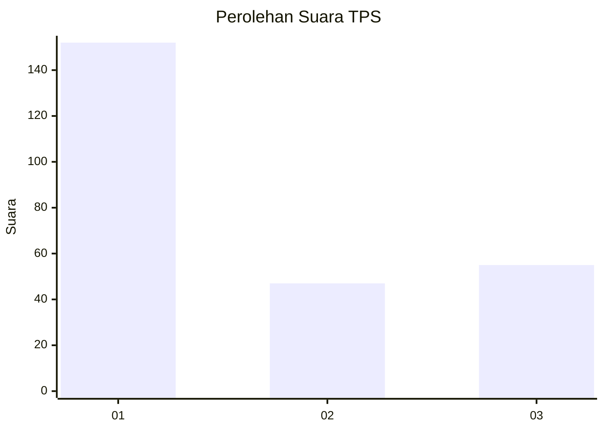
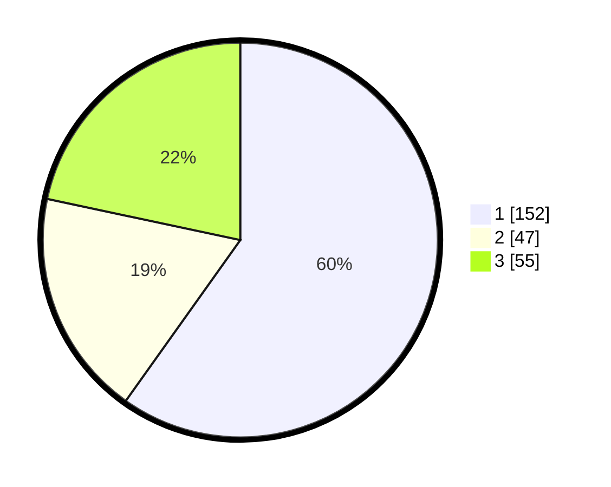

# Hasil

## Grafik

## Tabel

| No. | Nama Paslon    | Suara | Suara (raw) | Persentase |
|:--- |:-------------- | -----:| -----------:| ----------:|
| 1   | ANIES MUHAIMIN | 152   | [152][p-1]  | 59,84      |
| 2   | PRABOWO GIBRAN | 47    | [47][p-2]   | 18,50      |
| 3   | GANJAR MAHFUD  | 55    | [55][p-3]   | 21,65      |

[p-1]: https://github.com/gigit-pemilu/pemilu-2024-12-sumatera-utara/blob/main/pilpres/hitung-suara/sub/12-sumatera-utara/sub/13-mandailing-natal/sub/01-panyabungan/sub/1011-kota-siantar/sub/017-tps/sub/paslon-1.txt
[p-2]: https://github.com/gigit-pemilu/pemilu-2024-12-sumatera-utara/blob/main/pilpres/hitung-suara/sub/12-sumatera-utara/sub/13-mandailing-natal/sub/01-panyabungan/sub/1011-kota-siantar/sub/017-tps/sub/paslon-2.txt
[p-3]: https://github.com/gigit-pemilu/pemilu-2024-12-sumatera-utara/blob/main/pilpres/hitung-suara/sub/12-sumatera-utara/sub/13-mandailing-natal/sub/01-panyabungan/sub/1011-kota-siantar/sub/017-tps/sub/paslon-3.txt

## Foto C Plano

https://sirekap-obj-formc.kpu.go.id/db4a/pemilu/ppwp/12/13/01/10/11/1213011011017-20240223-103635--4d49e43a-aca3-41bf-a105-4be96fb8d5de.jpg

https://sirekap-obj-formc.kpu.go.id/db4a/pemilu/ppwp/12/13/01/10/11/1213011011017-20240223-103934--2b0f5c80-3917-45da-8e88-ab45e9dd117e.jpg

https://sirekap-obj-formc.kpu.go.id/db4a/pemilu/ppwp/12/13/01/10/11/1213011011017-20240223-104118--26b7a798-e4dd-4aba-8cba-b45dd814f217.jpg

## Metadata

| Key        | Value               |
| ---------- | ------------------- |
| Time Stamp | 2024-02-24 22:31:28 |

## DATA PEMILIH TETAP

Jumlah pemilih dalam DPT: **276**.
 * L: **133**.
 * P: **745**.

## DATA PENGGUNA HAK PILIH

Jumlah pengguna hak pilih dalam DPT: **196**.
 * L: **95**.
 * P: **701**.

Jumlah pengguna hak pilih dalam DPTb: **3**.
 * L: **7**.
 * P: **2**.

Jumlah pengguna hak pilih dalam DPK: **665**.
 * L: **664**.
 * P: **663**.

Jumlah pengguna hak pilih: **557**.
 * L: **655**.
 * P: **555**.

## JUMLAH SUARA SAH DAN TIDAK SAH

JUMLAH SELURUH SUARA SAH: **202**.

JUMLAH SUARA TIDAK SAH: **2**.

JUMLAH SELURUH SUARA SAH DAN SUARA TIDAK SAH: **204**.

