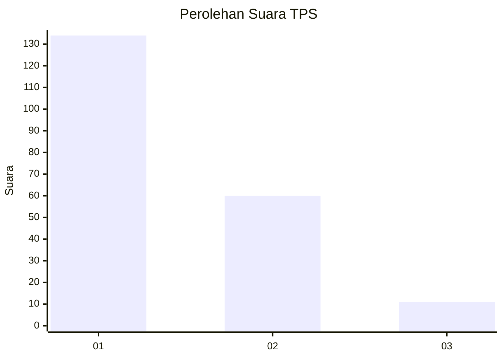
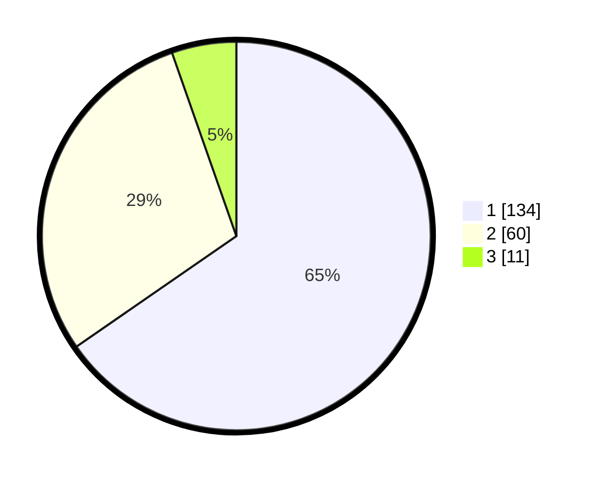

# Hasil

## Grafik

## Tabel

| No. | Nama Paslon    | Suara | Suara (raw) | Persentase |
|:--- |:-------------- | -----:| -----------:| ----------:|
| 1   | ANIES MUHAIMIN | 134   | [134][p-1]  | 65,37      |
| 2   | PRABOWO GIBRAN | 60    | [60][p-2]   | 29,27      |
| 3   | GANJAR MAHFUD  | 11    | [11][p-3]   | 5,37       |

[p-1]: https://github.com/gigit-pemilu/pemilu-2024/blob/main/pilpres/hitung-suara/sub/12-sumatera-utara/sub/13-mandailing-natal/sub/01-panyabungan/sub/1014-kayu-jati/sub/002-tps/sub/paslon-1.txt
[p-2]: https://github.com/gigit-pemilu/pemilu-2024/blob/main/pilpres/hitung-suara/sub/12-sumatera-utara/sub/13-mandailing-natal/sub/01-panyabungan/sub/1014-kayu-jati/sub/002-tps/sub/paslon-2.txt
[p-3]: https://github.com/gigit-pemilu/pemilu-2024/blob/main/pilpres/hitung-suara/sub/12-sumatera-utara/sub/13-mandailing-natal/sub/01-panyabungan/sub/1014-kayu-jati/sub/002-tps/sub/paslon-3.txt

## Foto C Plano

https://sirekap-obj-formc.kpu.go.id/a45e/pemilu/ppwp/12/13/01/10/14/1213011014002-20240214-215225--16dce02a-8aec-4361-bdc4-06c91ed01318.jpg

https://sirekap-obj-formc.kpu.go.id/a45e/pemilu/ppwp/12/13/01/10/14/1213011014002-20240214-214519--8b15af75-5db7-4844-97f1-c6d4cff6b2e1.jpg

https://sirekap-obj-formc.kpu.go.id/a45e/pemilu/ppwp/12/13/01/10/14/1213011014002-20240214-214641--d81fbc48-e712-44e1-bef5-de45a98d7275.jpg

## Metadata

| Key        | Value               |
| ---------- | ------------------- |
| Time Stamp | 2024-02-16 00:30:27 |

