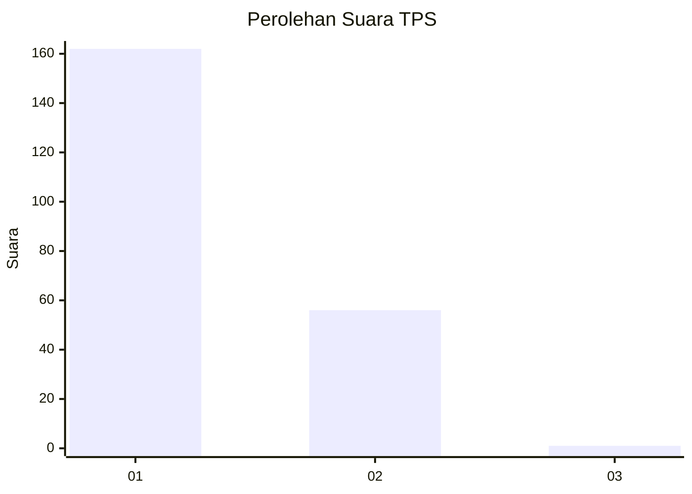
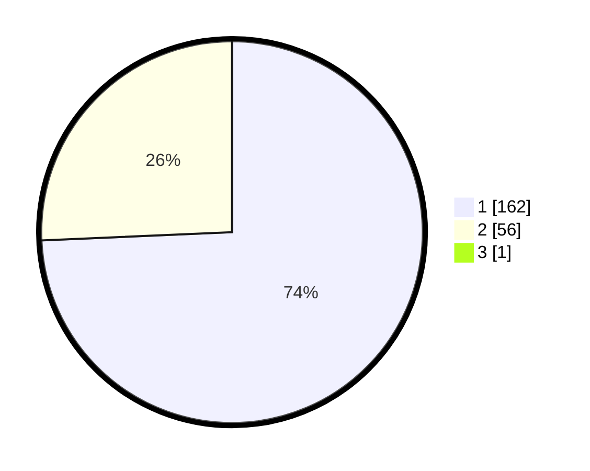

# Hasil

## Grafik

## Tabel

| No. | Nama Paslon    | Suara | Suara (raw) | Persentase |
|:--- |:-------------- | -----:| -----------:| ----------:|
| 1   | ANIES MUHAIMIN | 162   | [162][p-1]  | 73,97      |
| 2   | PRABOWO GIBRAN | 56    | [56][p-2]   | 25,57      |
| 3   | GANJAR MAHFUD  | 1     | [1][p-3]    | 0,46       |

[p-1]: https://github.com/gigit-pemilu/pemilu-2024-12-sumatera-utara/blob/main/pilpres/hitung-suara/sub/12-sumatera-utara/sub/13-mandailing-natal/sub/01-panyabungan/sub/1022-pasar-hilir/sub/001-tps/sub/paslon-1.txt
[p-2]: https://github.com/gigit-pemilu/pemilu-2024-12-sumatera-utara/blob/main/pilpres/hitung-suara/sub/12-sumatera-utara/sub/13-mandailing-natal/sub/01-panyabungan/sub/1022-pasar-hilir/sub/001-tps/sub/paslon-2.txt
[p-3]: https://github.com/gigit-pemilu/pemilu-2024-12-sumatera-utara/blob/main/pilpres/hitung-suara/sub/12-sumatera-utara/sub/13-mandailing-natal/sub/01-panyabungan/sub/1022-pasar-hilir/sub/001-tps/sub/paslon-3.txt

## Foto C Plano

https://sirekap-obj-formc.kpu.go.id/f99d/pemilu/ppwp/12/13/01/10/22/1213011022001-20240217-145654--7b33ff16-26f9-4230-90a7-2cc22f579829.jpg

https://sirekap-obj-formc.kpu.go.id/f99d/pemilu/ppwp/12/13/01/10/22/1213011022001-20240217-145755--43e80f3b-09ee-41d1-802f-0a6c715e09e1.jpg

https://sirekap-obj-formc.kpu.go.id/f99d/pemilu/ppwp/12/13/01/10/22/1213011022001-20240217-150127--a4869f2c-a925-4b5a-bd50-98086f121572.jpg

## Metadata

| Key        | Value               |
| ---------- | ------------------- |
| Time Stamp | 2024-02-17 19:00:04 |

